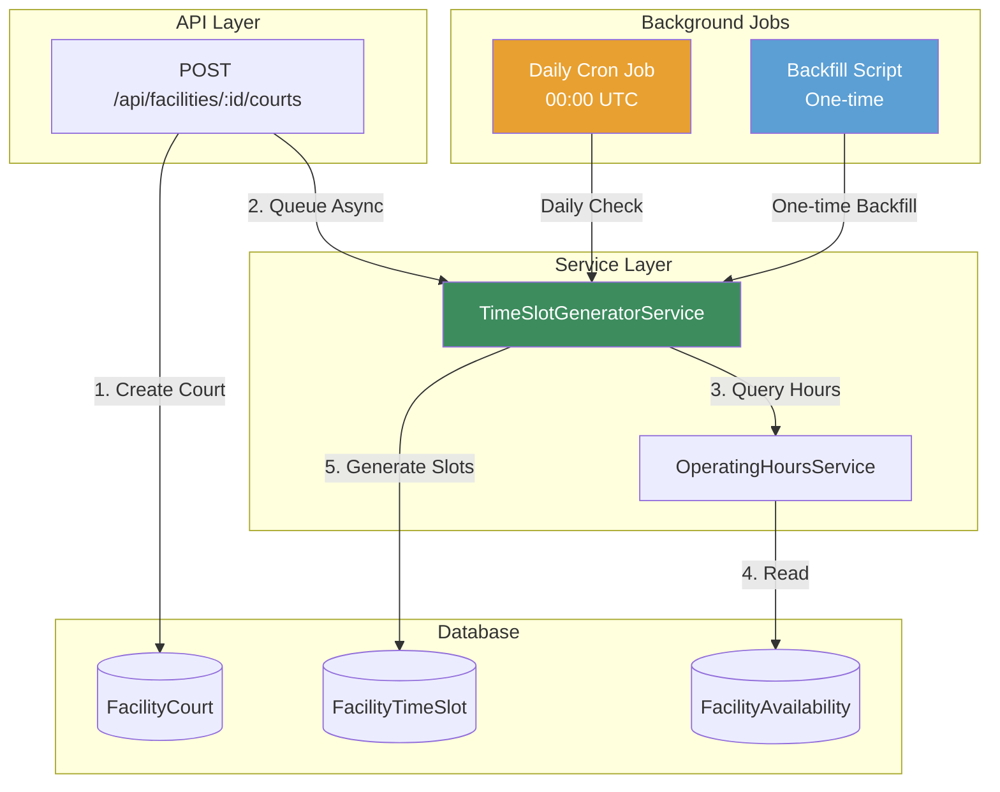
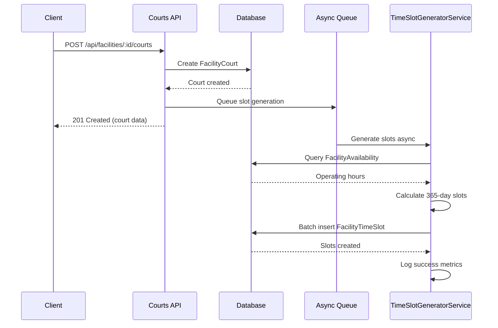
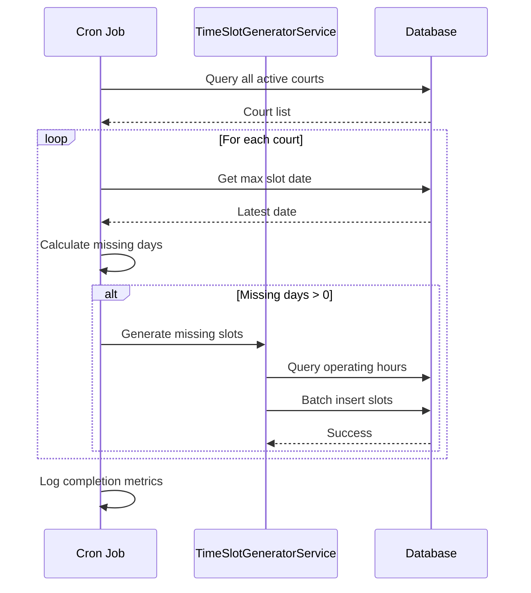

# Design Document: Auto-Generate Time Slots

## Overview

This feature implements an automated time slot generation system for court bookings within the Muster platform. The system maintains a rolling 365-day window of available time slots for all courts, eliminating manual setup work for ground operators and ensuring courts are immediately bookable upon creation.

### Problem Statement

Currently, the court creation endpoint in `server/src/routes/courts.ts` generates time slots inline during the POST request, creating a 90-day window with hardcoded hours (6 AM to 10 PM). This approach has several limitations:

1. **Inconsistent window duration**: 90 days vs. the required 365-day rolling window
2. **No maintenance mechanism**: Slots are not automatically extended as time passes
3. **Hardcoded operating hours**: Does not respect facility-specific operating hours
4. **Inline execution**: Slot generation blocks the API response, impacting performance
5. **No backfill support**: Existing courts without slots cannot be automatically populated
6. **No error recovery**: Failed slot generation blocks court creation

### Solution Overview

The solution introduces three key components:

1. **TimeSlotGeneratorService**: A reusable service that encapsulates slot generation logic
2. **Daily Cron Job**: Maintains the rolling 365-day window for all courts
3. **Backfill Script**: One-time migration to populate slots for existing courts

The refactored system will:
- Generate slots asynchronously to avoid blocking API responses
- Respect facility operating hours from the `FacilityAvailability` table
- Maintain a consistent 365-day rolling window across all courts
- Handle errors gracefully with retry mechanisms
- Prevent duplicate slot creation through database constraints


## Architecture

### System Components



### Component Responsibilities

#### TimeSlotGeneratorService
- **Purpose**: Centralized slot generation logic
- **Location**: `server/src/services/TimeSlotGeneratorService.ts`
- **Responsibilities**:
  - Generate time slots for a specific court and date range
  - Query and apply facility operating hours
  - Handle duplicate prevention
  - Batch insert slots efficiently
  - Log generation metrics and errors

#### OperatingHoursService
- **Purpose**: Abstract operating hours logic
- **Location**: `server/src/services/OperatingHoursService.ts`
- **Responsibilities**:
  - Retrieve operating hours for a facility
  - Apply default hours (6 AM - 10 PM) when not defined
  - Handle day-of-week restrictions
  - Handle blocked dates and special schedules

#### Daily Cron Job
- **Purpose**: Maintain rolling 365-day window
- **Location**: `server/src/jobs/maintainTimeSlots.ts`
- **Schedule**: Daily at 00:00 UTC
- **Responsibilities**:
  - Query all active courts
  - Check each court's slot coverage
  - Generate missing slots for dates beyond current coverage
  - Retry previously failed generations
  - Log execution metrics

#### Backfill Script
- **Purpose**: Populate slots for existing courts
- **Location**: `server/src/scripts/backfillTimeSlots.ts`
- **Execution**: One-time during deployment
- **Responsibilities**:
  - Identify courts with zero time slots
  - Generate 365-day window for each court
  - Report progress and completion metrics


### Data Flow

#### Court Creation Flow



#### Daily Maintenance Flow




## Components and Interfaces

### TimeSlotGeneratorService

```typescript
interface TimeSlotGenerationOptions {
  courtId: string;
  startDate: Date;
  endDate: Date;
  skipExisting?: boolean; // Default: true
}

interface TimeSlotGenerationResult {
  courtId: string;
  slotsGenerated: number;
  slotsSkipped: number;
  dateRange: {
    start: Date;
    end: Date;
  };
  duration: number; // milliseconds
  errors: string[];
}

interface OperatingHours {
  dayOfWeek: number; // 0-6
  startTime: string; // HH:MM
  endTime: string; // HH:MM
  isBlocked: boolean;
}

class TimeSlotGeneratorService {
  /**
   * Generate time slots for a court within a date range
   */
  async generateSlotsForCourt(
    options: TimeSlotGenerationOptions
  ): Promise<TimeSlotGenerationResult>;

  /**
   * Generate slots for a court with 365-day rolling window
   */
  async generateRollingWindow(courtId: string): Promise<TimeSlotGenerationResult>;

  /**
   * Check if a court has complete slot coverage for the next N days
   */
  async checkSlotCoverage(courtId: string, days: number): Promise<{
    hasCompleteCoverage: boolean;
    latestSlotDate: Date | null;
    missingDays: number;
  }>;

  /**
   * Get operating hours for a facility, with defaults
   */
  private async getOperatingHours(facilityId: string): Promise<OperatingHours[]>;

  /**
   * Generate slot data for a specific date based on operating hours
   */
  private generateSlotsForDate(
    courtId: string,
    date: Date,
    operatingHours: OperatingHours[],
    pricePerHour: number
  ): Array<{
    courtId: string;
    date: Date;
    startTime: string;
    endTime: string;
    price: number;
    status: string;
  }>;

  /**
   * Batch insert slots with duplicate handling
   */
  private async batchInsertSlots(
    slots: Array<any>,
    batchSize?: number
  ): Promise<{ inserted: number; skipped: number }>;
}
```

### OperatingHoursService

```typescript
interface DailyOperatingHours {
  dayOfWeek: number;
  startTime: string;
  endTime: string;
  isOpen: boolean;
}

class OperatingHoursService {
  /**
   * Get operating hours for a facility
   * Returns default hours (6 AM - 10 PM) if none defined
   */
  async getOperatingHours(facilityId: string): Promise<DailyOperatingHours[]>;

  /**
   * Check if a facility is open on a specific date
   */
  async isOpenOnDate(facilityId: string, date: Date): Promise<boolean>;

  /**
   * Get time slots for a specific day of week
   */
  getTimeSlotsForDay(dayOfWeek: number, hours: DailyOperatingHours[]): string[];

  /**
   * Default operating hours (6 AM - 10 PM, all days)
   */
  private getDefaultHours(): DailyOperatingHours[];
}
```

### Cron Job Interface

```typescript
interface CronJobMetrics {
  executionDate: Date;
  courtsProcessed: number;
  slotsGenerated: number;
  courtsWithErrors: number;
  duration: number;
  errors: Array<{
    courtId: string;
    error: string;
  }>;
}

class TimeSlotMaintenanceJob {
  /**
   * Execute daily maintenance
   */
  async execute(): Promise<CronJobMetrics>;

  /**
   * Process a single court
   */
  private async processCourt(courtId: string): Promise<{
    slotsGenerated: number;
    error?: string;
  }>;

  /**
   * Retry previously failed generations
   */
  private async retryFailedGenerations(): Promise<number>;
}
```


## Data Models

### Existing Schema (No Changes Required)

The implementation uses the existing Prisma schema without modifications:

```prisma
model FacilityTimeSlot {
  id          String   @id @default(uuid())
  date        DateTime // Specific date for this slot (UTC midnight)
  startTime   String   // HH:MM format (24-hour)
  endTime     String   // HH:MM format (24-hour)
  status      String   @default("available") // available, blocked, rented
  blockReason String?  // Reason if blocked by operator
  price       Float    // Price for this specific slot
  
  createdAt   DateTime @default(now())
  updatedAt   DateTime @updatedAt

  courtId     String
  court       FacilityCourt @relation(fields: [courtId], references: [id], onDelete: Cascade)
  rental      FacilityRental?
  events      Event[]

  @@unique([courtId, date, startTime])
  @@index([courtId])
  @@index([date])
  @@index([status])
  @@map("facility_time_slots")
}

model FacilityAvailability {
  id          String   @id @default(uuid())
  dayOfWeek   Int      // 0=Sunday, 1=Monday, etc.
  startTime   String   // HH:MM format
  endTime     String   // HH:MM format
  isRecurring Boolean  @default(true)
  specificDate DateTime? // For one-time availability
  isBlocked   Boolean  @default(false) // True for maintenance/private events
  blockReason String?
  
  facilityId  String
  facility    Facility @relation(fields: [facilityId], references: [id], onDelete: Cascade)

  @@map("facility_availability")
}

model FacilityCourt {
  id          String   @id @default(uuid())
  name        String
  sportType   String
  capacity    Int      @default(1)
  isIndoor    Boolean  @default(false)
  isActive    Boolean  @default(true)
  pricePerHour Float?
  displayOrder Int     @default(0)
  boundaryCoordinates Json?
  
  facilityId  String
  facility    Facility @relation(fields: [facilityId], references: [id], onDelete: Cascade)
  timeSlots   FacilityTimeSlot[]

  @@map("facility_courts")
}
```

### Key Constraints

1. **Unique Constraint**: `@@unique([courtId, date, startTime])` prevents duplicate slots
2. **Cascade Delete**: When a court is deleted, all time slots are automatically removed
3. **Indexes**: Optimized queries on `courtId`, `date`, and `status`

### Data Integrity Rules

1. **Date Normalization**: All dates stored as UTC midnight (00:00:00.000Z)
2. **Time Format**: All times stored as HH:MM strings (24-hour format)
3. **Status Values**: Only "available", "blocked", or "rented"
4. **Price Inheritance**: Slots inherit court's `pricePerHour` or facility's default
5. **No Gaps**: Consecutive 1-hour slots with no time gaps


## Correctness Properties

*A property is a characteristic or behavior that should hold true across all valid executions of a system—essentially, a formal statement about what the system should do. Properties serve as the bridge between human-readable specifications and machine-verifiable correctness guarantees.*

### Property Reflection

After analyzing all acceptance criteria, I identified the following redundancies:
- Properties 1.4, 9.1: Both test price inheritance (consolidated into Property 4)
- Properties 1.3, 9.2: Both test default "available" status (consolidated into Property 3)
- Properties 1.5, 8.1: Both test UTC midnight normalization (consolidated into Property 5)
- Properties 1.6, 8.2: Both test HH:MM format (consolidated into Property 6)
- Properties 2.1, 2.4: Both test operating hours respect (consolidated into Property 7)
- Properties 3.4, 5.2: Both test idempotence (consolidated into Property 11)
- Properties 4.2, 1.1: Both test 365-day generation (consolidated into Property 1)
- Properties 10.1, 10.2: Both test preservation of non-available slots (consolidated into Property 18)

The following properties provide unique validation value:

### Property 1: 365-Day Rolling Window Coverage

*For any* court created or processed by the maintenance job, the system SHALL generate time slots covering exactly 365 consecutive days starting from the current date.

**Validates: Requirements 1.1, 4.2**

### Property 2: One-Hour Slot Duration

*For any* generated time slot, the duration between startTime and endTime SHALL be exactly 1 hour (60 minutes).

**Validates: Requirements 1.2**

### Property 3: Default Available Status

*For any* newly generated time slot, the status field SHALL be set to "available" unless the slot already exists with a different status.

**Validates: Requirements 1.3, 9.2**

### Property 4: Price Inheritance

*For any* generated time slot, the price SHALL match the court's pricePerHour field at the time of generation, or the facility's default price if the court price is null.

**Validates: Requirements 1.4, 9.1**

### Property 5: UTC Midnight Normalization

*For any* generated time slot, the date field SHALL be stored as UTC with hours, minutes, seconds, and milliseconds set to zero (midnight).

**Validates: Requirements 1.5, 8.1**

### Property 6: Time Format Validation

*For any* generated time slot, both startTime and endTime SHALL match the HH:MM format using 24-hour notation (00:00 to 23:59).

**Validates: Requirements 1.6, 8.2**

### Property 7: Operating Hours Compliance

*For any* facility with defined operating hours, all generated time slots SHALL fall within the specified time ranges for their respective days of week.

**Validates: Requirements 2.1, 2.4**

### Property 8: Default Operating Hours

*For any* facility without defined operating hours, all generated time slots SHALL have startTime >= 06:00 and endTime <= 22:00.

**Validates: Requirements 2.2**

### Property 9: Closed Day Exclusion

*For any* facility with operating hours that mark specific days as closed (isBlocked=true), no time slots SHALL be generated for those days of the week.

**Validates: Requirements 2.3**

### Property 10: Complete Coverage Verification

*For any* court after maintenance job execution, querying the maximum slot date SHALL return a date that is at least 365 days from the current date.

**Validates: Requirements 3.2**

### Property 11: Idempotent Generation

*For any* court, running the slot generation process multiple times SHALL not create duplicate slots, and the total slot count SHALL remain unchanged after the first generation.

**Validates: Requirements 3.4, 5.2**

### Property 12: Gap Filling

*For any* court with partial slot coverage (e.g., only 200 days), running the maintenance job SHALL generate the missing slots to reach 365-day coverage without modifying existing slots.

**Validates: Requirements 3.3**

### Property 13: Zero-Slot Court Identification

*For any* set of courts where some have zero time slots, the backfill script SHALL correctly identify all and only those courts with zero slots.

**Validates: Requirements 4.1**

### Property 14: Duplicate Handling Resilience

*For any* attempted duplicate slot insertion (same courtId, date, startTime), the system SHALL skip the duplicate, log the conflict, and continue processing remaining slots without throwing an error.

**Validates: Requirements 5.4**

### Property 15: Async Execution Pattern

*For any* court creation request, the API SHALL return a successful response with the court data before slot generation completes.

**Validates: Requirements 6.3**

### Property 16: Graceful Failure Isolation

*For any* court where slot generation fails, the court creation SHALL still succeed, and the failure SHALL not prevent other courts from being processed.

**Validates: Requirements 7.1, 7.5**

### Property 17: Retry Recovery

*For any* court that failed slot generation, running the maintenance job SHALL retry the generation and successfully create the missing slots.

**Validates: Requirements 7.3**

### Property 18: Price Update Immutability

*For any* court with existing time slots, updating the court's pricePerHour SHALL not modify the price of any existing slots.

**Validates: Requirements 9.3**

### Property 19: Sequential Continuity

*For any* date within the 365-day window, the generated time slots SHALL be sequential with no time gaps between consecutive slots (e.g., 06:00-07:00, 07:00-08:00, 08:00-09:00).

**Validates: Requirements 9.4**

### Property 20: Non-Available Slot Preservation

*For any* time slot with status "rented" or "blocked", running the slot generation or maintenance job SHALL not modify or delete that slot.

**Validates: Requirements 10.1, 10.2**

### Property 21: Manual Slot Preservation

*For any* manually created time slot (created outside the generator), running the slot generation SHALL not modify or delete that slot.

**Validates: Requirements 10.4**


## Error Handling

### Error Categories

#### 1. Database Errors

**Scenarios:**
- Connection failures
- Query timeouts
- Constraint violations
- Transaction deadlocks

**Handling Strategy:**
```typescript
try {
  await prisma.facilityTimeSlot.createMany({ data: slots });
} catch (error) {
  if (error.code === 'P2002') {
    // Unique constraint violation - expected for duplicates
    logger.info('Duplicate slots detected, skipping', { courtId });
  } else if (error.code === 'P2003') {
    // Foreign key constraint - court doesn't exist
    logger.error('Court not found', { courtId, error });
    throw new CourtNotFoundError(courtId);
  } else {
    // Unexpected database error
    logger.error('Database error during slot generation', { courtId, error });
    throw error;
  }
}
```

#### 2. Operating Hours Errors

**Scenarios:**
- Invalid time format in FacilityAvailability
- Conflicting operating hours (e.g., startTime > endTime)
- Missing facility reference

**Handling Strategy:**
- Validate operating hours on retrieval
- Fall back to default hours (6 AM - 10 PM) if invalid
- Log validation errors for operator review

```typescript
function validateOperatingHours(hours: OperatingHours[]): boolean {
  for (const hour of hours) {
    if (!isValidTimeFormat(hour.startTime) || !isValidTimeFormat(hour.endTime)) {
      logger.warn('Invalid time format in operating hours', { hour });
      return false;
    }
    if (hour.startTime >= hour.endTime) {
      logger.warn('Invalid time range in operating hours', { hour });
      return false;
    }
  }
  return true;
}
```

#### 3. Court Data Errors

**Scenarios:**
- Court deleted during slot generation
- Invalid pricePerHour (negative or null)
- Missing facility reference

**Handling Strategy:**
- Check court existence before generation
- Use facility default price if court price is invalid
- Skip deleted courts gracefully

```typescript
async function generateSlotsForCourt(courtId: string): Promise<void> {
  const court = await prisma.facilityCourt.findUnique({
    where: { id: courtId },
    include: { facility: true },
  });

  if (!court) {
    logger.warn('Court not found, skipping slot generation', { courtId });
    return; // Graceful skip
  }

  const price = court.pricePerHour ?? court.facility.pricePerHour ?? 50;
  // Continue with generation...
}
```

#### 4. Date Calculation Errors

**Scenarios:**
- Leap year edge cases
- Daylight Saving Time transitions
- Invalid date inputs

**Handling Strategy:**
- Use UTC for all date calculations
- Normalize dates to midnight
- Validate date ranges before processing

```typescript
function normalizeToUTCMidnight(date: Date): Date {
  const normalized = new Date(date);
  normalized.setUTCHours(0, 0, 0, 0);
  return normalized;
}

function calculate365DayRange(startDate: Date): { start: Date; end: Date } {
  const start = normalizeToUTCMidnight(startDate);
  const end = new Date(start);
  end.setUTCDate(end.getUTCDate() + 365);
  return { start, end };
}
```

### Error Recovery Mechanisms

#### Retry Logic

```typescript
async function generateWithRetry(
  courtId: string,
  maxRetries: number = 3
): Promise<TimeSlotGenerationResult> {
  let lastError: Error | null = null;

  for (let attempt = 1; attempt <= maxRetries; attempt++) {
    try {
      return await timeSlotGenerator.generateRollingWindow(courtId);
    } catch (error) {
      lastError = error as Error;
      logger.warn('Slot generation attempt failed', {
        courtId,
        attempt,
        maxRetries,
        error: error.message,
      });

      if (attempt < maxRetries) {
        // Exponential backoff: 1s, 2s, 4s
        await sleep(Math.pow(2, attempt - 1) * 1000);
      }
    }
  }

  // All retries exhausted
  logger.error('Slot generation failed after all retries', {
    courtId,
    maxRetries,
    error: lastError,
  });

  throw lastError;
}
```

#### Failed Generation Tracking

```typescript
interface FailedGeneration {
  courtId: string;
  failedAt: Date;
  error: string;
  retryCount: number;
}

// Store in-memory or database for retry by cron job
const failedGenerations = new Map<string, FailedGeneration>();

async function trackFailure(courtId: string, error: Error): Promise<void> {
  const existing = failedGenerations.get(courtId);
  failedGenerations.set(courtId, {
    courtId,
    failedAt: new Date(),
    error: error.message,
    retryCount: (existing?.retryCount ?? 0) + 1,
  });
}

async function retryFailedGenerations(): Promise<number> {
  let successCount = 0;

  for (const [courtId, failure] of failedGenerations.entries()) {
    try {
      await timeSlotGenerator.generateRollingWindow(courtId);
      failedGenerations.delete(courtId);
      successCount++;
      logger.info('Retry successful', { courtId });
    } catch (error) {
      logger.warn('Retry failed', { courtId, retryCount: failure.retryCount });
    }
  }

  return successCount;
}
```

### Monitoring and Alerts

#### Metrics to Track

1. **Generation Success Rate**: Percentage of successful generations
2. **Average Generation Time**: Time to generate 365 days of slots
3. **Failed Courts Count**: Number of courts with zero slots
4. **Duplicate Attempts**: Number of duplicate slot insertions prevented
5. **Cron Job Duration**: Time to process all courts

#### Alert Conditions

```typescript
interface AlertCondition {
  condition: string;
  threshold: number;
  action: string;
}

const alertConditions: AlertCondition[] = [
  {
    condition: 'Court has zero slots 24 hours after creation',
    threshold: 24 * 60 * 60 * 1000, // 24 hours in ms
    action: 'Send email to system administrators',
  },
  {
    condition: 'Cron job duration exceeds 2 minutes',
    threshold: 2 * 60 * 1000, // 2 minutes in ms
    action: 'Log warning and investigate performance',
  },
  {
    condition: 'Generation success rate below 95%',
    threshold: 0.95,
    action: 'Send alert to on-call engineer',
  },
];
```


## Testing Strategy

### Dual Testing Approach

This feature requires both unit tests and property-based tests to ensure comprehensive coverage:

- **Unit tests**: Verify specific examples, edge cases, and error conditions
- **Property tests**: Verify universal properties across all inputs using randomized data

Together, these approaches provide comprehensive coverage where unit tests catch concrete bugs and property tests verify general correctness across a wide range of inputs.

### Property-Based Testing

#### Library Selection

**fast-check** - JavaScript/TypeScript property-based testing library

Installation:
```bash
npm install --save-dev fast-check
```

#### Configuration

- **Minimum iterations**: 100 runs per property test
- **Tagging format**: Each test must reference its design property
- **Tag format**: `Feature: auto-generate-time-slots, Property {number}: {property_text}`

#### Property Test Examples

```typescript
import fc from 'fast-check';
import { TimeSlotGeneratorService } from '../services/TimeSlotGeneratorService';

describe('Property Tests: TimeSlotGeneratorService', () => {
  // Feature: auto-generate-time-slots, Property 1: 365-Day Rolling Window Coverage
  it('generates exactly 365 days of slots for any court', async () => {
    await fc.assert(
      fc.asyncProperty(
        fc.record({
          courtId: fc.uuid(),
          facilityId: fc.uuid(),
          pricePerHour: fc.float({ min: 10, max: 500 }),
        }),
        async (court) => {
          // Setup: Create court in test database
          await createTestCourt(court);

          // Execute: Generate slots
          const result = await timeSlotGenerator.generateRollingWindow(court.courtId);

          // Verify: Check 365-day coverage
          const slots = await getSlotsByCourtId(court.courtId);
          const uniqueDates = new Set(slots.map(s => s.date.toISOString()));
          
          expect(uniqueDates.size).toBe(365);
        }
      ),
      { numRuns: 100 }
    );
  });

  // Feature: auto-generate-time-slots, Property 2: One-Hour Slot Duration
  it('generates slots with exactly 1-hour duration', async () => {
    await fc.assert(
      fc.asyncProperty(
        fc.uuid(), // courtId
        async (courtId) => {
          await createTestCourt({ courtId });
          await timeSlotGenerator.generateRollingWindow(courtId);

          const slots = await getSlotsByCourtId(courtId);

          // Verify: All slots have 1-hour duration
          for (const slot of slots) {
            const start = parseTime(slot.startTime);
            const end = parseTime(slot.endTime);
            const durationMinutes = (end - start) / (1000 * 60);
            expect(durationMinutes).toBe(60);
          }
        }
      ),
      { numRuns: 100 }
    );
  });

  // Feature: auto-generate-time-slots, Property 11: Idempotent Generation
  it('does not create duplicates when run multiple times', async () => {
    await fc.assert(
      fc.asyncProperty(
        fc.uuid(), // courtId
        fc.integer({ min: 2, max: 5 }), // number of runs
        async (courtId, numRuns) => {
          await createTestCourt({ courtId });

          // Run generation multiple times
          for (let i = 0; i < numRuns; i++) {
            await timeSlotGenerator.generateRollingWindow(courtId);
          }

          // Verify: Slot count matches single generation
          const slots = await getSlotsByCourtId(courtId);
          const expectedSlotCount = 365 * 16; // 365 days * 16 hours (6 AM - 10 PM)
          
          expect(slots.length).toBe(expectedSlotCount);
        }
      ),
      { numRuns: 100 }
    );
  });

  // Feature: auto-generate-time-slots, Property 7: Operating Hours Compliance
  it('respects facility operating hours', async () => {
    await fc.assert(
      fc.asyncProperty(
        fc.record({
          courtId: fc.uuid(),
          facilityId: fc.uuid(),
          operatingHours: fc.array(
            fc.record({
              dayOfWeek: fc.integer({ min: 0, max: 6 }),
              startTime: fc.constantFrom('06:00', '07:00', '08:00'),
              endTime: fc.constantFrom('18:00', '20:00', '22:00'),
              isBlocked: fc.boolean(),
            }),
            { minLength: 1, maxLength: 7 }
          ),
        }),
        async ({ courtId, facilityId, operatingHours }) => {
          // Setup: Create court and operating hours
          await createTestCourt({ courtId, facilityId });
          await createOperatingHours(facilityId, operatingHours);

          // Execute: Generate slots
          await timeSlotGenerator.generateRollingWindow(courtId);

          // Verify: All slots fall within operating hours
          const slots = await getSlotsByCourtId(courtId);
          
          for (const slot of slots) {
            const dayOfWeek = slot.date.getUTCDay();
            const hoursForDay = operatingHours.filter(h => h.dayOfWeek === dayOfWeek);
            
            if (hoursForDay.length > 0 && !hoursForDay[0].isBlocked) {
              expect(slot.startTime).toBeGreaterThanOrEqual(hoursForDay[0].startTime);
              expect(slot.endTime).toBeLessThanOrEqual(hoursForDay[0].endTime);
            }
          }
        }
      ),
      { numRuns: 100 }
    );
  });
});
```

### Unit Testing

#### Test Coverage Areas

1. **Service Layer Tests**
   - TimeSlotGeneratorService methods
   - OperatingHoursService methods
   - Edge cases (leap years, DST transitions)

2. **API Integration Tests**
   - Court creation with async slot generation
   - Error handling during court creation
   - Response time validation

3. **Cron Job Tests**
   - Maintenance job execution
   - Failed generation retry
   - Metrics collection

4. **Database Tests**
   - Unique constraint enforcement
   - Cascade delete behavior
   - Query performance

#### Unit Test Examples

```typescript
describe('TimeSlotGeneratorService', () => {
  describe('generateSlotsForDate', () => {
    it('generates slots for a specific date with default hours', async () => {
      const courtId = 'test-court-id';
      const date = new Date('2024-01-15');
      const operatingHours = [
        { dayOfWeek: 1, startTime: '06:00', endTime: '22:00', isBlocked: false },
      ];

      const slots = await service.generateSlotsForDate(
        courtId,
        date,
        operatingHours,
        50
      );

      expect(slots).toHaveLength(16); // 6 AM to 10 PM = 16 hours
      expect(slots[0].startTime).toBe('06:00');
      expect(slots[15].endTime).toBe('22:00');
    });

    it('skips blocked days', async () => {
      const courtId = 'test-court-id';
      const date = new Date('2024-01-15'); // Monday
      const operatingHours = [
        { dayOfWeek: 1, startTime: '06:00', endTime: '22:00', isBlocked: true },
      ];

      const slots = await service.generateSlotsForDate(
        courtId,
        date,
        operatingHours,
        50
      );

      expect(slots).toHaveLength(0);
    });

    it('handles leap year dates correctly', async () => {
      const courtId = 'test-court-id';
      const leapDate = new Date('2024-02-29'); // Leap year
      const operatingHours = [
        { dayOfWeek: 4, startTime: '06:00', endTime: '22:00', isBlocked: false },
      ];

      const slots = await service.generateSlotsForDate(
        courtId,
        leapDate,
        operatingHours,
        50
      );

      expect(slots).toHaveLength(16);
      expect(slots[0].date.toISOString()).toContain('2024-02-29');
    });
  });

  describe('checkSlotCoverage', () => {
    it('identifies courts with incomplete coverage', async () => {
      const courtId = 'test-court-id';
      
      // Create court with only 200 days of slots
      await createTestCourt({ courtId });
      await generateSlotsForDays(courtId, 200);

      const coverage = await service.checkSlotCoverage(courtId, 365);

      expect(coverage.hasCompleteCoverage).toBe(false);
      expect(coverage.missingDays).toBe(165);
    });

    it('confirms complete coverage for 365 days', async () => {
      const courtId = 'test-court-id';
      
      await createTestCourt({ courtId });
      await service.generateRollingWindow(courtId);

      const coverage = await service.checkSlotCoverage(courtId, 365);

      expect(coverage.hasCompleteCoverage).toBe(true);
      expect(coverage.missingDays).toBe(0);
    });
  });
});

describe('Court Creation API', () => {
  it('returns court data before slot generation completes', async () => {
    const startTime = Date.now();

    const response = await request(app)
      .post('/api/facilities/test-facility-id/courts')
      .send({
        name: 'Test Court',
        sportType: 'basketball',
        pricePerHour: 50,
      });

    const responseTime = Date.now() - startTime;

    expect(response.status).toBe(201);
    expect(response.body.id).toBeDefined();
    expect(responseTime).toBeLessThan(500); // API responds quickly
  });

  it('creates court successfully even if slot generation fails', async () => {
    // Mock slot generation to fail
    jest.spyOn(timeSlotGenerator, 'generateRollingWindow')
      .mockRejectedValue(new Error('Database error'));

    const response = await request(app)
      .post('/api/facilities/test-facility-id/courts')
      .send({
        name: 'Test Court',
        sportType: 'basketball',
        pricePerHour: 50,
      });

    expect(response.status).toBe(201);
    expect(response.body.id).toBeDefined();

    // Verify court exists in database
    const court = await prisma.facilityCourt.findUnique({
      where: { id: response.body.id },
    });
    expect(court).toBeDefined();
  });
});
```

### Integration Testing

```typescript
describe('End-to-End: Court Creation and Slot Generation', () => {
  it('creates court and generates 365 days of slots', async () => {
    // Create facility with operating hours
    const facility = await createTestFacility({
      operatingHours: [
        { dayOfWeek: 0, startTime: '08:00', endTime: '20:00' }, // Sunday
        { dayOfWeek: 1, startTime: '06:00', endTime: '22:00' }, // Monday
        // ... other days
      ],
    });

    // Create court
    const response = await request(app)
      .post(`/api/facilities/${facility.id}/courts`)
      .send({
        name: 'Court 1',
        sportType: 'tennis',
        pricePerHour: 75,
      });

    expect(response.status).toBe(201);
    const courtId = response.body.id;

    // Wait for async slot generation
    await waitForSlotGeneration(courtId);

    // Verify slots exist
    const slots = await prisma.facilityTimeSlot.findMany({
      where: { courtId },
    });

    expect(slots.length).toBeGreaterThan(0);

    // Verify 365-day coverage
    const uniqueDates = new Set(slots.map(s => s.date.toISOString()));
    expect(uniqueDates.size).toBe(365);

    // Verify operating hours respected
    for (const slot of slots) {
      const dayOfWeek = slot.date.getUTCDay();
      const hours = facility.operatingHours.find(h => h.dayOfWeek === dayOfWeek);
      
      if (hours) {
        expect(slot.startTime).toBeGreaterThanOrEqual(hours.startTime);
        expect(slot.endTime).toBeLessThanOrEqual(hours.endTime);
      }
    }
  });
});
```

### Performance Testing

```typescript
describe('Performance: Slot Generation', () => {
  it('generates 365 days of slots within 5 seconds', async () => {
    const courtId = 'test-court-id';
    await createTestCourt({ courtId });

    const startTime = Date.now();
    await timeSlotGenerator.generateRollingWindow(courtId);
    const duration = Date.now() - startTime;

    expect(duration).toBeLessThan(5000); // 5 seconds
  });

  it('processes 100 courts within 2 minutes', async () => {
    // Create 100 test courts
    const courtIds = await createMultipleTestCourts(100);

    const startTime = Date.now();
    
    for (const courtId of courtIds) {
      await timeSlotGenerator.generateRollingWindow(courtId);
    }

    const duration = Date.now() - startTime;

    expect(duration).toBeLessThan(120000); // 2 minutes
  });
});
```

### Test Data Generators

```typescript
// Generators for property-based testing
const courtArbitrary = fc.record({
  id: fc.uuid(),
  name: fc.string({ minLength: 1, maxLength: 50 }),
  sportType: fc.constantFrom('basketball', 'tennis', 'soccer', 'volleyball'),
  pricePerHour: fc.float({ min: 10, max: 500 }),
  facilityId: fc.uuid(),
});

const operatingHoursArbitrary = fc.array(
  fc.record({
    dayOfWeek: fc.integer({ min: 0, max: 6 }),
    startTime: fc.constantFrom('06:00', '07:00', '08:00', '09:00'),
    endTime: fc.constantFrom('18:00', '20:00', '22:00', '23:00'),
    isBlocked: fc.boolean(),
  }),
  { minLength: 1, maxLength: 7 }
);

const dateRangeArbitrary = fc.record({
  start: fc.date({ min: new Date('2024-01-01'), max: new Date('2025-12-31') }),
  days: fc.integer({ min: 1, max: 365 }),
});
```

### Coverage Goals

- **Unit Test Coverage**: Minimum 80% for service layer
- **Integration Test Coverage**: All API endpoints
- **Property Test Coverage**: All 21 correctness properties
- **Edge Case Coverage**: Leap years, DST transitions, boundary conditions


## Implementation Details

### Database Query Optimization

#### Batch Insert Strategy

```typescript
async function batchInsertSlots(
  slots: TimeSlotData[],
  batchSize: number = 1000
): Promise<{ inserted: number; skipped: number }> {
  let inserted = 0;
  let skipped = 0;

  // Process in batches to avoid memory issues
  for (let i = 0; i < slots.length; i += batchSize) {
    const batch = slots.slice(i, i + batchSize);

    try {
      const result = await prisma.facilityTimeSlot.createMany({
        data: batch,
        skipDuplicates: true, // Skip duplicates instead of throwing error
      });

      inserted += result.count;
    } catch (error) {
      logger.error('Batch insert failed', { batchIndex: i, error });
      skipped += batch.length;
    }
  }

  return { inserted, skipped };
}
```

#### Efficient Coverage Check

```typescript
async function checkSlotCoverage(
  courtId: string,
  targetDays: number
): Promise<CoverageResult> {
  // Single query to get max date
  const result = await prisma.facilityTimeSlot.aggregate({
    where: { courtId },
    _max: { date: true },
  });

  const latestSlotDate = result._max.date;

  if (!latestSlotDate) {
    return {
      hasCompleteCoverage: false,
      latestSlotDate: null,
      missingDays: targetDays,
    };
  }

  const today = normalizeToUTCMidnight(new Date());
  const targetDate = new Date(today);
  targetDate.setUTCDate(targetDate.getUTCDate() + targetDays);

  const missingDays = Math.max(
    0,
    Math.floor((targetDate.getTime() - latestSlotDate.getTime()) / (1000 * 60 * 60 * 24))
  );

  return {
    hasCompleteCoverage: missingDays === 0,
    latestSlotDate,
    missingDays,
  };
}
```

#### Index Usage

The existing schema indexes support efficient queries:

```sql
-- Existing indexes in schema
CREATE INDEX idx_facility_time_slots_court_id ON facility_time_slots(court_id);
CREATE INDEX idx_facility_time_slots_date ON facility_time_slots(date);
CREATE INDEX idx_facility_time_slots_status ON facility_time_slots(status);

-- Queries that benefit from indexes:
-- 1. Get max date for court (uses court_id index)
SELECT MAX(date) FROM facility_time_slots WHERE court_id = ?;

-- 2. Get slots in date range (uses court_id + date indexes)
SELECT * FROM facility_time_slots 
WHERE court_id = ? AND date >= ? AND date <= ?;

-- 3. Count available slots (uses court_id + status indexes)
SELECT COUNT(*) FROM facility_time_slots 
WHERE court_id = ? AND status = 'available';
```

### Cron Job Implementation

#### Using node-cron

```typescript
import cron from 'node-cron';
import { TimeSlotMaintenanceJob } from './jobs/TimeSlotMaintenanceJob';

// Schedule: Daily at 00:00 UTC
cron.schedule('0 0 * * *', async () => {
  logger.info('Starting time slot maintenance job');

  try {
    const job = new TimeSlotMaintenanceJob();
    const metrics = await job.execute();

    logger.info('Time slot maintenance completed', metrics);

    // Send metrics to monitoring system
    await sendMetrics('timeslot_maintenance', metrics);
  } catch (error) {
    logger.error('Time slot maintenance failed', { error });
    await sendAlert('timeslot_maintenance_failed', { error });
  }
}, {
  timezone: 'UTC',
});
```

#### Maintenance Job Implementation

```typescript
export class TimeSlotMaintenanceJob {
  private generator: TimeSlotGeneratorService;

  constructor() {
    this.generator = new TimeSlotGeneratorService();
  }

  async execute(): Promise<CronJobMetrics> {
    const startTime = Date.now();
    const metrics: CronJobMetrics = {
      executionDate: new Date(),
      courtsProcessed: 0,
      slotsGenerated: 0,
      courtsWithErrors: 0,
      duration: 0,
      errors: [],
    };

    try {
      // Get all active courts
      const courts = await prisma.facilityCourt.findMany({
        where: { isActive: true },
        select: { id: true, name: true },
      });

      logger.info(`Processing ${courts.length} courts`);

      // Process each court
      for (const court of courts) {
        const result = await this.processCourt(court.id);

        metrics.courtsProcessed++;
        metrics.slotsGenerated += result.slotsGenerated;

        if (result.error) {
          metrics.courtsWithErrors++;
          metrics.errors.push({
            courtId: court.id,
            error: result.error,
          });
        }
      }

      // Retry previously failed generations
      const retriedCount = await this.retryFailedGenerations();
      logger.info(`Retried ${retriedCount} failed generations`);

    } catch (error) {
      logger.error('Maintenance job execution failed', { error });
      throw error;
    } finally {
      metrics.duration = Date.now() - startTime;
    }

    return metrics;
  }

  private async processCourt(courtId: string): Promise<{
    slotsGenerated: number;
    error?: string;
  }> {
    try {
      // Check current coverage
      const coverage = await this.generator.checkSlotCoverage(courtId, 365);

      if (coverage.hasCompleteCoverage) {
        return { slotsGenerated: 0 };
      }

      // Generate missing slots
      const result = await this.generator.generateRollingWindow(courtId);

      return { slotsGenerated: result.slotsGenerated };
    } catch (error) {
      logger.error('Failed to process court', { courtId, error });
      return {
        slotsGenerated: 0,
        error: error.message,
      };
    }
  }

  private async retryFailedGenerations(): Promise<number> {
    // Implementation depends on how failures are tracked
    // Could use in-memory store, database table, or Redis
    return 0; // Placeholder
  }
}
```

### Backfill Script Implementation

```typescript
// server/src/scripts/backfillTimeSlots.ts
import { PrismaClient } from '@prisma/client';
import { TimeSlotGeneratorService } from '../services/TimeSlotGeneratorService';

const prisma = new PrismaClient();
const generator = new TimeSlotGeneratorService();

async function backfillTimeSlots() {
  console.log('🔄 Starting time slot backfill...');

  try {
    // Find all courts with zero time slots
    const courtsWithoutSlots = await prisma.facilityCourt.findMany({
      where: {
        isActive: true,
        timeSlots: {
          none: {},
        },
      },
      select: {
        id: true,
        name: true,
        facility: {
          select: {
            name: true,
          },
        },
      },
    });

    console.log(`📊 Found ${courtsWithoutSlots.length} courts without time slots`);

    if (courtsWithoutSlots.length === 0) {
      console.log('✅ All courts already have time slots');
      return;
    }

    let totalSlotsGenerated = 0;
    let successCount = 0;
    let errorCount = 0;

    // Process each court
    for (let i = 0; i < courtsWithoutSlots.length; i++) {
      const court = courtsWithoutSlots[i];
      const progress = `[${i + 1}/${courtsWithoutSlots.length}]`;

      console.log(`${progress} Processing: ${court.facility.name} - ${court.name}`);

      try {
        const result = await generator.generateRollingWindow(court.id);

        totalSlotsGenerated += result.slotsGenerated;
        successCount++;

        console.log(`  ✅ Generated ${result.slotsGenerated} slots`);
      } catch (error) {
        errorCount++;
        console.error(`  ❌ Failed: ${error.message}`);
      }
    }

    // Summary
    console.log('\n📈 Backfill Summary:');
    console.log(`  Courts processed: ${courtsWithoutSlots.length}`);
    console.log(`  Successful: ${successCount}`);
    console.log(`  Failed: ${errorCount}`);
    console.log(`  Total slots generated: ${totalSlotsGenerated}`);

    if (errorCount > 0) {
      console.log('\n⚠️  Some courts failed. Check logs for details.');
      process.exit(1);
    } else {
      console.log('\n✅ Backfill completed successfully!');
    }
  } catch (error) {
    console.error('❌ Backfill failed:', error);
    process.exit(1);
  } finally {
    await prisma.$disconnect();
  }
}

// Run if executed directly
if (require.main === module) {
  backfillTimeSlots();
}

export { backfillTimeSlots };
```

### Refactored Court Creation API

```typescript
// server/src/routes/courts.ts (refactored)
router.post('/facilities/:facilityId/courts', async (req, res) => {
  try {
    const { facilityId } = req.params;
    const {
      name,
      sportType,
      capacity,
      isIndoor,
      boundaryCoordinates,
      pricePerHour,
      displayOrder,
    } = req.body;

    // Verify facility exists
    const facility = await prisma.facility.findUnique({
      where: { id: facilityId },
    });

    if (!facility) {
      return res.status(404).json({ error: 'Facility not found' });
    }

    // Validate required fields
    if (!name || !sportType) {
      return res.status(400).json({ error: 'Name and sport type are required' });
    }

    // Check for duplicate court name
    const existingCourt = await prisma.facilityCourt.findFirst({
      where: { facilityId, name },
    });

    if (existingCourt) {
      return res.status(400).json({ error: 'Court with this name already exists' });
    }

    // Create court
    const court = await prisma.facilityCourt.create({
      data: {
        facilityId,
        name,
        sportType,
        capacity: capacity || 1,
        isIndoor: isIndoor || false,
        boundaryCoordinates: boundaryCoordinates || null,
        pricePerHour: pricePerHour || null,
        displayOrder: displayOrder || 0,
      },
    });

    // Queue async slot generation (non-blocking)
    queueSlotGeneration(court.id).catch((error) => {
      logger.error('Async slot generation failed', {
        courtId: court.id,
        error: error.message,
      });
    });

    // Return immediately
    res.status(201).json(court);
  } catch (error) {
    console.error('Create court error:', error);
    res.status(500).json({ error: 'Failed to create court' });
  }
});

async function queueSlotGeneration(courtId: string): Promise<void> {
  // Add small delay to ensure transaction is committed
  await new Promise(resolve => setTimeout(resolve, 100));

  const generator = new TimeSlotGeneratorService();
  
  try {
    const result = await generator.generateRollingWindow(courtId);
    logger.info('Slot generation completed', {
      courtId,
      slotsGenerated: result.slotsGenerated,
      duration: result.duration,
    });
  } catch (error) {
    logger.error('Slot generation failed', {
      courtId,
      error: error.message,
    });
    
    // Track failure for retry by cron job
    await trackFailedGeneration(courtId, error);
  }
}
```

### Environment Configuration

```typescript
// server/src/config/timeslots.ts
export const timeSlotConfig = {
  // Rolling window duration in days
  rollingWindowDays: 365,

  // Default operating hours (when not specified)
  defaultStartTime: '06:00',
  defaultEndTime: '22:00',

  // Slot duration in minutes
  slotDurationMinutes: 60,

  // Batch insert size
  batchSize: 1000,

  // Cron schedule (daily at midnight UTC)
  cronSchedule: '0 0 * * *',

  // Retry configuration
  maxRetries: 3,
  retryDelayMs: 1000,

  // Performance thresholds
  maxGenerationTimeMs: 5000,
  maxCronDurationMs: 120000,

  // Alert thresholds
  alertIfNoSlotsAfterHours: 24,
  alertIfSuccessRateBelow: 0.95,
};
```

### Logging Strategy

```typescript
// Structured logging for observability
logger.info('Slot generation started', {
  courtId,
  facilityId,
  dateRange: { start, end },
  operatingHoursCount,
});

logger.info('Slot generation completed', {
  courtId,
  slotsGenerated,
  slotsSkipped,
  duration,
  dateRange: { start, end },
});

logger.error('Slot generation failed', {
  courtId,
  error: error.message,
  stack: error.stack,
  dateRange: { start, end },
});

logger.warn('Duplicate slots detected', {
  courtId,
  duplicateCount,
  dateRange: { start, end },
});
```


## Deployment Plan

### Phase 1: Service Implementation

1. **Create TimeSlotGeneratorService**
   - Implement core slot generation logic
   - Add operating hours integration
   - Add batch insert with duplicate handling
   - Add coverage checking

2. **Create OperatingHoursService**
   - Implement operating hours retrieval
   - Add default hours fallback
   - Add validation logic

3. **Unit Tests**
   - Write tests for both services
   - Test edge cases (leap years, DST)
   - Test error handling

### Phase 2: API Refactoring

1. **Refactor Court Creation Endpoint**
   - Remove inline slot generation
   - Add async slot generation queue
   - Ensure API responds quickly (<500ms)
   - Add error handling

2. **Integration Tests**
   - Test court creation flow
   - Verify async slot generation
   - Test error scenarios

### Phase 3: Backfill Script

1. **Implement Backfill Script**
   - Create script to identify courts without slots
   - Use TimeSlotGeneratorService for generation
   - Add progress reporting

2. **Test Backfill**
   - Test on staging environment
   - Verify slot generation for existing courts
   - Check performance with large datasets

3. **Run Backfill in Production**
   - Schedule during low-traffic period
   - Monitor execution
   - Verify completion

### Phase 4: Cron Job

1. **Implement Maintenance Job**
   - Create cron job class
   - Add coverage checking for all courts
   - Add retry logic for failures
   - Add metrics collection

2. **Test Cron Job**
   - Test on staging environment
   - Verify daily execution
   - Check performance

3. **Deploy Cron Job**
   - Configure cron schedule
   - Enable monitoring and alerts
   - Verify first execution

### Phase 5: Monitoring and Optimization

1. **Set Up Monitoring**
   - Track generation success rate
   - Monitor cron job duration
   - Alert on failures

2. **Performance Optimization**
   - Analyze slow queries
   - Optimize batch sizes
   - Add caching if needed

3. **Documentation**
   - Update API documentation
   - Document cron job behavior
   - Create runbook for operations

### Rollback Plan

If issues arise during deployment:

1. **Phase 2 Rollback**: Revert to inline slot generation in court creation
2. **Phase 4 Rollback**: Disable cron job, rely on manual backfill
3. **Data Cleanup**: Script to remove duplicate slots if constraint fails

### Migration Checklist

- [ ] TimeSlotGeneratorService implemented and tested
- [ ] OperatingHoursService implemented and tested
- [ ] Court creation API refactored
- [ ] Integration tests passing
- [ ] Backfill script tested on staging
- [ ] Backfill script executed in production
- [ ] Cron job implemented and tested
- [ ] Cron job deployed and scheduled
- [ ] Monitoring and alerts configured
- [ ] Documentation updated
- [ ] Team trained on new system

## Security Considerations

### Authorization

- Only facility owners can create courts (existing check)
- Slot generation runs with system privileges
- No user input in slot generation (prevents injection)

### Data Validation

```typescript
function validateCourtData(data: any): void {
  if (data.pricePerHour && data.pricePerHour < 0) {
    throw new ValidationError('Price cannot be negative');
  }

  if (data.capacity && data.capacity < 1) {
    throw new ValidationError('Capacity must be at least 1');
  }

  // Validate sport type against allowed values
  const allowedSportTypes = ['basketball', 'tennis', 'soccer', 'volleyball', 'badminton'];
  if (!allowedSportTypes.includes(data.sportType)) {
    throw new ValidationError('Invalid sport type');
  }
}
```

### Rate Limiting

- Court creation endpoint already has rate limiting
- Cron job runs once daily (no user-triggered execution)
- Backfill script is admin-only, one-time execution

### Database Security

- Use parameterized queries (Prisma handles this)
- Unique constraints prevent duplicate data
- Cascade deletes ensure referential integrity
- No raw SQL queries in implementation

## Performance Considerations

### Expected Load

- **Courts per facility**: Average 5-10, max 50
- **Facilities in system**: Estimated 1,000-10,000
- **Total courts**: 5,000-100,000
- **Slots per court**: 365 days × 16 hours = 5,840 slots
- **Total slots**: 29M-584M slots

### Optimization Strategies

1. **Batch Inserts**: Insert 1,000 slots at a time
2. **Skip Duplicates**: Use `skipDuplicates: true` in Prisma
3. **Async Generation**: Don't block API responses
4. **Indexed Queries**: Leverage existing database indexes
5. **Parallel Processing**: Process multiple courts concurrently in cron job

### Scalability

```typescript
// Process courts in parallel (with concurrency limit)
async function processCourtsConcurrently(
  courtIds: string[],
  concurrency: number = 10
): Promise<void> {
  const chunks = chunkArray(courtIds, concurrency);

  for (const chunk of chunks) {
    await Promise.all(
      chunk.map(courtId => this.processCourt(courtId))
    );
  }
}
```

### Database Connection Pooling

```typescript
// Prisma connection pool configuration
const prisma = new PrismaClient({
  datasources: {
    db: {
      url: process.env.DATABASE_URL,
    },
  },
  // Connection pool settings
  pool: {
    min: 2,
    max: 10,
    acquireTimeoutMillis: 30000,
  },
});
```

## Maintenance and Operations

### Operational Runbook

#### Daily Monitoring

1. Check cron job execution logs
2. Verify no courts have zero slots
3. Monitor generation success rate
4. Check for error alerts

#### Weekly Review

1. Analyze performance metrics
2. Review failed generation logs
3. Check database growth
4. Verify slot coverage for all courts

#### Monthly Tasks

1. Review and optimize slow queries
2. Analyze storage usage
3. Update documentation if needed
4. Review and adjust alert thresholds

### Common Issues and Solutions

#### Issue: Court has zero slots after 24 hours

**Diagnosis:**
```bash
# Check if court exists
SELECT * FROM facility_courts WHERE id = '<court-id>';

# Check for any slots
SELECT COUNT(*) FROM facility_time_slots WHERE court_id = '<court-id>';

# Check cron job logs
grep "court-id" /var/log/timeslot-maintenance.log
```

**Solution:**
```bash
# Manually trigger slot generation
npm run backfill -- --court-id=<court-id>
```

#### Issue: Cron job taking too long

**Diagnosis:**
```sql
-- Find courts with most slots
SELECT court_id, COUNT(*) as slot_count
FROM facility_time_slots
GROUP BY court_id
ORDER BY slot_count DESC
LIMIT 10;

-- Check for missing indexes
EXPLAIN ANALYZE SELECT MAX(date) FROM facility_time_slots WHERE court_id = '<court-id>';
```

**Solution:**
- Increase concurrency in cron job
- Optimize batch size
- Add database indexes if needed

#### Issue: Duplicate slots created

**Diagnosis:**
```sql
-- Find duplicate slots
SELECT court_id, date, start_time, COUNT(*) as count
FROM facility_time_slots
GROUP BY court_id, date, start_time
HAVING COUNT(*) > 1;
```

**Solution:**
```sql
-- Remove duplicates (keep oldest)
DELETE FROM facility_time_slots
WHERE id NOT IN (
  SELECT MIN(id)
  FROM facility_time_slots
  GROUP BY court_id, date, start_time
);
```

### Backup and Recovery

- Database backups include all time slots
- Slots can be regenerated from court data
- No critical user data in time slots (only availability)
- Recovery: Run backfill script to regenerate slots

## Future Enhancements

### Short-term (Next 3 months)

1. **Configurable Slot Durations**
   - Allow 30-minute, 1-hour, or 2-hour slots per court
   - Update schema to add `slotDuration` field to FacilityCourt

2. **Dynamic Pricing**
   - Peak/off-peak pricing by time of day
   - Weekend vs. weekday pricing
   - Seasonal pricing adjustments

3. **Bulk Operations**
   - Bulk block/unblock time slots
   - Bulk price updates
   - Bulk operating hours changes

### Medium-term (3-6 months)

1. **Seasonal Operating Hours**
   - Define different hours for different seasons
   - Automatic slot adjustment when seasons change

2. **Slot Generation Preview**
   - Show preview before creating court
   - Allow operators to adjust before finalizing

3. **Advanced Scheduling**
   - Recurring maintenance windows
   - Holiday schedules
   - Special event blocking

### Long-term (6-12 months)

1. **Machine Learning Optimization**
   - Predict demand and adjust slot availability
   - Dynamic pricing based on demand
   - Optimal slot duration recommendations

2. **External Calendar Integration**
   - Sync with Google Calendar, Outlook
   - Import/export availability
   - Two-way sync for bookings

3. **Multi-facility Optimization**
   - Cross-facility availability search
   - Load balancing across facilities
   - Coordinated maintenance scheduling

## Conclusion

This design provides a robust, scalable solution for automatic time slot generation that:

- Maintains a rolling 365-day window of availability
- Respects facility operating hours
- Handles errors gracefully with retry mechanisms
- Performs efficiently with batch operations
- Integrates seamlessly with existing systems
- Provides comprehensive monitoring and alerting

The implementation follows best practices for:
- Separation of concerns (services, jobs, scripts)
- Error handling and recovery
- Performance optimization
- Testing (unit, integration, property-based)
- Operational monitoring

The phased deployment plan ensures safe rollout with rollback options at each stage.

