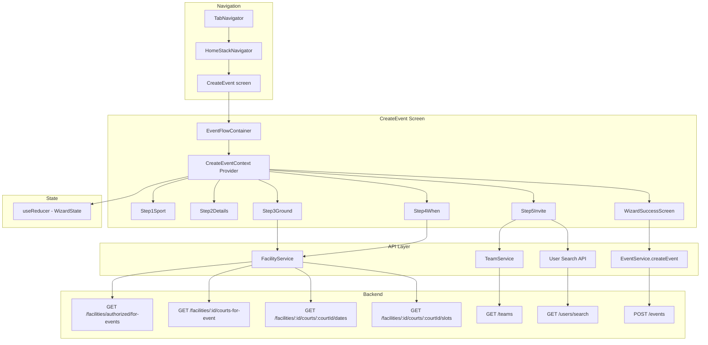

# Design Document: Create Event Flow

## Overview

Replace the existing `CreateEventScreen.tsx` (which uses the `CreationWizard` wrapper) with a new five-screen full-screen progressive slide flow. Each screen occupies the full viewport, slides horizontally, and has no header bar. The bottom tab bar remains visible throughout. The five screens map to: **What** (sport), **How** (event details), **Where** (ground & court), **When** (date & time), and **Who's Invited** (visibility & invitations).

The current implementation bundles all five steps inside a single component with a monolithic `useMemo` for the `steps` array. The redesign splits each screen into its own component, manages wizard state via a local React context (not Redux — wizard state is ephemeral), and introduces new backend endpoints for court/date/time filtering based on reservations vs. facility ownership.

### Key Design Decisions

1. **Local context over Redux** — Wizard state is transient and discarded on unmount. A `CreateEventContext` with `useReducer` keeps it co-located and avoids polluting the global store.
2. **Screen-per-file** — Each of the five steps is a standalone component receiving wizard state via context. This replaces the current approach of inlining all step JSX in a single `useMemo`.
3. **Reuse existing components** — `SportIconGrid`, `FormSelect`, and `WizardSuccessScreen` are retained. The `CreationWizard` shell is replaced by a new `EventFlowContainer` that removes the header/back arrow and uses `Animated.View` for horizontal slide transitions.
4. **Reservation-aware filtering** — New backend endpoints filter courts, dates, and time slots based on whether the organizer owns the facility or has reservations. This replaces the current `getAvailableSlots` bulk-fetch approach.

## Architecture



## Components and Interfaces

### EventFlowContainer

Replaces `CreationWizard`. Renders full-screen with no header bar. Manages the current step index, horizontal slide animation via `Animated.Value`, and the bottom Continue/Create button.

```typescript
interface EventFlowContainerProps {
  children: React.ReactNode; // The 5 step components
}
```

- Reads `currentStep` from `CreateEventContext`
- Renders a `WizardProgressDots` indicator (existing component, 5 dots)
- Renders the active step's component
- Renders a bottom-pinned button: hidden on Step 1 (auto-advance), "Continue" on Steps 2–4, "Create Event" on Step 5
- On Step 1, tapping a sport tile auto-advances (no Continue button)
- Animates `translateX` on step transitions (200ms, same as current `CreationWizard`)

### CreateEventContext

A React context + `useReducer` holding all wizard state.

```typescript
interface WizardState {
  currentStep: number; // 0–4
  sport: SportType | null;
  eventType: EventType | null;
  minAge: string;
  maxAge: string;
  genderRestriction: string;
  skillLevel: string;
  maxParticipants: string;
  price: string;
  facilityId: string;
  facilityName: string;
  isOwner: boolean;
  courtId: string;
  courtName: string;
  selectedDate: string;
  selectedSlots: SlotData[];
  recurring: boolean;
  recurringFrequency: 'weekly' | 'biweekly' | 'monthly' | null;
  recurringEndDate: string;
  visibility: 'private' | 'public' | null;
  invitedItems: InviteItem[];
  minPlayerRating: string;
  isSubmitting: boolean;
  showSuccess: boolean;
  createdEventId: string | null;
}

type WizardAction =
  | { type: 'SET_SPORT'; sport: SportType }
  | { type: 'SET_EVENT_TYPE'; eventType: EventType }
  | { type: 'SET_FIELD'; field: string; value: any }
  | { type: 'SET_FACILITY'; facilityId: string; facilityName: string; isOwner: boolean }
  | { type: 'SET_COURT'; courtId: string; courtName: string }
  | { type: 'RESET_COURT' }
  | { type: 'SET_DATE'; date: string }
  | { type: 'TOGGLE_SLOT'; slot: SlotData; slotsForDate: SlotData[] }
  | { type: 'SET_VISIBILITY'; visibility: 'private' | 'public' }
  | { type: 'ADD_INVITE'; item: InviteItem }
  | { type: 'REMOVE_INVITE'; id: string }
  | { type: 'GO_TO_STEP'; step: number }
  | { type: 'NEXT_STEP' }
  | { type: 'PREV_STEP' }
  | { type: 'SUBMIT_START' }
  | { type: 'SUBMIT_SUCCESS'; eventId: string }
  | { type: 'SUBMIT_FAIL' };
```

### Step Components

| Component | Screen | Headline | Key Behavior |
|-----------|--------|----------|-------------|
| `Step1Sport` | 1 | "What are you playing?" | Renders `SportIconGrid`. On tap, dispatches `SET_SPORT` + `NEXT_STEP`. No Continue button. |
| `Step2Details` | 2 | "How's it set up?" | Event type, age, gender, skill, max participants, price. Continue enabled when eventType is set. |
| `Step3Ground` | 3 | "Where's the game?" | Searchable Ground dropdown, Court dropdown (filtered by reservations or ownership). "Book Court Time" button navigates to Grounds tab. Continue enabled when both ground and court are selected. |
| `Step4When` | 4 | "When's it happening?" | Date dropdown, Time slot selector, Recurring toggle with frequency and end date. Continue enabled when date + at least one slot selected. |
| `Step5Invite` | 5 | Dynamic based on visibility | Private/Public toggle. Private → invite search. Public → min rating filter. "Create Event" button submits. |

### SlotData Interface (unchanged from current)

```typescript
interface SlotData {
  id: string;
  date: string;
  startTime: string;
  endTime: string;
  price: number;
  court: { id: string; name: string; sportType: string; capacity: number };
  isFromRental: boolean;
  rentalId: string | null;
}
```

### InviteItem Interface (unchanged from current)

```typescript
interface InviteItem {
  id: string;
  name: string;
  type: 'roster' | 'player';
  image?: string;
}
```

### "Book Court Time" Navigation

Screen 3 renders a persistent "Book Court Time" button. On press:

```typescript
navigation.navigate('Facilities', {
  screen: 'FacilitiesList',
  params: { openSearch: true },
});
```

This navigates to the Grounds tab. The `FacilitiesListScreen` already has a `HeaderSearchPill` with placeholder "Need a spot?" — the `openSearch` param will trigger the search pill to auto-focus on mount, opening the search modal. The `FacilitiesStackParamList` type for `FacilitiesList` already accepts optional params.

When the user returns to the Home tab and re-enters CreateEvent, the wizard state is lost (expected — the user needs to start fresh after booking a new reservation).

## Data Models

### Existing Models (no changes)

- **Event** — Prisma model with `sportType`, `eventType`, `facilityId`, `timeSlotId`, `rentalId`, `eligibility*` fields, `isPrivate`, `invitedUserIds`
- **Facility** — `id`, `name`, `ownerId` (via `FacilityOwnership`), `sportTypes`, address fields
- **FacilityCourt** — `id`, `name`, `sportType`, `capacity`, `facilityId`
- **FacilityTimeSlot** — `id`, `date`, `startTime` (HH:MM), `endTime` (HH:MM), `status`, `courtId`, `price`
- **FacilityRental** — `id`, `userId`, `timeSlotId`, `status`, `recurringGroupId`

### New/Modified API Response Shapes

#### Courts for Event (new endpoint response)

```typescript
interface CourtForEvent {
  id: string;
  name: string;
  sportType: string;
  capacity: number;
  availableSlotCount: number; // helps user see which courts have availability
}
```

#### Dates for Court (new endpoint response)

```typescript
interface DateForCourt {
  date: string; // ISO date string YYYY-MM-DD
  slotCount: number; // number of available slots on this date
}
```

#### Slots for Court+Date (new endpoint response)

```typescript
interface SlotForDate {
  id: string;
  startTime: string; // HH:MM
  endTime: string; // HH:MM
  price: number;
  isFromRental: boolean;
  rentalId: string | null;
}
```

### New Backend Endpoints

#### 1. `GET /facilities/:facilityId/courts-for-event`

Query params: `userId`, `sportType` (optional)

Logic:
- Determine if user is facility owner
- If owner: return all active courts (optionally filtered by sportType) that have at least one available time slot in the future
- If not owner: return only courts where the user has a confirmed `FacilityRental` with a future `FacilityTimeSlot` (optionally filtered by sportType)

#### 2. `GET /facilities/:facilityId/courts/:courtId/dates`

Query params: `userId`

Logic:
- Determine if user is facility owner
- If owner: return all future dates that have at least one available time slot on this court
- If not owner: return only dates where the user has a confirmed rental on this court

#### 3. `GET /facilities/:facilityId/courts/:courtId/slots`

Query params: `userId`, `date` (YYYY-MM-DD)

Logic:
- Determine if user is facility owner
- If owner: return all available time slots on this court for this date
- If not owner: return only time slots where the user has a confirmed rental

#### 4. `GET /facilities/authorized/for-events` (existing, no changes)

Already returns facilities where user is owner or has confirmed rentals.

### Recurring Event Data

When the recurring toggle is enabled, the create event payload includes:

```typescript
interface RecurringEventPayload {
  recurring: true;
  recurringFrequency: 'weekly' | 'biweekly' | 'monthly';
  recurringEndDate: string; // ISO date
}
```

The backend will create a series of events linked by a `recurringGroupId` (similar to `FacilityRental.recurringGroupId`). This requires a new `recurringGroupId` field on the `Event` model.


## Correctness Properties

*A property is a characteristic or behavior that should hold true across all valid executions of a system — essentially, a formal statement about what the system should do. Properties serve as the bridge between human-readable specifications and machine-verifiable correctness guarantees.*

### Property 1: Progress indicator reflects current step

*For any* step index in the range 0–4, the progress indicator component should render with `current` equal to that index and `total` equal to 5.

**Validates: Requirements 1.6**

### Property 2: Sport selection auto-advances to Step 2

*For any* sport in the available sports list, dispatching a sport selection action should set the wizard's `sport` field to that sport and advance `currentStep` from 0 to 1.

**Validates: Requirements 2.2**

### Property 3: Max Participants label matches event type

*For any* event type value, the Max Participants field label should be "Max Rosters" when the event type is `Game`, and "Max Players" when the event type is `Practice` or `Pickup`.

**Validates: Requirements 3.6, 3.7**

### Property 4: Step 2 Continue button requires event type

*For any* wizard state on Step 2, the Continue button should be enabled if and only if `eventType` is non-null (one of Game, Practice, Pickup).

**Validates: Requirements 3.9**

### Property 5: Court filtering by ownership status

*For any* facility, user, and set of courts with time slots and reservations: if the user is the facility owner, the returned courts should be all active courts with at least one available future time slot; if the user is not the owner, the returned courts should be exactly those courts where the user has a confirmed future reservation.

**Validates: Requirements 4.3, 4.4**

### Property 6: Ground change resets downstream selections

*For any* wizard state where a court, date, or time slots are selected, changing the facility should reset `courtId`, `selectedDate`, and `selectedSlots` to their empty/default values.

**Validates: Requirements 4.5**

### Property 7: Step 3 Continue button requires ground and court

*For any* wizard state on Step 3, the Continue button should be enabled if and only if both `facilityId` and `courtId` are non-empty strings.

**Validates: Requirements 4.8**

### Property 8: Date filtering by ownership status

*For any* facility, court, user, and set of time slots with reservations: if the user is the facility owner, the returned dates should be all future dates with at least one available slot on that court; if the user is not the owner, the returned dates should be exactly those dates where the user has a confirmed reservation on that court.

**Validates: Requirements 5.2, 5.3**

### Property 9: Time slot filtering by ownership status

*For any* facility, court, date, user, and set of time slots with reservations: if the user is the facility owner, the returned slots should be all available slots on that court and date; if the user is not the owner, the returned slots should be exactly those slots where the user has a confirmed reservation.

**Validates: Requirements 5.5, 5.6**

### Property 10: Step 4 Continue button requires date and slot

*For any* wizard state on Step 4, the Continue button should be enabled if and only if `selectedDate` is non-empty and `selectedSlots` has at least one element.

**Validates: Requirements 5.10**

### Property 11: Invite search entity types match event type

*For any* event type and search query: when the event type is `Game` and visibility is `Private`, search results should contain only items of type `roster`; when the event type is `Practice` or `Pickup` and visibility is `Private`, search results should contain items of both type `roster` and type `player` (when matching results exist for both).

**Validates: Requirements 6.4, 6.6**

### Property 12: Event submission payload contains all wizard fields

*For any* valid completed wizard state (all five screens filled), the event creation payload sent to the API should include: `sportType` matching the selected sport, `eventType` matching the selected event type, `facilityId` matching the selected ground, `timeSlotIds` matching the selected slots, `isPrivate` matching the visibility selection, and all eligibility fields (age, gender, skill) matching their wizard values.

**Validates: Requirements 6.11**

### Property 13: API error surfaces error message

*For any* error response from the event creation API, the wizard should display an error message and should not transition to the success screen.

**Validates: Requirements 6.12**

### Property 14: Brand vocabulary compliance

*For any* rendered text string in the Event Flow UI, the string should not contain the forbidden terms "Team" (when referring to a roster), "Members" (when referring to players), or "Facility" (when referring to a ground) in user-facing labels.

**Validates: Requirements 7.1, 7.2, 7.3**

## Error Handling

| Scenario | Handling |
|----------|----------|
| `getAuthorizedFacilities` fails | Show inline error in Ground dropdown with retry option. Disable Continue. |
| `getCourtsForEvent` fails | Show "Couldn't load courts" message below Ground selector. Allow ground re-selection. |
| `getDatesForCourt` / `getSlotsForDate` fails | Show inline error in the respective dropdown. Allow re-selection of upstream field. |
| Invite search fails | Silently fail (current behavior). Show empty results. Log warning. |
| `createEvent` API returns 4xx | Display `Alert.alert` with the error message from the response body. Keep wizard on Step 5. Set `isSubmitting` to false. |
| `createEvent` API returns 5xx | Display generic "Something went wrong. Please try again." alert. Keep wizard on Step 5. |
| Network timeout | Display "Network error. Check your connection and try again." alert. |
| User navigates away mid-flow | Wizard state is lost (context unmounts). No draft persistence — this is intentional for v1. |
| Invalid slot selection (non-contiguous) | The `TOGGLE_SLOT` reducer enforces contiguous selection. Non-adjacent slots are not selectable (disabled state). |

### Validation Rules

- Step 1: `sport` must be a valid `SportType` enum value
- Step 2: `eventType` must be set. `minAge`/`maxAge` are optional but if set, `minAge <= maxAge`. `maxParticipants` must be a positive integer. `price` must be >= 0.
- Step 3: `facilityId` and `courtId` must be non-empty
- Step 4: `selectedDate` must be non-empty, `selectedSlots.length >= 1`. If recurring is enabled, `recurringFrequency` must be set and `recurringEndDate` must be a future date after `selectedDate`.
- Step 5: `visibility` must be set. No further validation required (invites are optional for private, rating filter is optional for public).

## Testing Strategy

### Property-Based Testing

Use `fast-check` (already in the project's dev dependencies per `tech.md`) for property-based tests. Each property test runs a minimum of 100 iterations.

Properties to implement as PBT:

| Property | Test File | Generator Strategy |
|----------|-----------|-------------------|
| Property 2: Sport auto-advance | `tests/create-event-flow/wizard-reducer.property.test.ts` | Generate random `SportType` values |
| Property 3: Max Participants label | `tests/create-event-flow/step2-details.property.test.ts` | Generate random `EventType` values |
| Property 4: Step 2 validation | `tests/create-event-flow/wizard-validation.property.test.ts` | Generate random wizard states with/without eventType |
| Property 5: Court filtering | `tests/create-event-flow/court-filtering.property.test.ts` | Generate random courts, slots, rentals, and ownership flags |
| Property 6: Ground reset | `tests/create-event-flow/wizard-reducer.property.test.ts` | Generate random wizard states with downstream selections, then change facility |
| Property 7: Step 3 validation | `tests/create-event-flow/wizard-validation.property.test.ts` | Generate random wizard states with/without facilityId+courtId |
| Property 8: Date filtering | `tests/create-event-flow/date-filtering.property.test.ts` | Generate random slots, rentals, ownership flags |
| Property 9: Slot filtering | `tests/create-event-flow/slot-filtering.property.test.ts` | Generate random slots, rentals, dates, ownership flags |
| Property 10: Step 4 validation | `tests/create-event-flow/wizard-validation.property.test.ts` | Generate random wizard states with/without date+slots |
| Property 11: Invite search types | `tests/create-event-flow/invite-search.property.test.ts` | Generate random event types, search results with mixed entity types |
| Property 12: Submission payload | `tests/create-event-flow/submit-payload.property.test.ts` | Generate random complete wizard states |
| Property 14: Brand vocabulary | `tests/create-event-flow/brand-vocabulary.property.test.ts` | Generate random wizard states, render text, scan for forbidden terms |

Each test must include a tag comment:
```typescript
// Feature: create-event-flow, Property 5: Court filtering by ownership status
```

### Unit Testing

Unit tests complement property tests for specific examples and edge cases:

- Step 1 renders all sports from `ALL_SPORTS` constant
- Step 1 does not render a Continue button
- Step 2 renders all three event type options (Game, Practice, Pickup)
- Step 3 renders "Book Court Time" button
- Step 3 "Book Court Time" navigates to `Facilities` tab with `{ screen: 'FacilitiesList', params: { openSearch: true } }`
- Step 4 recurring toggle reveals frequency dropdown and end date input
- Step 5 defaults to no visibility selected
- Step 5 "Public" tap reveals min player rating filter
- Success screen renders after successful submission
- Error alert shown on API failure
- Contiguous slot selection enforcement (cannot select non-adjacent slots)
- Age validation: `minAge > maxAge` shows validation error

### Test Configuration

```typescript
// jest.config.js additions (if needed)
{
  testMatch: ['**/tests/create-event-flow/**/*.test.ts'],
}
```

All property tests use `fc.assert(fc.property(...), { numRuns: 100 })` minimum.
