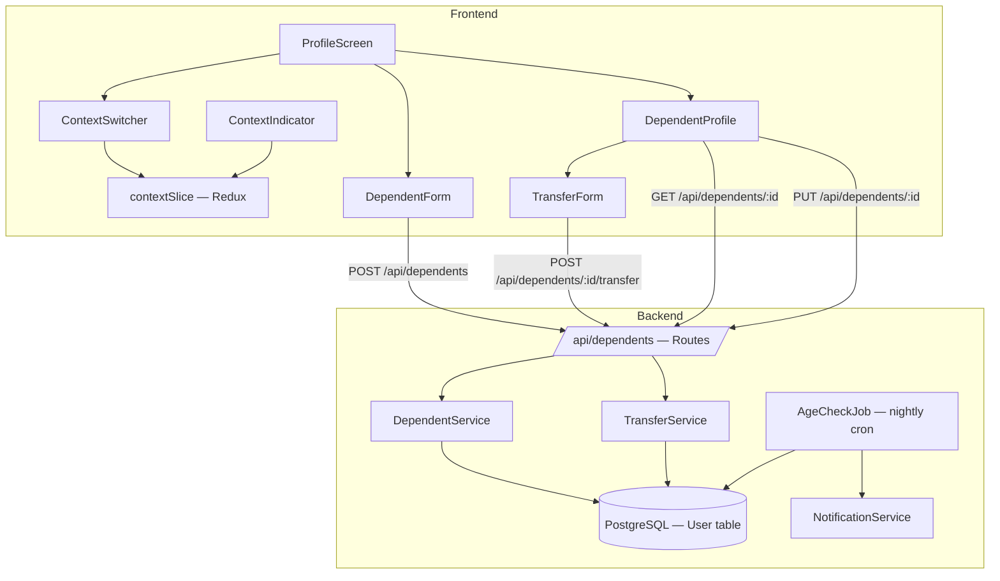
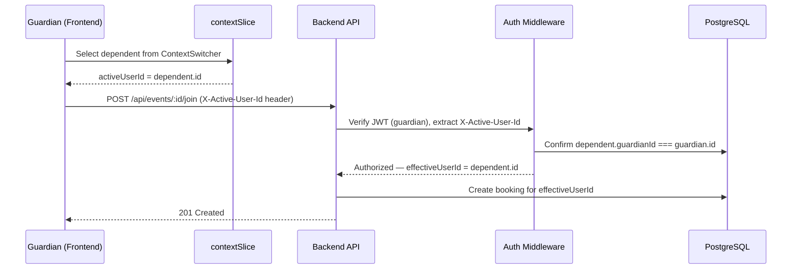

# Design Document: Dependent Accounts

## Overview

Dependent Accounts enables guardians to create and manage under-18 player accounts within Muster. A dependent is a full `User` record with `isDependent = true`, no login credentials, and a `guardianId` foreign key linking it to the guardian's account. The guardian accesses dependent management from the Profile screen and can switch the app's active context between their own account and any dependent. All actions (Join Up, Salutes, Roster memberships, League memberships, bookings, ratings) are scoped to whichever context is active. When a dependent turns 18, a nightly job notifies the guardian, who can then transfer the account to an independent user with full login credentials — preserving all history.

### Key Design Decisions

1. **Dependents are User records, not a separate model.** This avoids duplicating every relation (bookings, events, Salutes, Rosters, Leagues, ratings) and lets existing queries work unchanged — the only difference is how the `userId` is resolved (from auth vs. active context).
2. **Context switching is client-side state.** The guardian remains authenticated; the frontend swaps the `activeUserId` sent in API requests. No server-side session changes are needed.
3. **Age validation is server-enforced.** The backend rejects dependent creation/edit if `dateOfBirth` yields age ≥ 18, and rejects account transfer if age < 18.
4. **Transfer is an in-place mutation.** Setting `isDependent = false`, clearing `guardianId`, and adding credentials on the existing record preserves all foreign-key references without data migration.

## Architecture



### Request Flow — Context-Scoped Actions

All existing API endpoints already accept a `userId` (from auth middleware or request body). Context switching works by having the frontend send the active context's `userId` instead of the guardian's own ID. The backend validates that the guardian owns the dependent before allowing the action.



## Components and Interfaces

### Frontend Components

| Component | Location | Purpose |
|---|---|---|
| `DependentsSection` | `src/components/profile/DependentsSection.tsx` | Lists dependents on ProfileScreen; "Add Dependent" button |
| `ContextSwitcher` | `src/components/profile/ContextSwitcher.tsx` | Bottom-sheet or dropdown to pick active context |
| `ContextIndicator` | `src/components/navigation/ContextIndicator.tsx` | Persistent badge in tab bar or header showing active user |
| `DependentFormScreen` | `src/screens/profile/DependentFormScreen.tsx` | Create / edit dependent form (name, DOB, sport prefs) |
| `DependentProfileScreen` | `src/screens/profile/DependentProfileScreen.tsx` | View dependent stats, ratings, history, Salutes |
| `TransferAccountScreen` | `src/screens/profile/TransferAccountScreen.tsx` | Collect email + password for account transfer |

### New Navigation Routes

```typescript
// Added to ProfileStackParamList
export type ProfileStackParamList = {
  ProfileScreen: undefined;
  EditProfile: undefined;
  Settings: undefined;
  NotificationPreferences: undefined;
  DependentForm: { dependentId?: string };       // create (no param) or edit
  DependentProfile: { dependentId: string };
  TransferAccount: { dependentId: string };
};
```

### Redux State — `contextSlice`

```typescript
// src/store/slices/contextSlice.ts
interface ContextState {
  /** The user ID currently in effect. Defaults to the guardian's own ID. */
  activeUserId: string | null;
  /** Cached list of the guardian's dependents for the switcher. */
  dependents: DependentSummary[];
}

interface DependentSummary {
  id: string;
  firstName: string;
  lastName: string;
  profileImage: string | null;
  dateOfBirth: string;
}
```

The `activeUserId` is read by a custom hook `useActiveUserId()` that all screens use when making API calls. When `activeUserId` matches the guardian's own ID, behavior is identical to today.

### Backend API Endpoints

| Method | Path | Description |
|---|---|---|
| `POST` | `/api/dependents` | Create a dependent for the authenticated guardian |
| `GET` | `/api/dependents` | List all dependents for the authenticated guardian |
| `GET` | `/api/dependents/:id` | Get a single dependent's profile |
| `PUT` | `/api/dependents/:id` | Update a dependent's profile fields |
| `POST` | `/api/dependents/:id/transfer` | Transfer dependent to independent account |

### Backend Services


**DependentService** (`server/src/services/dependent.ts`)

```typescript
class DependentService {
  /** Create a dependent User record linked to the guardian. */
  async createDependent(guardianId: string, data: CreateDependentInput): Promise<User>;

  /** List all dependents for a guardian. */
  async listDependents(guardianId: string): Promise<DependentSummary[]>;

  /** Get full dependent profile (stats, ratings, history). */
  async getDependentProfile(guardianId: string, dependentId: string): Promise<DependentProfile>;

  /** Update dependent fields (name, DOB, sport prefs, image). */
  async updateDependent(guardianId: string, dependentId: string, data: UpdateDependentInput): Promise<User>;
}
```

**TransferService** (`server/src/services/transfer.ts`)

```typescript
class TransferService {
  /** Convert dependent to independent account. Validates age ≥ 18. */
  async transferAccount(guardianId: string, dependentId: string, credentials: TransferCredentials): Promise<User>;
}
```

**AgeCheckJob** (`server/src/jobs/age-check.ts`)

```typescript
/** Nightly job: find dependents who turned 18, send one-time notification to guardian. */
async function processAgeCheck(): Promise<AgeCheckMetrics>;
```

### Auth Middleware Extension

The existing auth middleware is extended with an optional `X-Active-User-Id` header. When present:

1. Validate the JWT as usual (guardian identity).
2. If `X-Active-User-Id` differs from the JWT user ID, verify the target user has `guardianId === jwtUserId` and `isDependent === true`.
3. Set `req.effectiveUserId` to the validated active user ID.
4. All downstream handlers use `req.effectiveUserId` instead of `req.user.userId`.

If the header is absent or matches the JWT user, behavior is unchanged.

## Data Models

### Prisma Schema Changes

```prisma
model User {
  // ... existing fields ...

  // Dependent account fields
  isDependent  Boolean  @default(false)
  guardianId   String?

  // Self-referential relation
  guardian     User?    @relation("GuardianDependents", fields: [guardianId], references: [id])
  dependents   User[]   @relation("GuardianDependents")

  // Track whether the age-18 notification has been sent
  transferNotificationSent Boolean @default(false)
}
```

Key points:
- `guardianId` is a nullable FK referencing `User.id` (self-referential).
- `isDependent` defaults to `false` — existing users are unaffected.
- `transferNotificationSent` prevents the nightly job from sending duplicate notifications.
- The existing `dateOfBirth` field (already required `DateTime`) is used for age calculations — no new date field needed.
- The existing `email` field must become nullable (`String?`) to support dependents with no login credentials. The `password` field is already nullable.

### TypeScript Types (Frontend)

```typescript
// src/types/dependent.ts
export interface CreateDependentInput {
  firstName: string;
  lastName: string;
  dateOfBirth: string;       // ISO 8601 date
  sportPreferences: string[]; // SportType values
  profileImage?: string;
}

export interface UpdateDependentInput {
  firstName?: string;
  lastName?: string;
  dateOfBirth?: string;
  sportPreferences?: string[];
  profileImage?: string;
}

export interface TransferCredentials {
  email: string;
  password: string;
}

export interface DependentSummary {
  id: string;
  firstName: string;
  lastName: string;
  profileImage: string | null;
  dateOfBirth: string;
}

export interface DependentProfile extends DependentSummary {
  sportRatings: PlayerSportRating[];
  eventHistory: EventParticipation[];
  salutesReceived: number;
  rosterMemberships: RosterMembership[];
  leagueMemberships: LeagueMembershipSummary[];
}
```

### Validation Rules

| Rule | Enforced At | Description |
|---|---|---|
| Age < 18 on create | Server + Client | `dateOfBirth` must yield age < 18 at time of submission |
| Age < 18 on edit | Server + Client | Edited `dateOfBirth` must still yield age < 18 |
| Age ≥ 18 on transfer | Server + Client | Transfer only allowed when dependent is 18 or older |
| Guardian ownership | Server (middleware) | `X-Active-User-Id` must reference a dependent whose `guardianId` matches the JWT user |
| Email uniqueness on transfer | Server | Provided email must not already exist in the `users` table |
| Non-null guardianId when isDependent | Server (DB constraint) | Application-level check: if `isDependent = true`, `guardianId` must be non-null |


## Correctness Properties

*A property is a characteristic or behavior that should hold true across all valid executions of a system — essentially, a formal statement about what the system should do. Properties serve as the bridge between human-readable specifications and machine-verifiable correctness guarantees.*

### Property 1: Dependent creation invariants

*For any* valid dependent creation input (name, dateOfBirth yielding age < 18, sport preferences) submitted by an authenticated guardian, the resulting User record SHALL have `isDependent = true`, `guardianId` equal to the guardian's user ID, `email = null`, and `password = null`.

**Validates: Requirements 1.2, 1.5, 10.5, 10.7**

### Property 2: Age validation boundary

*For any* date of birth, the system's age calculation function SHALL return age ≥ 18 if and only if the date is on or before exactly 18 years ago from today. This single validation is used to reject dependent creation (Req 1.3), reject dependent DOB edits (Req 4.2), and reject transfers for under-18 dependents (Req 8.5). Edge cases: DOB exactly 18 years ago today (age = 18, valid for transfer, invalid for creation), DOB one day after 18 years ago (age = 17, valid for creation, invalid for transfer).

**Validates: Requirements 1.3, 4.2, 8.5**

### Property 3: List dependents completeness

*For any* guardian with N dependent User records (where each has `guardianId = guardian.id` and `isDependent = true`), the list dependents endpoint SHALL return exactly those N records and no others. The returned set of IDs SHALL equal the set of dependent IDs in the database for that guardian.

**Validates: Requirements 2.1, 5.2**

### Property 4: Dependent profile data scoping

*For any* dependent, the dependent profile endpoint SHALL return only data (sport ratings, event participations, Salutes, Roster memberships, League memberships) where the associated `userId` matches the dependent's ID. No records belonging to the guardian or other dependents SHALL appear.

**Validates: Requirements 3.2**

### Property 5: Dependent update round-trip

*For any* valid update input (name, dateOfBirth yielding age < 18, sport preferences, profile image), after updating a dependent and then reading the dependent's profile, the returned fields SHALL match the submitted update values.

**Validates: Requirements 4.3**

### Property 6: Context switch preserves auth and changes active user

*For any* context switch from the guardian (or another dependent) to a target dependent, the Redux auth state (JWT token, guardian user object) SHALL remain unchanged, while `contextSlice.activeUserId` SHALL equal the target dependent's ID. Switching back to the guardian SHALL restore `activeUserId` to the guardian's own ID.

**Validates: Requirements 5.3, 5.4, 5.5, 6.3**

### Property 7: Action scoping to active context

*For any* API request made while `activeUserId` is set to a dependent's ID, the middleware SHALL resolve `req.effectiveUserId` to the dependent's ID (not the guardian's). Consequently, any record created by that request (booking, event participation, Roster membership, League membership, game participation) SHALL have its `userId` field equal to the dependent's ID.

**Validates: Requirements 7.1, 7.2, 7.3, 7.4, 7.5, 7.6**

### Property 8: Transfer produces independent account with preserved history

*For any* dependent who is 18 or older, after a successful account transfer with valid email and password, the User record SHALL have `isDependent = false`, `guardianId = null`, `email` set to the provided value, and `password` set to a bcrypt hash. The count of bookings, event participations, Salutes received, Roster memberships, League memberships, and game participations associated with that user ID SHALL be identical before and after the transfer.

**Validates: Requirements 8.2, 8.3, 8.4**

### Property 9: Age check job notification correctness

*For any* set of dependent User records, the age check job SHALL produce Transfer_Notifications for exactly those dependents where `dateOfBirth` yields age ≥ 18 AND `transferNotificationSent = false`. Dependents who are still under 18 or who have already been notified SHALL NOT receive a notification.

**Validates: Requirements 9.1**

### Property 10: Age check job idempotence

*For any* database state, running the age check job twice in succession SHALL produce notifications only on the first run. The second run SHALL produce zero notifications (because `transferNotificationSent` was set to `true` on the first run).

**Validates: Requirements 9.4**

## Error Handling

| Scenario | HTTP Status | Error Message | Handling |
|---|---|---|---|
| DOB yields age ≥ 18 on dependent creation | 400 | "Dependent must be under 18" | Server validates; client pre-validates with date picker constraint |
| DOB yields age ≥ 18 on dependent edit | 400 | "Dependent must be under 18" | Same as above |
| Transfer attempted for dependent under 18 | 400 | "Dependent must be 18 or older to transfer" | Server validates age; client disables transfer button if under 18 |
| Transfer email already exists | 409 | "Email address is already in use" | Server checks uniqueness before update |
| X-Active-User-Id references non-existent user | 403 | "Invalid active user context" | Middleware rejects; client clears context |
| X-Active-User-Id references user not owned by guardian | 403 | "Not authorized to act as this user" | Middleware verifies guardianId match |
| X-Active-User-Id references non-dependent user | 403 | "Not authorized to act as this user" | Middleware checks isDependent flag |
| Guardian tries to edit/view another guardian's dependent | 403 | "Not authorized" | Service layer verifies ownership |
| Missing required fields on dependent creation | 400 | Field-specific validation errors | Express validator middleware |
| Network error during dependent creation | — | "Something went wrong. Please try again." | Client shows retry option |
| Transfer password too weak | 400 | "Password must be at least 8 characters" | Server + client validation |

### Context Recovery

If the active context references a dependent that no longer exists (e.g., transferred account, data inconsistency), the `contextSlice` middleware detects the stale reference on the next API 403 response and automatically resets `activeUserId` to the guardian's own ID, showing a brief toast notification.

## Testing Strategy

### Unit Tests

Unit tests cover specific examples, edge cases, and error conditions:

- **Age calculation**: Exact boundary (18th birthday today, day before, day after), leap year birthdays
- **Dependent creation validation**: Missing fields, empty name, future DOB, DOB exactly 18 years ago
- **Transfer validation**: Under-18 rejection, duplicate email rejection, weak password rejection
- **Context middleware**: Missing header (falls through to JWT user), valid dependent header, invalid dependent header, non-dependent user header
- **Age check job**: No dependents, all under 18, mix of eligible and already-notified, empty database
- **DependentsSection component**: Renders list of dependents, renders empty state, "Add Dependent" button navigates
- **ContextSwitcher component**: Shows guardian + dependents, selection dispatches Redux action
- **ContextIndicator component**: Shows guardian name when no dependent active, shows dependent name with badge when dependent active

### Property-Based Tests

Property-based tests use **fast-check** (already in the project) with a minimum of 100 iterations per property. Each test is tagged with a comment referencing the design property.

| Property | Test File | What It Generates |
|---|---|---|
| P1: Dependent creation invariants | `server/src/services/__tests__/dependent.property.test.ts` | Random valid names, DOBs (age 0–17), sport preference arrays |
| P2: Age validation boundary | `server/src/utils/__tests__/age-validation.property.test.ts` | Random dates spanning ±2 years around the 18-year boundary |
| P3: List dependents completeness | `server/src/services/__tests__/dependent.property.test.ts` | Random guardian with 0–10 dependents, verify list = exact set |
| P4: Dependent profile data scoping | `server/src/services/__tests__/dependent.property.test.ts` | Random dependent with mixed records, verify all returned records belong to dependent |
| P5: Dependent update round-trip | `server/src/services/__tests__/dependent.property.test.ts` | Random valid update payloads, verify read-after-write equality |
| P6: Context switch preserves auth | `tests/store/contextSlice.property.test.ts` | Random sequences of context switches, verify auth state invariant |
| P7: Action scoping to active context | `server/src/middleware/__tests__/active-context.property.test.ts` | Random guardian + dependent pairs, verify effectiveUserId resolution |
| P8: Transfer preserves history | `server/src/services/__tests__/transfer.property.test.ts` | Random dependents with varying history counts, verify counts unchanged |
| P9: Age check notification correctness | `server/src/jobs/__tests__/age-check.property.test.ts` | Random sets of dependents with varying ages and notification states |
| P10: Age check idempotence | `server/src/jobs/__tests__/age-check.property.test.ts` | Random eligible dependents, run job twice, verify second run produces 0 notifications |

Each property test includes a tag comment:
```typescript
// Feature: dependent-accounts, Property 1: Dependent creation invariants
```

### Integration Tests

- **Full dependent lifecycle**: Create → list → view profile → edit → context switch → perform action → transfer
- **Auth middleware with context header**: End-to-end request with `X-Active-User-Id` header through to database write
- **Age check job with real database**: Seed dependents at various ages, run job, verify notification records
