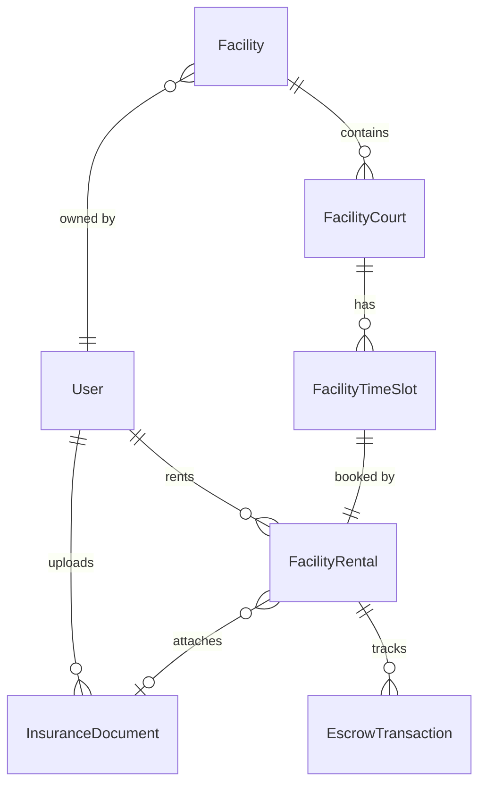
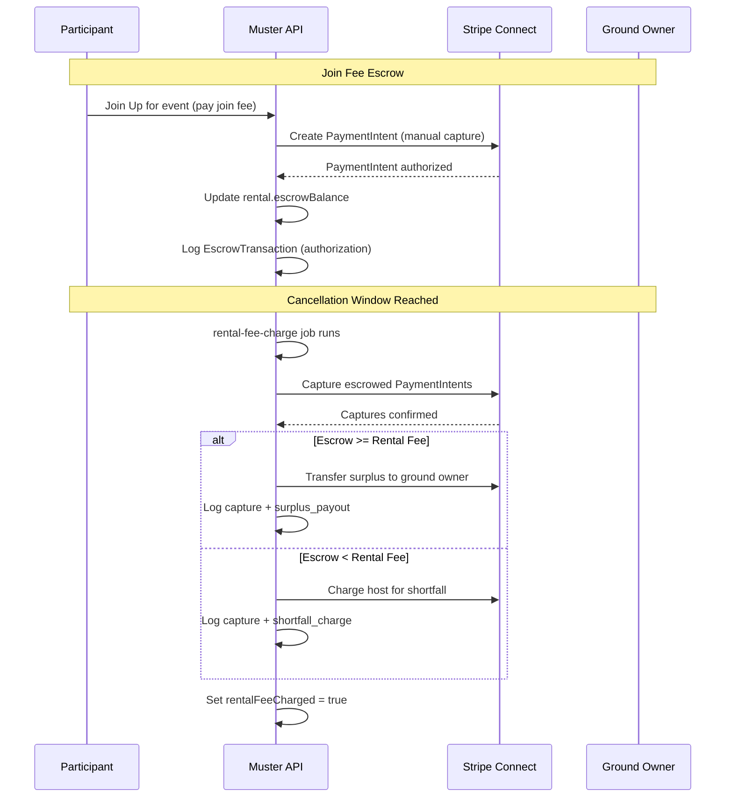

# Design Document: Insurance, Booking & Escrow

## Overview

This design extends Muster with three interconnected capabilities:

1. **Insurance Document Management** — Users upload and manage proof-of-insurance documents on their Profile Screen. A nightly cron job expires stale documents and sends 30-day warning notifications.
2. **Ground Insurance Requirement & Reservation Approval** — Ground owners toggle a `requiresInsurance` flag on their facility. When enabled, renters must attach a valid insurance document to their reservation, which enters a `pending_approval` state until the ground owner approves or denies it.
3. **Escrow-Based Rental Fee Charging** — Join fees from event participants are held via Stripe manual-capture PaymentIntents. When the reservation enters the cancellation window, a cron job captures escrowed funds to cover the rental fee, pays out surplus to the host, or charges the host for any shortfall.

All payment flows use Stripe Connect — the platform never holds funds. Idempotency keys follow the existing format in `server/src/utils/idempotency.ts`.

## Architecture

```mermaid
flowchart TD
    subgraph Frontend ["React Native (Expo)"]
        PS[Profile Screen]
        CFS[Create/Edit Facility Screen]
        HS[Home Screen]
        FDS[Facility Details Screen]
        IDS[InsuranceDocumentsSection]
        IDF[InsuranceDocumentForm]
        ISel[InsuranceDocumentSelector]
        PRS[PendingReservationsSection]
        ETL[EscrowTransactionLog]
    end

    subgraph Backend ["Express.js API"]
        IDR["/api/insurance-documents"]
        RAR["/api/reservation-approvals"]
        RR["/api/rentals (extended)"]
        FR["/api/facilities (extended)"]
        SWH["/api/stripe/webhooks (extended)"]
    end

    subgraph Services
        IDSS[InsuranceDocumentService]
        ETSS[EscrowTransactionService]
        ES[EscrowService (extended)]
        NS[NotificationService (extended)]
        IUS[ImageUploadService (extended)]
    end

    subgraph Jobs
        IEJ[insurance-expiry job]
        RFCJ[rental-fee-charge job]
    end

    subgraph External
        Stripe[Stripe Connect]
        DB[(PostgreSQL / Prisma)]
    end

    PS --> IDS --> IDR
    PS --> IDF --> IDR
    CFS --> FR
    HS --> PRS --> RAR
    FDS --> ISel --> RR
    FDS --> ETL --> ETSS

    IDR --> IDSS --> DB
    IDR --> IUS
    RAR --> NS
    RAR --> DB
    RR --> ES --> Stripe
    RR --> ETSS --> DB
    SWH --> ETSS
    IEJ --> IDSS
    IEJ --> NS
    RFCJ --> ES
    RFCJ --> ETSS
```

### Key Architectural Decisions

1. **Insurance documents stored as files on disk (dev) / S3 (prod)** — Reuses the existing `DocumentService` multer pattern for PDF/JPEG/PNG uploads with a 10 MB limit.
2. **Reservation approval is a status transition on `FacilityRental`** — Adding `pending_approval` to the existing `status` field avoids a separate approval table. The time slot is marked `rented` immediately to hold it.
3. **Escrow for join fees uses the existing `escrow.ts` pattern** — New `EscrowTransactionService` logs every financial event to a dedicated `EscrowTransaction` table for auditability.
4. **Two new cron jobs** — `insurance-expiry` (nightly) and `rental-fee-charge` (every 15 minutes) follow the `node-cron` pattern in `server/src/jobs/index.ts`.
5. **RTK Query for frontend data fetching** — New `insuranceDocumentsApi.ts` slice follows the existing pattern in `src/store/api/`.

## Components and Interfaces

### Backend Routes

#### `POST /api/insurance-documents` — Upload insurance document
- Accepts multipart form: `file` (PDF/JPEG/PNG, ≤10 MB), `policyName` (string), `expiryDate` (ISO date string)
- Validates file type, size, required fields, and that expiry date is in the future
- Creates `InsuranceDocument` record with status `active`
- Returns the created document

#### `GET /api/insurance-documents` — List user's insurance documents
- Query param: `userId` (required), `status` (optional: `active` | `expired`)
- Returns all documents for the user, ordered by `createdAt` desc

#### `GET /api/insurance-documents/:id` — Get single document
- Returns document record including `documentUrl` for viewing

#### `DELETE /api/insurance-documents/:id` — Delete insurance document
- Only the owning user can delete
- Removes file from storage and deletes DB record

#### `GET /api/reservation-approvals` — List pending reservations for ground owner
- Query param: `ownerId` (required)
- Returns all `FacilityRental` records with status `pending_approval` across the owner's facilities, including renter info, court, time slot, and attached insurance document

#### `POST /api/reservation-approvals/:rentalId/approve` — Approve reservation
- Transitions rental status from `pending_approval` to `confirmed`
- Sends confirmation notification to renter

#### `POST /api/reservation-approvals/:rentalId/deny` — Deny reservation
- Transitions rental status from `pending_approval` to `cancelled`
- Releases the held time slot (sets it back to `available`)
- Sends denial notification to renter
- No payment is created or captured

### Backend Services

#### `InsuranceDocumentService`
```typescript
class InsuranceDocumentService {
  async create(userId: string, file: Express.Multer.File, policyName: string, expiryDate: Date): Promise<InsuranceDocument>;
  async listByUser(userId: string, status?: string): Promise<InsuranceDocument[]>;
  async getById(id: string): Promise<InsuranceDocument | null>;
  async delete(id: string, userId: string): Promise<void>;
  async processExpiry(): Promise<{ expired: number; notified: number }>;
  async validateForAttachment(documentId: string): Promise<boolean>;
}
```

#### `EscrowTransactionService`
```typescript
class EscrowTransactionService {
  async logTransaction(data: {
    rentalId: string;
    type: 'authorization' | 'capture' | 'surplus_payout' | 'shortfall_charge' | 'refund';
    amount: number;
    stripePaymentIntentId?: string;
    status: 'pending' | 'completed' | 'failed';
  }): Promise<EscrowTransaction>;
  async getByRental(rentalId: string): Promise<EscrowTransaction[]>;
  async chargeRentalFee(rentalId: string): Promise<void>;
}
```

### Extended Rental Route (`server/src/routes/rentals.ts`)

The existing `POST /facilities/:facilityId/courts/:courtId/slots/:slotId/rent` route is extended:
- If `facility.requiresInsurance` is `true`:
  - Requires `insuranceDocumentId` in request body
  - Validates the document is `active` and belongs to the renter
  - Creates rental with status `pending_approval` instead of `confirmed`
  - Stores `attachedInsuranceDocumentId` on the rental record
- If `facility.requiresInsurance` is `false`:
  - Existing flow unchanged

### Extended Facility Routes (`server/src/routes/facilities.ts`)

The existing `POST /` and `PUT /:id` routes accept `requiresInsurance` (boolean) in the request body and persist it to the facility record.

### Frontend Components

#### `InsuranceDocumentsSection` (`src/components/profile/InsuranceDocumentsSection.tsx`)
- Renders inside `ProfileScreen` below existing sections
- Lists all user insurance documents with status badges
- Expired documents shown grayed out with "Expired" label
- "Add Insurance Document" button opens `InsuranceDocumentForm`

#### `InsuranceDocumentForm` (`src/components/profile/InsuranceDocumentForm.tsx`)
- Modal/screen with file picker, policy name input, expiry date picker
- Client-side validation for required fields and future expiry date
- Calls `POST /api/insurance-documents`

#### `InsuranceDocumentSelector` (`src/components/bookings/InsuranceDocumentSelector.tsx`)
- Shown during reservation flow when `facility.requiresInsurance` is `true`
- Lists only `active` documents
- If no active documents, shows blocking message with link to Profile Screen
- Selected document ID is sent with the rental request

#### `PendingReservationsSection` (`src/components/home/PendingReservationsSection.tsx`)
- Shown on Home Screen for users who own facilities
- Lists pending reservations with renter name, court, date/time
- Tap to view details and attached insurance document
- Approve/Deny buttons

#### `EscrowTransactionLog` (`src/components/facilities/EscrowTransactionLog.tsx`)
- Shown on ground management screen for each reservation
- Lists all escrow transactions: type, amount, timestamp, status
- Only visible to the ground owner

### RTK Query API (`src/store/api/insuranceDocumentsApi.ts`)
- `useGetInsuranceDocumentsQuery({ userId, status? })`
- `useUploadInsuranceDocumentMutation()`
- `useDeleteInsuranceDocumentMutation()`
- `useGetPendingReservationsQuery({ ownerId })`
- `useApproveReservationMutation()`
- `useDenyReservationMutation()`
- `useGetEscrowTransactionsQuery({ rentalId })`


## Data Models

### New Table: `InsuranceDocument`

```prisma
model InsuranceDocument {
  id                     String   @id @default(uuid())
  documentUrl            String
  policyName             String
  expiryDate             DateTime
  status                 String   @default("active") // "active" | "expired"
  expiryNotificationSent Boolean  @default(false)
  createdAt              DateTime @default(now())
  updatedAt              DateTime @updatedAt

  // Foreign Keys
  userId String

  // Relations
  user    User             @relation(fields: [userId], references: [id], onDelete: Cascade)
  rentals FacilityRental[]

  @@index([userId])
  @@index([status])
  @@index([expiryDate])
  @@map("insurance_documents")
}
```

### New Table: `EscrowTransaction`

```prisma
model EscrowTransaction {
  id                    String   @id @default(uuid())
  type                  String   // "authorization" | "capture" | "surplus_payout" | "shortfall_charge" | "refund"
  amount                Float    // Amount in cents (USD)
  status                String   @default("pending") // "pending" | "completed" | "failed"
  stripePaymentIntentId String?
  createdAt             DateTime @default(now())

  // Foreign Keys
  rentalId String

  // Relations
  rental FacilityRental @relation(fields: [rentalId], references: [id], onDelete: Cascade)

  @@index([rentalId])
  @@index([type])
  @@map("escrow_transactions")
}
```

### Extended: `Facility` model

Add one column:

```prisma
requiresInsurance Boolean @default(false)
```

### Extended: `FacilityRental` model

Add three columns and one relation:

```prisma
// Insurance attachment
attachedInsuranceDocumentId String?

// Escrow tracking
escrowBalance    Float   @default(0) // Cumulative escrowed join-fee amount in cents
rentalFeeCharged Boolean @default(false)

// Relations (add to existing relations block)
attachedInsuranceDocument InsuranceDocument? @relation(fields: [attachedInsuranceDocumentId], references: [id])
escrowTransactions        EscrowTransaction[]
```

The existing `status` field already supports `"confirmed"`, `"cancelled"`, `"completed"`, `"no_show"`. We add `"pending_approval"` as a valid value — no schema change needed since it's a `String` column, but all code that checks status must be updated to handle the new value.

### Extended: `User` model

Add relation:

```prisma
insuranceDocuments InsuranceDocument[]
```

### Entity Relationship Diagram



### Cron Job: `insurance-expiry`

- Schedule: Daily at 01:00 UTC (after time slot maintenance at 00:00)
- Logic:
  1. Query all `InsuranceDocument` records where `status = 'active'` and `expiryDate < now()`
  2. Batch update status to `'expired'`
  3. Query all `InsuranceDocument` records where `status = 'active'`, `expiryNotificationSent = false`, and `expiryDate` is within 30 days
  4. Send push notification via `NotificationService` for each
  5. Set `expiryNotificationSent = true` on notified records

### Cron Job: `rental-fee-charge`

- Schedule: Every 15 minutes
- Logic:
  1. Query all `FacilityRental` records where `status = 'confirmed'`, `rentalFeeCharged = false`, and the reservation start time is within `cancellationPolicyHours` of now
  2. For each rental, call `EscrowTransactionService.chargeRentalFee(rentalId)`:
     a. Sum all authorized escrow PaymentIntents for the rental
     b. If `escrowBalance >= totalPrice`: capture intents to cover rental fee, pay surplus to host via Stripe Connect transfer, log transactions
     c. If `escrowBalance < totalPrice`: capture all intents, charge host for shortfall, log transactions
     d. Set `rentalFeeCharged = true`
     e. On capture failure: cancel all successfully captured intents, log failure, retry on next run

### Stripe Payment Flow




## Correctness Properties

*A property is a characteristic or behavior that should hold true across all valid executions of a system — essentially, a formal statement about what the system should do. Properties serve as the bridge between human-readable specifications and machine-verifiable correctness guarantees.*

### Property 1: Valid upload creates active record

*For any* valid insurance document submission (non-empty file of allowed type ≤ 10 MB, non-empty policy name, and expiry date in the future), the system should create an `InsuranceDocument` record with `status = "active"`, the correct `userId`, `policyName`, `expiryDate`, and a non-empty `documentUrl`.

**Validates: Requirements 1.3**

### Property 2: File validation rejects invalid types and sizes

*For any* file whose MIME type is not in `["application/pdf", "image/jpeg", "image/png"]` or whose size exceeds 10 MB, the upload endpoint should reject the request and return a validation error without creating a record.

**Validates: Requirements 1.4**

### Property 3: Missing or invalid fields rejected

*For any* insurance document submission where at least one required field (document file, policy name, expiry date) is missing, or where the expiry date is in the past, the system should reject the submission with a validation error identifying the problem and no record should be created.

**Validates: Requirements 1.5, 1.6**

### Property 4: Expiry job correctly transitions expired documents

*For any* set of `InsuranceDocument` records, after the nightly expiry job runs, every document whose `expiryDate` is before the current time should have `status = "expired"`, and every document whose `expiryDate` is in the future should retain `status = "active"`.

**Validates: Requirements 2.1**

### Property 5: 30-day expiry notification sent exactly once

*For any* `InsuranceDocument` with `status = "active"` and `expiryDate` within 30 days, the nightly expiry job should send a notification and set `expiryNotificationSent = true`. Running the job a second time should not send a duplicate notification for the same document (idempotence: `f(f(x)) = f(x)` on the notification state).

**Validates: Requirements 2.4, 2.5**

### Property 6: Document selector returns only active documents

*For any* user with a mix of active and expired insurance documents, querying the selector endpoint with `status = "active"` should return only documents with `status = "active"` and never include expired documents.

**Validates: Requirements 2.3, 4.1**

### Property 7: requiresInsurance round-trip

*For any* facility and *for any* boolean value `v`, setting `requiresInsurance = v` via the update endpoint and then reading the facility back should return `requiresInsurance = v`.

**Validates: Requirements 3.3, 3.4**

### Property 8: Insurance-required reservation creates pending_approval with correct attachment

*For any* reservation submission at a facility where `requiresInsurance = true`, given a valid active insurance document, the created `FacilityRental` should have `status = "pending_approval"`, `attachedInsuranceDocumentId` equal to the submitted document ID, and the associated time slot should have `status = "rented"`.

**Validates: Requirements 4.2, 5.1**

### Property 9: Reservation blocked when renter has no active documents

*For any* renter with zero `InsuranceDocument` records with `status = "active"`, attempting to create a reservation at a facility where `requiresInsurance = true` should be rejected with an error message, and no `FacilityRental` record should be created.

**Validates: Requirements 4.3**

### Property 10: Non-insurance reservation proceeds without insurance requirement

*For any* facility where `requiresInsurance = false`, a reservation submission without an `insuranceDocumentId` should succeed and create a `FacilityRental` with `status = "confirmed"` (the standard flow), with `attachedInsuranceDocumentId = null`.

**Validates: Requirements 4.4**

### Property 11: Pending approval slot prevents double-booking

*For any* time slot that has a `FacilityRental` with `status = "pending_approval"`, attempting to create a second rental for the same time slot should fail with a conflict error.

**Validates: Requirements 5.2**

### Property 12: Approve transitions pending_approval to confirmed

*For any* `FacilityRental` with `status = "pending_approval"`, calling the approve endpoint should transition the status to `"confirmed"` and the time slot should remain `"rented"`.

**Validates: Requirements 6.4**

### Property 13: Deny transitions to cancelled and releases slot

*For any* `FacilityRental` with `status = "pending_approval"`, calling the deny endpoint should transition the status to `"cancelled"`, set the associated time slot back to `"available"`, and create zero Stripe PaymentIntents or charges.

**Validates: Requirements 6.5, 6.6**

### Property 14: Escrow PaymentIntent has correct Stripe properties

*For any* join fee escrow creation, the resulting Stripe PaymentIntent should have `capture_method = "manual"`, `transfer_group` equal to the reservation ID, a non-empty `idempotencyKey`, `transfer_data.destination` set to the facility's Stripe Connect account ID, and `application_fee_amount = floor(amount * PLATFORM_FEE_RATE)`.

**Validates: Requirements 7.1, 7.2, 7.3, 7.5, 8.5**

### Property 15: Escrow balance invariant

*For any* reservation with N authorized escrow PaymentIntents, the `escrowBalance` field on the `FacilityRental` record should equal the sum of all authorized PaymentIntent amounts.

**Validates: Requirements 7.4**

### Property 16: Rental fee charge job selects correct rentals

*For any* set of `FacilityRental` records, the rental-fee-charge job should only process rentals where `status = "confirmed"`, `rentalFeeCharged = false`, and the reservation start time is within `cancellationPolicyHours` of the current time. Rentals outside the window, already charged, or not confirmed should be skipped.

**Validates: Requirements 8.1**

### Property 17: Sufficient escrow captures and pays surplus

*For any* reservation where `escrowBalance >= totalPrice`, after the rental fee charge completes, `rentalFeeCharged` should be `true`, the captured amount should equal `totalPrice`, and if `escrowBalance > totalPrice`, a surplus transfer of `escrowBalance - totalPrice` should be issued to the host's Stripe Connect account.

**Validates: Requirements 8.2, 8.3**

### Property 18: Insufficient escrow captures all and charges shortfall

*For any* reservation where `escrowBalance < totalPrice`, after the rental fee charge completes, all escrowed PaymentIntents should be captured, the host should be charged `totalPrice - escrowBalance` for the shortfall, and `rentalFeeCharged` should be `true`.

**Validates: Requirements 8.4**

### Property 19: Capture failure triggers rollback

*For any* rental fee charge where at least one PaymentIntent capture fails, all successfully captured intents for that reservation should be cancelled (released), `rentalFeeCharged` should remain `false`, and a failure should be logged.

**Validates: Requirements 8.6**

### Property 20: Every escrow operation is logged

*For any* escrow-related operation (authorization, capture, surplus payout, shortfall charge, refund), a corresponding `EscrowTransaction` record should be created with the correct `type`, `amount`, `rentalId`, and `status`.

**Validates: Requirements 9.1**

### Property 21: Escrow transaction log access restricted to ground owner

*For any* user who is not the ground owner of the facility associated with a reservation, requesting the escrow transaction log for that reservation should be denied with a 403 error.

**Validates: Requirements 9.3**

## Error Handling

| Scenario | Handling |
|---|---|
| File upload exceeds 10 MB | Multer rejects with 413; client shows "File too large" |
| Invalid file type (not PDF/JPEG/PNG) | Multer rejects with 400; client shows "Unsupported file type" |
| Insurance document expired between selection and submission | Server re-validates document status at submission; returns 400 with "Insurance document has expired" |
| Approve/deny a rental not in `pending_approval` state | Returns 409 Conflict with "Reservation is not pending approval" |
| Stripe PaymentIntent creation fails | Returns 502; logs error; client shows "Payment processing failed, please try again" |
| Partial capture failure during rental fee charge | Cancels all successfully captured intents via `paymentIntents.cancel()`; logs failure to `EscrowTransaction` with status `failed`; job retries on next run |
| Stripe Connect account not set up for facility | Returns 400 with "Facility is not set up to receive payments"; blocks escrow creation |
| Concurrent rental attempts on same time slot | Prisma unique constraint on `timeSlotId` prevents duplicates; second request gets 409 |
| Nightly expiry job fails mid-run | Each document processed independently; partial progress is committed; failed documents retried next run |
| Insurance document deleted while attached to pending reservation | Soft-check at approval time; ground owner sees "Document no longer available" warning |

## Testing Strategy

### Unit Tests

- `InsuranceDocumentService`: creation with valid/invalid inputs, expiry processing, notification flag idempotency
- `EscrowTransactionService`: transaction logging, rental fee charge with sufficient/insufficient/zero escrow
- Reservation approval: approve/deny state transitions, slot release on deny
- File validation: MIME type checking, size limits
- Rental route extension: insurance requirement branching, document attachment
- Facility route extension: `requiresInsurance` persistence

### Property-Based Tests

Use **fast-check** (already in the project's dev dependencies per `tech.md`).

Each property test must:
- Run a minimum of **100 iterations**
- Reference its design document property with a tag comment: `// Feature: insurance-booking-escrow, Property N: <title>`
- Each correctness property is implemented by a **single** property-based test

Property tests to implement:
1. **Property 1**: Generate random valid inputs → verify active record created
2. **Property 2**: Generate random invalid file types/sizes → verify rejection
3. **Property 3**: Generate random combinations of missing fields and past dates → verify rejection
4. **Property 4**: Generate random document sets with mixed expiry dates → run job → verify correct status transitions
5. **Property 5**: Run expiry job twice on documents within 30 days → verify notification sent exactly once
6. **Property 6**: Generate random document sets with mixed statuses → verify selector returns only active
7. **Property 7**: Generate random boolean values → set and read back `requiresInsurance`
8. **Property 8**: Generate random valid reservations at insurance-required grounds → verify pending_approval + attachment + slot held
9. **Property 9**: Generate random renters with no active docs → verify reservation blocked
10. **Property 10**: Generate random reservations at non-insurance grounds → verify standard flow
11. **Property 11**: Generate random pending_approval rentals → attempt second rental on same slot → verify rejection
12. **Property 12**: Generate random pending_approval rentals → approve → verify confirmed
13. **Property 13**: Generate random pending_approval rentals → deny → verify cancelled + slot released + no payment
14. **Property 14**: Generate random escrow creation params → verify PaymentIntent properties (mock Stripe)
15. **Property 15**: Generate random sequences of join fee payments → verify escrowBalance = sum of amounts
16. **Property 16**: Generate random rental sets with mixed states/times → verify job selects only eligible rentals
17. **Property 17**: Generate random rentals where escrow >= price → verify capture + surplus transfer
18. **Property 18**: Generate random rentals where escrow < price → verify capture all + shortfall charge
19. **Property 19**: Simulate partial capture failures → verify rollback of captured intents
20. **Property 20**: Generate random escrow operations → verify corresponding transaction records
21. **Property 21**: Generate random non-owner users → verify 403 on escrow log access

### Integration Tests

Located in `server/src/tests/integration/`:
- Full reservation flow: upload document → create insurance-required facility → submit reservation → approve → join event → escrow hold → cancellation window → rental fee charge
- Denial flow: submit reservation → deny → verify slot released, no charges
- Expiry flow: create document with near-future expiry → run job → verify expired status and notification
