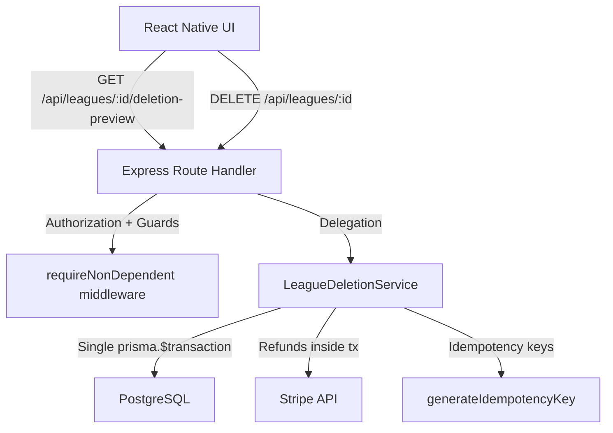

# Design Document: League Deletion Cascade

## Overview

This design replaces the existing naive `prisma.league.delete()` with a comprehensive, atomic deletion flow. The new system introduces a `lockedFromDeletion` field on the League model that permanently locks leagues once any match goes live or completes. For unlocked leagues, a dedicated `LeagueDeletionService` orchestrates the full cascade: issuing Stripe refunds for player dues, crediting roster balances for membership fees, detaching facility rentals (preserving them for the original user), deleting linked events, and finally deleting the league — all within a single Prisma interactive transaction. A preview endpoint lets the Commissioner review the full impact before confirming, and the React Native UI hides the delete button entirely for locked leagues.

## Architecture

The feature spans three layers:



**Key design decisions:**

1. **Separate service file** — `server/src/services/LeagueDeletionService.ts` keeps the route handler thin and the business logic testable in isolation.
2. **Stripe refunds inside the Prisma transaction** — If any refund fails, the transaction rolls back all DB changes. This guarantees atomicity across Stripe + DB operations.
3. **Lock via `lockedFromDeletion` field** — Set by a Prisma middleware hook when any match transitions to `in_progress` or `completed`, not checked only at deletion time. This makes the lock proactive and tamper-proof.
4. **Preview as separate GET endpoint** — `GET /api/leagues/:id/deletion-preview` returns a `DeletionImpactSummary` without side effects, letting the UI render a confirmation screen.
5. **Rentals preserved, not deleted** — FacilityRentals are detached from matches/events but never deleted or cancelled, so the original user keeps their court reservation.

## Components and Interfaces

### 1. LeagueDeletionService (`server/src/services/LeagueDeletionService.ts`)

```typescript
export interface DeletionImpactSummary {
  leagueId: string;
  leagueName: string;
  eventCount: number;
  rentalCount: number;
  stripeRefunds: {
    count: number;
    totalAmount: number; // in cents
  };
  rosterBalanceRefunds: {
    count: number;
    totalAmount: number; // in USD
  };
}

export interface DeletionResult extends DeletionImpactSummary {
  success: true;
}

export class LeagueDeletionService {
  /**
   * Compute the impact of deleting a league without performing any mutations.
   * Used by the preview endpoint.
   */
  async getDeletionPreview(leagueId: string): Promise<DeletionImpactSummary>;

  /**
   * Execute the full atomic deletion cascade inside a single Prisma
   * interactive transaction. Steps (in order):
   *
   * 1. Issue Stripe refunds for all succeeded PlayerDuesPayments
   * 2. Credit roster balances for membership fees (create TeamTransactions)
   * 3. Detach FacilityRentals from matches (nullify Match.rentalId, Match.eventId)
   * 4. Detach Events from FacilityRentals (nullify Event.rentalId)
   * 5. Delete Events linked to league matches
   * 6. Delete the League (Prisma cascade handles Seasons, Matches,
   *    LeagueMemberships, LeagueTransactions, LeagueDocuments, etc.)
   *
   * If any step fails, the entire transaction rolls back.
   */
  async executeLeagueDeletion(leagueId: string): Promise<DeletionResult>;
}
```

### 2. Route Handler Updates (`server/src/routes/leagues.ts`)

Two endpoints are modified/added:

| Method | Path | Purpose | Guards |
|--------|------|---------|--------|
| `GET` | `/api/leagues/:id/deletion-preview` | Return `DeletionImpactSummary` | Auth, organizerId check, `lockedFromDeletion` check |
| `DELETE` | `/api/leagues/:id` | Execute atomic deletion | `requireNonDependent`, auth, organizerId check, `lockedFromDeletion` check |

The existing `DELETE /:id` handler is completely rewritten to delegate to `LeagueDeletionService.executeLeagueDeletion()`.

### 3. Prisma Middleware / Hook for Lock (`server/src/middleware/league-lock.ts`)

A Prisma middleware that intercepts `Match.update` operations. When `status` changes to `in_progress` or `completed`, it sets `League.lockedFromDeletion = true` on the parent league. This runs automatically on every match status transition.

```typescript
// Pseudocode for the Prisma middleware
prisma.$use(async (params, next) => {
  const result = await next(params);
  if (params.model === 'Match' && params.action === 'update') {
    const newStatus = params.args.data?.status;
    if (newStatus === 'in_progress' || newStatus === 'completed') {
      await prisma.league.update({
        where: { id: result.leagueId },
        data: { lockedFromDeletion: true },
      });
    }
  }
  return result;
});
```

### 4. React Native Confirmation Screen (`src/screens/leagues/LeagueDeletionConfirmScreen.tsx`)

A modal/screen component that:
- Fetches `DeletionImpactSummary` from the preview endpoint
- Displays each category (events, rentals, Stripe refunds, roster balance refunds) with counts and monetary totals
- Requires explicit confirmation via a `FormButton` with `variant="danger"`
- On confirm, calls `DELETE /api/leagues/:id` and navigates back on success

### 5. League Management Screen Updates

- The delete button renders only when `league.lockedFromDeletion === false` and the current user is the Commissioner
- When visible, the delete button navigates to the `LeagueDeletionConfirmScreen`
- When `lockedFromDeletion` is `true`, the button is completely absent from the render tree (not disabled — hidden)

## Data Models

### Schema Changes

**League model** — add one field:

```prisma
model League {
  // ... existing fields ...
  lockedFromDeletion Boolean @default(false)
}
```

This requires a Prisma migration: `ALTER TABLE leagues ADD COLUMN "lockedFromDeletion" BOOLEAN NOT NULL DEFAULT false;`

**No other schema changes are needed.** The existing `onDelete: Cascade` relations from League → Season → Match, League → LeagueMembership, League → LeagueTransaction, League → LeagueDocument, and League → CertificationDocument handle the cascade deletion of child records once the league row is deleted.

### Deletion Transaction Flow (Step-by-Step)

Within a single `prisma.$transaction`:

```
1. QUERY: Find all Seasons for the league
2. QUERY: Find all PlayerDuesPayments with paymentStatus='succeeded' for those seasons
3. STRIPE: For each payment with a stripePaymentIntentId → stripe.refunds.create()
   - idempotencyKey: generateIdempotencyKey(paymentId, playerId, 'refund')
4. UPDATE: Set each refunded PlayerDuesPayment.paymentStatus = 'refunded'
5. QUERY: Find all active LeagueMemberships with memberType='roster' (if membershipFee > 0)
6. UPDATE: For each roster → increment Team.balance by membershipFee
7. INSERT: For each roster → create TeamTransaction { type: 'refund', amount, balanceBefore, balanceAfter, description }
8. QUERY: Find all Matches with their eventId and rentalId
9. UPDATE: Nullify Match.rentalId and Match.eventId for all league matches
10. QUERY: Collect all eventIds from step 8
11. UPDATE: For each Event linked to a rental → set Event.rentalId = null
12. UPDATE: For each FacilityRental linked via usedForEventId to these events → set usedForEventId = null
13. DELETE: All Events collected in step 10
14. DELETE: League (Prisma cascade handles Seasons, Matches, Memberships, Transactions, Documents)
```

### API Response Shapes

**GET `/api/leagues/:id/deletion-preview`** — 200:
```json
{
  "leagueId": "uuid",
  "leagueName": "Sunday Soccer League",
  "eventCount": 12,
  "rentalCount": 8,
  "stripeRefunds": { "count": 24, "totalAmount": 120000 },
  "rosterBalanceRefunds": { "count": 4, "totalAmount": 200.00 }
}
```

**DELETE `/api/leagues/:id`** — 200:
```json
{
  "success": true,
  "leagueId": "uuid",
  "leagueName": "Sunday Soccer League",
  "eventCount": 12,
  "rentalCount": 8,
  "stripeRefunds": { "count": 24, "totalAmount": 120000 },
  "rosterBalanceRefunds": { "count": 4, "totalAmount": 200.00 }
}
```

**GET `/api/leagues/:id`** — updated to include:
```json
{
  "lockedFromDeletion": false,
  // ... existing fields
}
```


## Correctness Properties

*A property is a characteristic or behavior that should hold true across all valid executions of a system — essentially, a formal statement about what the system should do. Properties serve as the bridge between human-readable specifications and machine-verifiable correctness guarantees.*

### Property 1: Match status transition locks league

*For any* league and any match belonging to that league, when the match status is updated to `in_progress` or `completed`, the league's `lockedFromDeletion` field should be `true` after the update.

**Validates: Requirements 1.2, 1.3**

### Property 2: Lock permanence invariant

*For any* league where `lockedFromDeletion` is `true`, no sequence of API operations (updates, match cancellations, season changes) should result in `lockedFromDeletion` becoming `false`.

**Validates: Requirements 1.5**

### Property 3: Locked league rejects deletion

*For any* league where `lockedFromDeletion` is `true` and any requesting user (including the Commissioner), the deletion endpoint should return a 403 status code and the league should remain unchanged in the database.

**Validates: Requirements 1.4**

### Property 4: Deletion preview accuracy

*For any* league with a known set of seasons, matches, events, facility rentals, succeeded PlayerDuesPayments, and active roster memberships, the `DeletionImpactSummary` returned by the preview endpoint should have `eventCount` equal to the number of distinct events linked via `Match.eventId`, `rentalCount` equal to the number of distinct rentals linked via `Match.rentalId`, `stripeRefunds.count` equal to the number of succeeded PlayerDuesPayments with a `stripePaymentIntentId`, `stripeRefunds.totalAmount` equal to the sum of those payments' amounts, `rosterBalanceRefunds.count` equal to the number of active roster memberships (when `membershipFee > 0`), and `rosterBalanceRefunds.totalAmount` equal to `rosterBalanceRefunds.count × membershipFee`.

**Validates: Requirements 2.1, 7.5**

### Property 5: Stripe refund correctness with idempotency

*For any* paid league deletion, for every `PlayerDuesPayment` with `paymentStatus='succeeded'` and a non-null `stripePaymentIntentId`, the Stripe Refund API should be called exactly once with that `payment_intent` and an idempotency key equal to `generateIdempotencyKey(paymentId, playerId, 'refund')`, and after successful deletion the payment's status should be `refunded`.

**Validates: Requirements 5.1, 5.2, 5.3, 5.4**

### Property 6: Roster balance refund correctness

*For any* league with `membershipFee > 0` and any set of active roster memberships with `memberType='roster'`, after successful deletion each roster's `Team.balance` should have increased by exactly `membershipFee`, and a `TeamTransaction` with `type='refund'` and `amount=membershipFee` should exist for each roster with correct `balanceBefore` and `balanceAfter` values.

**Validates: Requirements 6.1, 6.2, 6.3**

### Property 7: Rental preservation after deletion

*For any* league deletion where matches are linked to FacilityRentals, after successful deletion the total count of FacilityRental records in the database should be unchanged, each previously-linked rental should still exist with `usedForEventId` set to `null`, and no rental's `status` should have been modified.

**Validates: Requirements 3.3, 4.2, 4.3, 4.4**

### Property 8: Event cleanup after deletion

*For any* league deletion, after successful completion, no Event records that were linked to the league's matches via `Match.eventId` should exist in the database.

**Validates: Requirements 3.1, 3.2**

### Property 9: Rollback on failure preserves all state

*For any* league deletion where a Stripe refund call fails or a database operation throws, all database state should remain identical to the state before the deletion attempt: no `PlayerDuesPayment.paymentStatus` values changed, no `Team.balance` values modified, no `FacilityRental.usedForEventId` values nullified, no events deleted, and the league still exists.

**Validates: Requirements 5.5, 7.2, 7.3, 7.4**

### Property 10: Authorization rejects non-organizers

*For any* league and any user whose ID does not match `League.organizerId`, the deletion endpoint should return a 403 status code and the league should remain unchanged.

**Validates: Requirements 9.1, 9.3**

### Property 11: UI delete button visibility follows lock state

*For any* league, the delete button should render if and only if `lockedFromDeletion` is `false` and the current user is the Commissioner. When `lockedFromDeletion` is `true`, the button should be completely absent from the render tree.

**Validates: Requirements 2.4, 8.1, 8.2**

## Error Handling

| Scenario | HTTP Status | Response | Behavior |
|----------|-------------|----------|----------|
| League not found | 404 | `{ error: "League not found" }` | No side effects |
| User is not the Commissioner | 403 | `{ error: "Only the league commissioner can delete this league" }` | No side effects |
| User is a dependent account | 403 | `{ error: "Dependents are not permitted to perform this action" }` | Blocked by `requireNonDependent` middleware |
| League is locked from deletion | 403 | `{ error: "This league cannot be deleted because matches have been played" }` | No side effects |
| Stripe refund fails | 500 | `{ error: "Deletion failed: Stripe refund error for payment {id}" }` | Full transaction rollback — all DB state unchanged |
| Database error during transaction | 500 | `{ error: "Deletion failed: internal error" }` | Full transaction rollback |
| Stripe SDK not configured | 500 | `{ error: "Payment processing is not configured" }` | Deletion blocked before transaction starts |

**Stripe error handling strategy:**
- The `stripe.refunds.create()` call is wrapped in a try/catch inside the Prisma transaction callback
- On catch, the error is re-thrown, which causes `prisma.$transaction` to roll back
- Idempotency keys ensure that if the deletion is retried after a transient Stripe failure, already-processed refunds are not duplicated
- The error message includes the specific `PlayerDuesPayment.id` that failed, aiding debugging

**Preview endpoint errors:**
- The preview endpoint (`GET /deletion-preview`) is read-only and has no side effects
- If the league is locked, it returns 403 (same as the delete endpoint)
- If the league doesn't exist, it returns 404

## Testing Strategy

### Unit Tests

Unit tests target the `LeagueDeletionService` in isolation with mocked Prisma client and mocked Stripe SDK.

- **Preview accuracy**: Verify `getDeletionPreview` returns correct counts for leagues with various combinations of seasons, matches, events, rentals, and payments
- **Free league deletion**: Verify deletion works for leagues with `pricingType='free'` (no Stripe refunds, no membership fee refunds)
- **Paid league deletion**: Verify all Stripe refunds are issued and all roster balances are credited
- **Stripe failure rollback**: Mock a Stripe refund failure and verify the service throws (triggering transaction rollback)
- **Idempotency key format**: Verify `generateIdempotencyKey` is called with `(paymentId, playerId, 'refund')` for each refund
- **Lock check**: Verify the service rejects deletion for locked leagues
- **Authorization**: Verify the route handler rejects non-organizer users with 403
- **404 handling**: Verify the route handler returns 404 for non-existent leagues
- **Edge case — league with no seasons**: Verify deletion succeeds with zero refunds
- **Edge case — league with no matches**: Verify deletion succeeds with zero events/rentals to clean up
- **Edge case — payments without stripePaymentIntentId**: Verify these are skipped (no Stripe call) but still counted

### Property-Based Tests

Property-based tests use `fast-check` with a minimum of 100 iterations per property. Each test is tagged with a comment referencing the design property.

- **Feature: league-deletion-cascade, Property 4: Deletion preview accuracy** — Generate random league data (varying numbers of seasons, matches with/without events, matches with/without rentals, succeeded/failed payments, active/inactive memberships) and verify the preview summary matches manual counts.

- **Feature: league-deletion-cascade, Property 5: Stripe refund correctness with idempotency** — Generate random sets of PlayerDuesPayments with varying statuses and stripePaymentIntentIds, execute deletion with a mocked Stripe, and verify refund calls match exactly the succeeded payments with valid intent IDs, each with the correct idempotency key.

- **Feature: league-deletion-cascade, Property 6: Roster balance refund correctness** — Generate random leagues with varying membershipFee values (including 0) and random sets of roster memberships with random initial balances, execute deletion, and verify each roster's balance increased by exactly membershipFee with a matching TeamTransaction.

- **Feature: league-deletion-cascade, Property 7: Rental preservation after deletion** — Generate random leagues with matches linked to varying numbers of FacilityRentals, execute deletion, and verify all rentals still exist with nullified event references and unchanged status.

- **Feature: league-deletion-cascade, Property 9: Rollback on failure preserves all state** — Generate random league data, inject a Stripe failure at a random refund index, attempt deletion, and verify all database state (payment statuses, roster balances, rental references, event existence, league existence) is identical to the pre-attempt state.

- **Feature: league-deletion-cascade, Property 10: Authorization rejects non-organizers** — Generate random league/user ID pairs where the user is not the organizer, call the deletion endpoint, and verify 403 is returned with the league unchanged.

### Test Configuration

- Library: `fast-check` (already in project dependencies)
- Runner: Jest + ts-jest (`npm test` from `server` directory)
- Minimum iterations: 100 per property test
- Stripe SDK: Mocked via Jest mocks (`jest.mock('stripe')`)
- Prisma: Mocked via a test transaction helper or in-memory mock
- Each property test file tagged: `// Feature: league-deletion-cascade, Property N: <title>`
