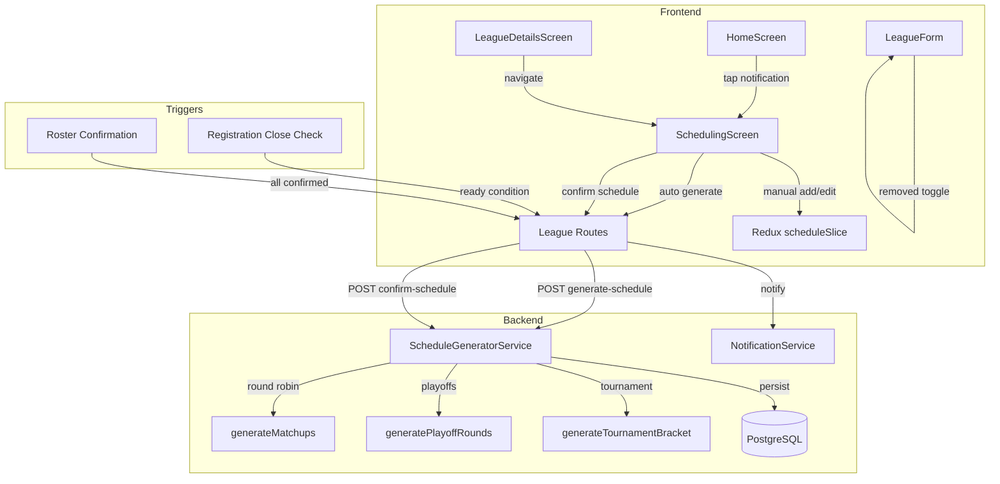
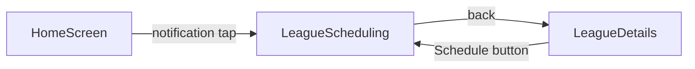

# Design Document: League Scheduling

## Overview

This feature overhauls the league event scheduling flow in Muster. It removes the `autoGenerateMatchups` toggle from the League Form, introduces a "ready to schedule" notification for Commissioners, and adds a dedicated Scheduling Screen where the Commissioner can auto-generate or manually build the event schedule. The backend `ScheduleGeneratorService` is extended to support season (round robin), season with playoffs, and tournament formats. After review and confirmation, shell events are persisted and all roster players are notified.

### Key Design Decisions

1. **Two-phase schedule workflow**: Generation produces an in-memory preview; only confirmation persists to the database. This gives the Commissioner full editorial control before anything is published.
2. **Reuse existing `ScheduleGeneratorService`**: The current service already handles round-robin generation and matchup distribution. We extend it with playoff and tournament bracket logic rather than creating a new service.
3. **Shell events as first-class entities**: Confirmed schedules create `Event` + `Match` records with `scheduledStatus: 'unscheduled'`, reusing the existing pattern from `ScheduleGeneratorService`.
4. **Notification via existing `NotificationService`**: The "ready to schedule" notification uses the same push notification infrastructure already in place for match scheduling.
5. **Redux Toolkit + RTK Query for state**: The scheduling screen state (generated events, edits, review mode) lives in a new Redux slice, with API calls handled by RTK Query endpoints on the existing `leaguesApi`.

## Architecture



### Navigation Flow

The `SchedulingScreen` is added to the `LeaguesStackNavigator` as a new route `LeagueScheduling` with param `{ leagueId: string }`. It is reachable from:
- The Home Screen "ready to schedule" notification tap
- The League Details screen (Commissioner-only action)



## Components and Interfaces

### Frontend Components

#### SchedulingScreen (`src/screens/leagues/SchedulingScreen.tsx`)
The main screen for building and reviewing the league schedule.

```typescript
interface SchedulingScreenProps {
  route: { params: { leagueId: string } };
  navigation: NativeStackNavigationProp<LeaguesStackParamList, 'LeagueScheduling'>;
}
```

**UI Layout:**
- Header with league name
- "Auto Generate Schedule" button (calls backend generation endpoint)
- Event list (FlatList) showing generated/manual events
- Each event row: Home Roster, Away Roster, Date, Time, optional flag (Playoffs/Tournament)
- FAB or button to add a manual game
- "Confirm Schedule" button (disabled until events exist)

#### ScheduleEventCard (`src/components/league/ScheduleEventCard.tsx`)
Renders a single event row in the schedule list.

```typescript
interface ScheduleEventCardProps {
  event: ScheduleEvent;
  rosters: RosterInfo[];
  onEdit: (event: ScheduleEvent) => void;
  onRemove: (eventId: string) => void;
}
```

#### ScheduleEventEditor (`src/components/league/ScheduleEventEditor.tsx`)
Modal or inline editor for creating/editing a single game.

```typescript
interface ScheduleEventEditorProps {
  event?: ScheduleEvent; // undefined for new game
  rosters: RosterInfo[];
  onSave: (event: ScheduleEvent) => void;
  onCancel: () => void;
}
```

### Frontend State (Redux)

#### scheduleSlice (`src/store/slices/scheduleSlice.ts`)

```typescript
interface ScheduleEvent {
  id: string;               // client-generated UUID for tracking
  homeRosterId: string;
  homeRosterName: string;
  awayRosterId: string;
  awayRosterName: string;
  scheduledAt: string;       // ISO date-time
  round: number;
  flag?: 'playoffs' | 'tournament';
}

interface ScheduleState {
  leagueId: string | null;
  events: ScheduleEvent[];
  isReviewing: boolean;
  isGenerating: boolean;
  error: string | null;
}
```

Actions: `setEvents`, `addEvent`, `updateEvent`, `removeEvent`, `clearSchedule`, `setReviewing`.

### Backend API Endpoints

#### POST `/api/leagues/:id/generate-schedule`
Generates a schedule preview without persisting. Returns the generated events for Commissioner review.

**Request:** `{ leagueId }` (from URL param)

**Response:**
```typescript
{
  events: Array<{
    homeRoster: { id: string; name: string };
    awayRoster: { id: string; name: string };
    scheduledAt: string;
    round: number;
    flag?: 'playoffs' | 'tournament';
  }>;
}
```

**Error responses:**
- `400` — fewer than 2 rosters registered
- `404` — league not found
- `403` — user is not the Commissioner

#### POST `/api/leagues/:id/confirm-schedule`
Persists the reviewed schedule as shell events.

**Request:**
```typescript
{
  events: Array<{
    homeRosterId: string;
    homeRosterName: string;
    awayRosterId: string;
    awayRosterName: string;
    scheduledAt: string;
    round: number;
    flag?: 'playoffs' | 'tournament';
  }>;
}
```

**Response:** `{ eventsCreated: number }`

**Side effects:**
- Creates `Event` records with `scheduledStatus: 'unscheduled'`
- Creates `Match` records linked to events
- Sets `league.scheduleGenerated = true`
- Sends push notification to all confirmed roster players

#### POST `/api/leagues/:id/check-ready`
Called by a scheduled job or on roster confirmation. Checks if the league is ready to schedule and sends a notification to the Commissioner if conditions are met.

### Backend Service Extensions

#### ScheduleGeneratorService

Extend with new static methods:

```typescript
class ScheduleGeneratorService {
  // Existing
  static async generateRoundRobin(leagueId: string): Promise<{ eventsCreated: number }>;

  // New: preview-only generation (no DB writes)
  static generateSchedulePreview(league: LeagueWithRosters): SchedulePreview;

  // New: playoff round generation
  static generatePlayoffRounds(
    rosterCount: number,
    playoffSlots: number,
    startDate: Date,
    preferredDays: number[],
    timeWindow: { start: string; end: string }
  ): PlayoffEvent[];

  // New: tournament bracket generation
  static generateTournamentBracket(
    rosters: RosterInfo[],
    eliminationFormat: 'single_elimination' | 'double_elimination',
    startDate: Date,
    preferredDays: number[],
    timeWindow: { start: string; end: string }
  ): TournamentEvent[];

  // New: persist confirmed schedule
  static async confirmSchedule(
    leagueId: string,
    organizerId: string,
    events: ConfirmableEvent[]
  ): Promise<{ eventsCreated: number }>;
}
```

### Notification Trigger

A background check (cron job or event-driven) evaluates two conditions for each league that hasn't generated a schedule:

1. `registrationCloseDate` has passed
2. All invited rosters have confirmed (all memberships with `memberType: 'roster'` are `status: 'active'`)

Whichever fires first triggers a "ready to schedule" notification to the Commissioner, provided at least one roster is registered. The notification payload includes `{ type: 'league_ready_to_schedule', leagueId }` so the Home Screen can navigate to the Scheduling Screen on tap.

## Data Models

### Existing Models (no schema changes required)

The existing Prisma schema already supports the scheduling feature:

- **League**: Has `leagueFormat`, `gameFrequency`, `preferredGameDays`, `preferredTimeWindowStart`, `preferredTimeWindowEnd`, `seasonGameCount`, `playoffTeamCount`, `eliminationFormat`, `autoGenerateMatchups`, `scheduleGenerated` fields.
- **Event**: Has `scheduledStatus` field (`'unscheduled'` | `'scheduled'`), `eligibilityRestrictedToLeagues`, `eligibilityRestrictedToTeams`.
- **Match**: Links `leagueId`, `homeTeamId`, `awayTeamId`, `eventId`, `scheduledAt`, `status`.

### Behavioral Changes

- `autoGenerateMatchups` will always be stored as `false` on new leagues. The field remains in the schema for backward compatibility but is no longer exposed in the form.
- `scheduleGenerated` is set to `true` only when the Commissioner confirms the schedule via the new `confirm-schedule` endpoint.

### New Types (TypeScript only, no schema migration)

```typescript
// Shared between frontend and backend
interface RosterInfo {
  id: string;
  name: string;
}

interface SchedulePreview {
  events: SchedulePreviewEvent[];
  totalGames: number;
  format: 'season' | 'season_with_playoffs' | 'tournament';
}

interface SchedulePreviewEvent {
  homeRoster: RosterInfo;
  awayRoster: RosterInfo;
  scheduledAt: string;
  round: number;
  flag?: 'playoffs' | 'tournament';
}

// Playoff-specific
interface PlayoffEvent extends SchedulePreviewEvent {
  flag: 'playoffs';
  playoffRound: number; // 1 = quarterfinal, 2 = semifinal, etc.
}

// Tournament-specific
interface TournamentEvent extends SchedulePreviewEvent {
  flag: 'tournament';
  bracketRound: number;
  bracketPosition: number;
  placeholderLabel?: string; // "Winner of Game N"
}
```


## Correctness Properties

*A property is a characteristic or behavior that should hold true across all valid executions of a system — essentially, a formal statement about what the system should do. Properties serve as the bridge between human-readable specifications and machine-verifiable correctness guarantees.*

### Property 1: Form data excludes autoGenerateMatchups

*For any* set of valid league form inputs submitted through the LeagueForm component, the resulting form data object shall not contain the `autoGenerateMatchups` field.

**Validates: Requirements 1.2**

### Property 2: New leagues default autoGenerateMatchups to false

*For any* league created through the create league endpoint, the stored `autoGenerateMatchups` value shall be `false`.

**Validates: Requirements 1.3**

### Property 3: Notification on registration close

*For any* league with a `registrationCloseDate` that has passed, at least one registered roster, and no schedule generated yet, the system shall produce a "ready to schedule" notification for the Commissioner.

**Validates: Requirements 2.1**

### Property 4: Notification on all rosters confirmed

*For any* league where all invited rosters have confirmed participation (all roster memberships are `active`), at least one roster is registered, and no schedule has been generated yet, the system shall produce a "ready to schedule" notification for the Commissioner.

**Validates: Requirements 2.2**

### Property 5: At most one ready notification per league

*For any* league, regardless of how many ready conditions are satisfied, the system shall generate at most one "ready to schedule" notification.

**Validates: Requirements 2.3**

### Property 6: Notification text format

*For any* league name, the "ready to schedule" notification text shall equal `"${leagueName} is ready to schedule."`.

**Validates: Requirements 2.5**

### Property 7: Event card displays all required fields

*For any* schedule event with a home roster name, away roster name, date, and time, the rendered event card shall contain all four pieces of information.

**Validates: Requirements 3.4**

### Property 8: Manual game addition grows event list

*For any* schedule event list and any valid game (with home roster, away roster, date, and time), adding the game manually shall increase the event list length by one and the new event shall appear in the list.

**Validates: Requirements 3.7**

### Property 9: Playoff and tournament events display correct flags

*For any* schedule event with `flag: 'playoffs'`, the rendered output shall include a "Playoffs" label. *For any* schedule event with `flag: 'tournament'`, the rendered output shall include a "Tournament" label.

**Validates: Requirements 3.9, 3.10, 5.5, 6.3**

### Property 10: Round-robin matchup completeness

*For any* set of N rosters (N ≥ 2) in a season-format league, the generated round-robin schedule shall contain at least N×(N−1)/2 unique roster pairings (ignoring home/away order).

**Validates: Requirements 4.1, 8.2**

### Property 11: Minimize repeat matchups

*For any* generated round-robin schedule, no pair of rosters shall play each other more than ⌈seasonGameCount / (N×(N−1)/2)⌉ + 1 times, where N is the number of rosters.

**Validates: Requirements 4.2**

### Property 12: Home/away balance

*For any* roster in any generated schedule, the absolute difference between the number of home games and the number of away games shall be at most one.

**Validates: Requirements 4.3, 8.4**

### Property 13: Game count matches configuration

*For any* league configuration with a `seasonGameCount` value, the generated schedule shall contain exactly `seasonGameCount` games (excluding playoff/tournament games).

**Validates: Requirements 4.4**

### Property 14: Games scheduled on preferred days only

*For any* generated schedule event, the day of the week of the scheduled date shall be one of the league's `preferredGameDays`.

**Validates: Requirements 4.5**

### Property 15: Games within time window

*For any* generated schedule event, the scheduled time shall be ≥ `preferredTimeWindowStart` and < `preferredTimeWindowEnd`.

**Validates: Requirements 4.6**

### Property 16: No double-booking

*For any* generated schedule, no roster shall appear in two games whose time slots overlap on the same day.

**Validates: Requirements 4.7, 8.3**

### Property 17: Playoff rounds follow regular season

*For any* season-with-playoffs schedule, all events with `flag: 'playoffs'` shall have a `scheduledAt` date strictly after the latest regular season event's `scheduledAt` date.

**Validates: Requirements 5.2**

### Property 18: Playoff roster assignments are TBD

*For any* generated playoff event, the home and away roster names shall be placeholder values (e.g., "TBD") rather than actual roster names.

**Validates: Requirements 5.3**

### Property 19: Playoff slot count matches configuration

*For any* season-with-playoffs league with `playoffTeamCount` set to K, the generated playoff bracket shall accommodate exactly K roster slots.

**Validates: Requirements 5.4**

### Property 20: Tournament first-round uses registered rosters

*For any* tournament-format league with N registered rosters, the first round of the generated bracket shall contain matchups using all N rosters (with byes if N is not a power of 2).

**Validates: Requirements 6.1**

### Property 21: Tournament placeholder naming

*For any* tournament bracket event in round 2 or later, the roster name for an undetermined slot shall follow the format "Winner of Game N" where N is the game number from the previous round.

**Validates: Requirements 6.2**

### Property 22: Elimination format determines bracket structure

*For any* tournament league configured with single elimination, the total number of games shall equal N−1 (where N is the number of first-round participants including byes). *For any* tournament league configured with double elimination, the total number of games shall be between 2×(N−1) and 2×(N−1)+1.

**Validates: Requirements 6.4**

### Property 23: Confirmed schedule persists with unscheduled status

*For any* confirmed schedule, all persisted Event records shall have `scheduledStatus` equal to `'unscheduled'`, and each Event shall have a corresponding Match record linked to the league.

**Validates: Requirements 7.4, 7.5**

### Property 24: Player notification on schedule confirmation

*For any* confirmed schedule, every player in every confirmed roster of the league shall receive a notification that the schedule has been published.

**Validates: Requirements 7.7**

### Property 25: No persistence without confirmation

*For any* schedule that has been generated but not confirmed, the database shall contain zero new Event or Match records for that league, and zero notifications shall have been sent.

**Validates: Requirements 7.8**

### Property 26: Schedule generation round-trip

*For any* valid set of rosters and league configuration, generating a schedule preview and then reading back the matchups shall produce an equivalent set of matchups (same home/away pairings, same dates, same rounds).

**Validates: Requirements 8.1**

## Error Handling

### Frontend Errors

| Scenario | Handling |
|---|---|
| Auto-generate fails (< 2 rosters) | Display inline error banner on Scheduling Screen: "At least two rosters are required to generate a schedule." |
| Auto-generate fails (network) | Display retry-able error toast. Schedule state remains unchanged. |
| Confirm fails (network) | Display error alert with retry option. Events remain in local Redux state for re-attempt. |
| Invalid manual game (missing fields) | Disable save button in editor until all fields are filled. Show field-level validation errors. |
| Navigation to Scheduling Screen with invalid leagueId | Show "League not found" screen with back navigation. |

### Backend Errors

| Scenario | HTTP Status | Response |
|---|---|---|
| League not found | 404 | `{ error: 'League not found' }` |
| User is not Commissioner | 403 | `{ error: 'Only the league Commissioner can manage the schedule' }` |
| Fewer than 2 rosters | 400 | `{ error: 'At least 2 registered rosters are required to generate a schedule' }` |
| Schedule already generated | 409 | `{ error: 'Schedule has already been generated for this league' }` |
| Incomplete schedule config | 400 | `{ error: 'Schedule configuration incomplete: preferredGameDays and seasonGameCount are required' }` |
| Database transaction failure | 500 | `{ error: 'Failed to save schedule. Please try again.' }` — transaction rolls back all changes |

### Notification Errors

- Notification delivery failures are non-blocking. The system logs the failure and continues processing remaining players.
- If the Commissioner's push token is invalid, the notification is silently dropped (consistent with existing `NotificationService` behavior).

## Testing Strategy

### Unit Tests

Unit tests cover specific examples, edge cases, and integration points:

- **LeagueForm**: Verify the `autoGenerateMatchups` toggle is not rendered; verify form submission excludes the field.
- **SchedulingScreen**: Verify empty state placeholder; verify "Auto Generate Schedule" button presence; verify navigation params.
- **ScheduleEventCard**: Verify rendering of home/away roster names, date, time, and flags.
- **ScheduleEventEditor**: Verify field validation (all fields required); verify save/cancel behavior.
- **scheduleSlice**: Verify `addEvent`, `updateEvent`, `removeEvent`, `clearSchedule` reducers.
- **generate-schedule endpoint**: Verify 400 for < 2 rosters; verify 403 for non-Commissioner; verify 404 for missing league.
- **confirm-schedule endpoint**: Verify Event and Match creation; verify `scheduledStatus: 'unscheduled'`; verify notification dispatch.
- **Ready notification trigger**: Verify notification on registration close; verify notification on all rosters confirmed; verify no notification with zero rosters.

### Property-Based Tests

Property-based tests use `fast-check` (as specified in the tech stack) with a minimum of 100 iterations per test. Each test references its design document property.

Tests focus on the `ScheduleGeneratorService` logic, which is the core algorithmic component:

- **Round-robin completeness** (Property 10): Generate random roster sets (2–20 rosters) and verify unique matchup count.
- **Home/away balance** (Property 12): Generate random schedules and verify each roster's home/away difference ≤ 1.
- **Game count** (Property 13): Generate random league configs and verify output length equals `seasonGameCount`.
- **Preferred days** (Property 14): Generate random day configurations and verify all events land on preferred days.
- **Time window** (Property 15): Generate random time windows and verify all events are within bounds.
- **No double-booking** (Property 16): Generate random schedules and verify no roster appears in overlapping games.
- **Playoff ordering** (Property 17): Generate season-with-playoffs schedules and verify playoff dates follow regular season.
- **Playoff TBD** (Property 18): Generate playoff rounds and verify placeholder roster names.
- **Tournament placeholder naming** (Property 21): Generate tournament brackets and verify "Winner of Game N" format.
- **Elimination bracket size** (Property 22): Generate tournament brackets and verify game count matches elimination format.
- **Round-trip** (Property 26): Generate schedules, serialize, deserialize, and verify equivalence.
- **Notification text format** (Property 6): Generate random league names and verify notification text matches pattern.

Each property test must be tagged with a comment:
```typescript
// Feature: league-scheduling, Property 10: Round-robin matchup completeness
```

### Test Organization

```
tests/
├── unit/
│   ├── components/
│   │   ├── LeagueForm.test.tsx
│   │   ├── ScheduleEventCard.test.tsx
│   │   └── ScheduleEventEditor.test.tsx
│   ├── screens/
│   │   └── SchedulingScreen.test.tsx
│   ├── store/
│   │   └── scheduleSlice.test.ts
│   └── server/
│       ├── generate-schedule.test.ts
│       └── confirm-schedule.test.ts
├── property/
│   ├── schedule-generator.property.test.ts
│   ├── notification-format.property.test.ts
│   └── schedule-roundtrip.property.test.ts
```
