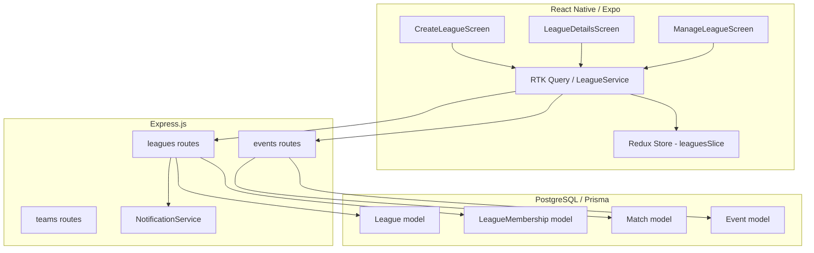
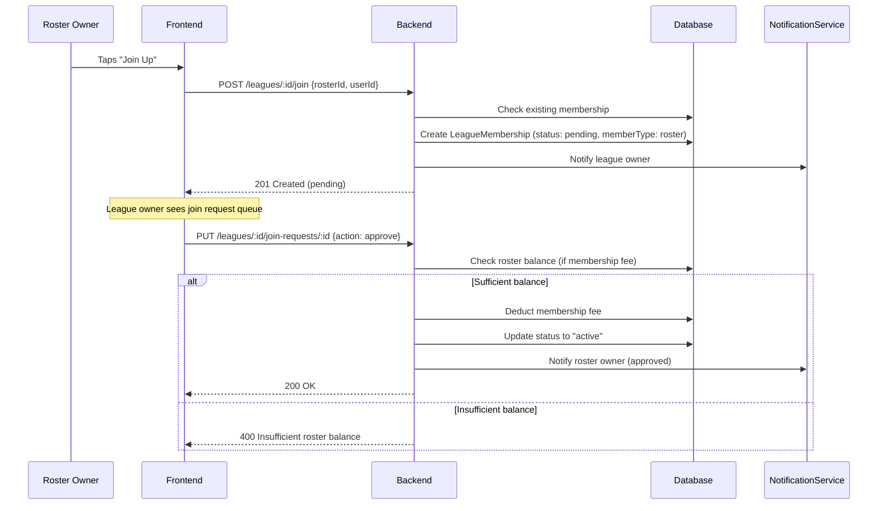
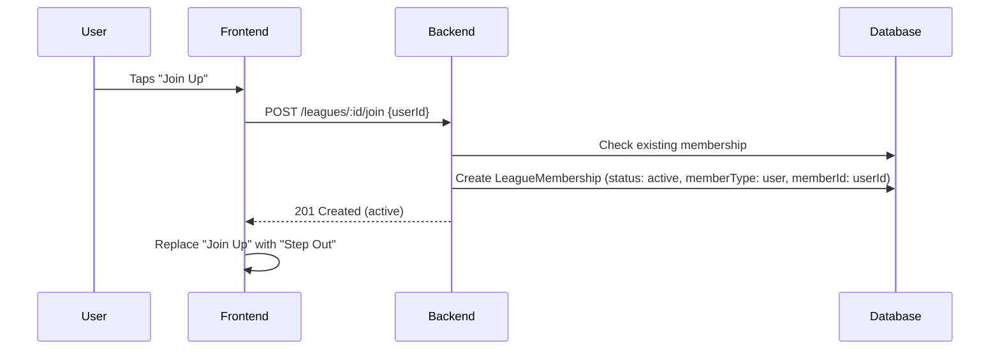

# Design Document: League Screens and Flow

## Overview

This design extends Muster's league system to support two distinct league types — **Team Leagues** (roster-based competition) and **Pickup Leagues** (individual player pools). The feature adds `leagueType` and `visibility` fields to the League model, refactors `LeagueMembership` to support both roster-level and individual-user membership, and builds out the League Detail Screen with sections for upcoming events, members, and standings. It covers creation, joining, event scheduling, standings, and management flows for both league types.

The implementation spans:
- **Database**: Prisma schema changes to League and LeagueMembership models
- **Backend**: New and updated Express API endpoints for league type handling, join flows, and event scheduling
- **Frontend**: Updated React Native screens (Create League, League Detail, League Management) with Redux Toolkit state management
- **Vocabulary**: Consistent use of Muster brand terms (Roster, League, Join Up, Step Out, Players)

## Architecture



### Key Architectural Decisions

1. **Polymorphic membership via `memberType` + `memberId`**: Rather than creating separate tables for roster memberships and user memberships, we add `memberType` ("roster" | "user") and `memberId` fields to `LeagueMembership`. The existing `teamId` field is kept nullable for backward compatibility, and a new nullable `userId` field is added. This avoids a migration-breaking change while supporting both league types.

2. **League type is immutable after creation**: Once a league is created with a `leagueType`, it cannot be changed. This prevents data integrity issues where memberships of one type exist but the league type changes.

3. **Visibility only applies to Team Leagues**: Pickup Leagues are always public. The visibility selector is conditionally shown only when "Team League" is selected during creation.

4. **Standings calculation uses `pointsConfig`**: The existing `pointsConfig` JSON field on League is used to calculate standings. Tiebreakers follow goal difference → goals scored ordering, matching the existing standings endpoint pattern.

5. **Double-booking prevention is server-side**: Scheduling conflict checks for roster assignment happen in the backend API to ensure consistency regardless of client state.

## Components and Interfaces

### Frontend Components

#### CreateLeagueScreen (Updated)
- Adds league type selector ("Team League" / "Pickup League") at the top of the form
- Conditionally shows visibility selector ("Public" / "Private") when Team League is selected
- Auto-sets visibility to "public" and hides selector for Pickup Leagues
- Passes `leagueType` and `visibility` to the API on submit

#### LeagueDetailsScreen (Updated)
Restructured with conditional sections based on `leagueType`:

- **Header**: League name, sport type, image, organizer info
- **Action Bar**: Contextual buttons based on user role and league type
  - Team League (Public): "Join Up" button for roster owners not yet in the league
  - Team League (Private): "Add Rosters" button for owner/admins
  - Pickup League: "Join Up" / "Step Out" toggle for authenticated users
- **Upcoming Events Section**: Chronologically sorted future events with event name, date, time, ground, and roster assignments (Team League) or open game label (Pickup League)
- **Members Section**: 
  - Team League: List of rosters with name, player count, win/loss record
  - Pickup League: List of individual players
  - Only shows active memberships
- **Standings Section**:
  - Team League: Roster standings ranked by points (matches played, W/L/D, points, GD)
  - Pickup League: Individual player rankings
- **Join Request Queue** (Team League, Public, owner/admin only): Pending roster join requests with approve/decline actions

#### ManageLeagueScreen (Updated)
- Event creation with conditional roster assignment interface (Team League only)
- Double-booking conflict detection UI
- Result recording for matches

### Backend API Endpoints

#### New Endpoints
| Method | Path | Description |
|--------|------|-------------|
| POST | `/api/leagues` | Updated to accept `leagueType` and `visibility` |
| POST | `/api/leagues/:id/join` | Updated to handle both roster and individual joins |
| POST | `/api/leagues/:id/leave` | Updated to handle individual Step Out |
| GET | `/api/leagues/:id/join-requests` | Get pending join requests (Team League, Public) |
| PUT | `/api/leagues/:id/join-requests/:requestId` | Approve/decline a join request |
| POST | `/api/leagues/:id/invite-roster` | Invite a roster to a private Team League |
| PUT | `/api/leagues/:id/invitations/:invitationId` | Accept/decline a roster invitation |
| GET | `/api/leagues/:id/events` | Get upcoming league events |
| POST | `/api/leagues/:id/events` | Create a league event with optional roster assignment |

#### Updated Endpoints
| Method | Path | Changes |
|--------|------|---------|
| GET | `/api/leagues/:id` | Returns `leagueType`, `visibility`, and polymorphic memberships |
| GET | `/api/leagues/:id/members` | Returns rosters or users based on `leagueType` |
| GET | `/api/leagues/:id/standings` | Returns roster standings or player rankings based on `leagueType` |
| PUT | `/api/leagues/:id` | Prevents modification of `leagueType` |

### Redux State Updates

```typescript
// Updated LeaguesState in leaguesSlice
interface LeaguesState {
  leagues: League[];
  selectedLeague: League | null;
  standings: TeamStanding[] | PlayerRanking[];
  playerRankings: PlayerRanking[];
  joinRequests: LeagueMembership[];
  upcomingEvents: Event[];
  isLoading: boolean;
  error: string | null;
  filters: LeagueFilters;
  pagination: PaginationState;
}
```

### Service Layer

```typescript
// LeagueService additions
class LeagueService {
  // Existing methods updated
  createLeague(data: CreateLeagueData, userId: string): Promise<League>;
  getLeagueById(id: string): Promise<League>;
  
  // New methods
  joinLeagueAsRoster(leagueId: string, rosterId: string, userId: string): Promise<LeagueMembership>;
  joinLeagueAsUser(leagueId: string, userId: string): Promise<LeagueMembership>;
  stepOutOfLeague(leagueId: string, userId: string): Promise<void>;
  getJoinRequests(leagueId: string): Promise<LeagueMembership[]>;
  approveJoinRequest(leagueId: string, requestId: string): Promise<LeagueMembership>;
  declineJoinRequest(leagueId: string, requestId: string): Promise<void>;
  inviteRoster(leagueId: string, rosterId: string): Promise<LeagueMembership>;
  respondToInvitation(leagueId: string, invitationId: string, accept: boolean): Promise<void>;
  getLeagueEvents(leagueId: string): Promise<Event[]>;
  createLeagueEvent(leagueId: string, data: CreateLeagueEventData): Promise<Event>;
  checkSchedulingConflicts(leagueId: string, rosterIds: string[], startTime: Date, endTime: Date): Promise<ConflictResult>;
}
```

## Data Models

### Prisma Schema Changes

#### League Model (Updated)
```prisma
model League {
  // ... existing fields ...
  leagueType  String  @default("team")  // "team" or "pickup"
  visibility  String  @default("public") // "public" or "private"
  membershipFee Float? // Optional fee for joining
}
```

#### LeagueMembership Model (Updated)
```prisma
model LeagueMembership {
  // ... existing fields ...
  memberType  String  @default("roster") // "roster" or "user"
  memberId    String  // References Roster ID or User ID based on memberType
  teamId      String? // Kept nullable for backward compatibility
  userId      String? // New: for individual player membership
  
  // New relation
  user        User?   @relation(fields: [userId], references: [id])
}
```

### TypeScript Type Updates

```typescript
// Updated League type
interface League {
  // ... existing fields ...
  leagueType: 'team' | 'pickup';
  visibility: 'public' | 'private';
  membershipFee?: number;
}

// Updated CreateLeagueData
interface CreateLeagueData {
  // ... existing fields ...
  leagueType: 'team' | 'pickup';
  visibility?: 'public' | 'private';
  membershipFee?: number;
}

// Updated LeagueMembership
interface LeagueMembership {
  // ... existing fields ...
  memberType: 'roster' | 'user';
  memberId: string;
  userId?: string;
  user?: User;
}

// New types
interface CreateLeagueEventData {
  title: string;
  description: string;
  startTime: Date;
  endTime: Date;
  facilityId?: string;
  rosterIds?: string[]; // Only for Team Leagues
}

interface ConflictResult {
  hasConflicts: boolean;
  conflicts: Array<{
    rosterId: string;
    rosterName: string;
    conflictingEventId: string;
    conflictingEventTitle: string;
    startTime: Date;
    endTime: Date;
  }>;
}
```

### Data Flow Diagrams

#### Team League — Public Join Request Flow


#### Pickup League — Direct Join Flow



## Correctness Properties

*A property is a characteristic or behavior that should hold true across all valid executions of a system — essentially, a formal statement about what the system should do. Properties serve as the bridge between human-readable specifications and machine-verifiable correctness guarantees.*

### Property 1: League type and visibility persistence

*For any* valid league creation request with a leagueType of "team" or "pickup" and a valid visibility value, the persisted League record SHALL have a `leagueType` matching the submitted value and a `visibility` that is either "public" or "private", defaulting to "public" when not specified.

**Validates: Requirements 1.2, 2.1, 2.2**

### Property 2: League type immutability

*For any* existing League record and any update request that attempts to change the `leagueType` field, the system SHALL reject the change and the `leagueType` on the League record SHALL remain equal to its original value.

**Validates: Requirements 1.3**

### Property 3: Pickup leagues are always public

*For any* league with `leagueType` "pickup", the `visibility` field SHALL always be "public". Any attempt to create or update a pickup league with `visibility` "private" SHALL result in `visibility` being "public".

**Validates: Requirements 1.5, 5.3**

### Property 4: Membership type consistency

*For any* LeagueMembership record, `memberType` SHALL be either "roster" or "user". When `memberType` is "roster", `memberId` SHALL reference a valid Roster ID. When `memberType` is "user", `memberId` SHALL reference a valid User ID.

**Validates: Requirements 2.3, 2.4, 2.6, 2.7**

### Property 5: Public team league join creates pending membership

*For any* roster owner joining a public Team League where the roster is not already a member, the system SHALL create a LeagueMembership with `status` "pending" and `memberType` "roster".

**Validates: Requirements 4.2**

### Property 6: Join request approval activates membership

*For any* pending LeagueMembership in a public Team League, when the league owner or admin approves the request (and the roster has sufficient balance for any configured fee), the membership `status` SHALL be updated to "active".

**Validates: Requirements 4.4**

### Property 7: Join request decline withdraws membership

*For any* pending LeagueMembership in a public Team League, when the league owner or admin declines the request, the membership `status` SHALL be updated to "withdrawn".

**Validates: Requirements 4.5**

### Property 8: Membership fee deduction on activation

*For any* LeagueMembership activation (via invitation acceptance or join request approval) where the league has a `membershipFee` configured and the roster balance is >= the fee, the roster balance SHALL decrease by exactly the `membershipFee` amount.

**Validates: Requirements 3.5, 4.6**

### Property 9: Invitation acceptance creates active roster membership

*For any* roster invitation to a private Team League, when the roster owner accepts and the fee condition is satisfied (no fee or sufficient balance), the system SHALL create a LeagueMembership with `status` "active" and `memberType` "roster".

**Validates: Requirements 3.7**

### Property 10: Pickup league join is immediate and active

*For any* authenticated user joining a Pickup League where they are not already a participant, the system SHALL immediately create a LeagueMembership with `status` "active", `memberType` "user", and `memberId` equal to the user's ID.

**Validates: Requirements 5.2**

### Property 11: Step Out sets withdrawn status and timestamp

*For any* active LeagueMembership in a Pickup League, when the user taps "Step Out", the membership `status` SHALL be updated to "withdrawn" and the `leftAt` timestamp SHALL be set to a non-null value.

**Validates: Requirements 5.5**

### Property 12: Upcoming events contain only future events

*For any* league and any reference time, the Upcoming Events Section SHALL contain only events whose `startTime` is strictly after the reference time. No past events SHALL appear in the list.

**Validates: Requirements 6.1**

### Property 13: Upcoming events are sorted by start time ascending

*For any* list of upcoming league events with length >= 2, for every consecutive pair of events (event[i], event[i+1]), event[i].startTime SHALL be <= event[i+1].startTime.

**Validates: Requirements 6.2**

### Property 14: Event display contains required fields

*For any* event in the Upcoming Events Section, the rendered output SHALL contain the event name, date, time, and ground name. For Team League events with assigned rosters, the output SHALL additionally contain the names of all assigned rosters. For Pickup League events, no roster assignments SHALL be displayed.

**Validates: Requirements 6.3, 6.5, 6.6**

### Property 15: Members section shows only active memberships

*For any* league with a mix of active, pending, and withdrawn memberships, the Members Section SHALL display only memberships with `status` "active".

**Validates: Requirements 7.3**

### Property 16: Team league member display includes required fields

*For any* Team League, each entry in the Members Section SHALL display the roster name, player count, and win/loss record. When a roster has zero completed matches, the win/loss record SHALL display as "0-0".

**Validates: Requirements 7.1, 7.4, 7.5**

### Property 17: Standings points calculation

*For any* roster in a Team League with a given `pointsConfig` (win, draw, loss values) and a set of match results, the total points SHALL equal `(wins × pointsConfig.win) + (draws × pointsConfig.draw) + (losses × pointsConfig.loss)`.

**Validates: Requirements 8.3**

### Property 18: Standings tiebreaker ordering

*For any* set of rosters in a Team League standings where two or more rosters have equal points, the ordering SHALL use goal difference as the first tiebreaker (higher goal difference ranks higher) and goals scored as the second tiebreaker (higher goals scored ranks higher).

**Validates: Requirements 8.4**

### Property 19: Scheduling conflict detection prevents double-booking

*For any* Team League event creation that assigns a roster already assigned to another event with overlapping time (the new event's time range intersects with the existing event's time range), the system SHALL detect the conflict and prevent the assignment.

**Validates: Requirements 9.5, 9.6**

### Property 20: Team league events require at least two rosters

*For any* Team League event creation with roster assignment, the system SHALL require at least two rosters to be assigned. An assignment with fewer than two rosters SHALL be rejected.

**Validates: Requirements 9.2**

### Property 21: Pickup league events have no roster assignment

*For any* event created for a Pickup League, the event SHALL have no roster assignments. The event SHALL be accessible for any active league participant to Join Up individually.

**Validates: Requirements 10.1, 10.2**

## Error Handling

### Frontend Error Handling

| Scenario | Handling |
|----------|----------|
| League creation fails | Display error alert with message from API, keep form state for retry |
| Join request fails (already member) | Display "This roster is already in the league" message |
| Join request fails (network) | Display generic network error with retry option |
| Insufficient roster balance for fee | Display "Insufficient roster balance" error with current balance shown |
| Scheduling conflict detected | Display conflict details (conflicting event name, time) and prevent submission |
| League data fails to load | Show ErrorDisplay component with retry button |
| Invitation response fails | Display error and keep invitation in current state |

### Backend Error Handling

| Scenario | HTTP Status | Response |
|----------|-------------|----------|
| Invalid leagueType value | 400 | `{ error: "leagueType must be 'team' or 'pickup'" }` |
| Attempt to modify leagueType | 400 | `{ error: "leagueType cannot be modified after creation" }` |
| Pickup league with private visibility | 400 | `{ error: "Pickup leagues must be public" }` |
| Roster already in league | 409 | `{ error: "Roster is already a member of this league" }` |
| User already in pickup league | 409 | `{ error: "You are already a participant in this league" }` |
| Insufficient roster balance | 400 | `{ error: "Insufficient roster balance", required: fee, available: balance }` |
| Scheduling conflict | 409 | `{ error: "Scheduling conflict", conflicts: [...] }` |
| Non-owner/admin action | 403 | `{ error: "Only the league owner or admins can perform this action" }` |
| League not found | 404 | `{ error: "League not found" }` |
| Fewer than 2 rosters assigned | 400 | `{ error: "Team League events require at least 2 rosters" }` |

### Validation Rules

- `leagueType`: Required, must be "team" or "pickup"
- `visibility`: Optional (defaults to "public"), must be "public" or "private", forced to "public" for pickup leagues
- `membershipFee`: Optional, must be >= 0 if provided
- `memberType`: Required on membership creation, must be "roster" or "user"
- `memberId`: Required on membership creation, must reference a valid entity
- Roster assignment: Minimum 2 rosters for Team League events
- Time overlap: Two events overlap if `event1.startTime < event2.endTime AND event2.startTime < event1.endTime`

## Testing Strategy

### Dual Testing Approach

This feature requires both unit tests and property-based tests for comprehensive coverage.

**Unit tests** cover:
- Specific UI rendering examples (league type selector, visibility selector, button states)
- Navigation flows (tapping event navigates to detail screen)
- Notification sending on specific actions
- Brand vocabulary compliance in rendered components
- Edge cases: insufficient balance, zero matches ("0-0" display)

**Property-based tests** cover:
- Universal properties across all valid inputs (league type persistence, membership consistency, standings calculation)
- Comprehensive input coverage through randomization

### Property-Based Testing Configuration

- **Library**: fast-check (already in project dependencies)
- **Minimum iterations**: 100 per property test
- **Tag format**: `Feature: league-screens-flow, Property {number}: {property_text}`
- Each correctness property is implemented by a single property-based test
- Tests are located in `tests/properties/league-screens-flow/`

### Test Organization

```
tests/
├── properties/
│   └── league-screens-flow/
│       ├── league-creation.property.test.ts    # Properties 1-3
│       ├── membership.property.test.ts         # Properties 4-11
│       ├── events-display.property.test.ts     # Properties 12-14
│       ├── members-display.property.test.ts    # Properties 15-16
│       ├── standings.property.test.ts          # Properties 17-18
│       └── scheduling.property.test.ts         # Properties 19-21
├── screens/
│   └── leagues/
│       ├── CreateLeagueScreen.test.tsx          # UI examples for Req 1, 10.3
│       ├── LeagueDetailsScreen.test.tsx         # UI examples for Req 3.1, 4.1, 4.3, 5.1, 5.4, 6.4
│       └── ManageLeagueScreen.test.tsx          # UI examples for Req 9.1, 9.3, 9.4
├── services/
│   └── LeagueService.test.ts                   # Integration tests for API calls
└── api/
    └── leagues.test.ts                         # Backend endpoint tests
```

### Key Test Scenarios (Unit Tests)

1. CreateLeagueScreen renders league type selector with "Team League" and "Pickup League" options (Req 1.1)
2. Selecting "Team League" shows visibility selector (Req 1.4)
3. Selecting "Pickup League" hides visibility selector (Req 1.5)
4. Private Team League shows "Add Rosters" button for owner (Req 3.1)
5. Public Team League shows "Join Up" button for non-member roster owners (Req 4.1)
6. Pickup League shows "Join Up" / "Step Out" toggle (Req 5.1, 5.4)
7. Tapping event navigates to Event Detail Screen (Req 6.4)
8. Pickup League event creation hides roster assignment interface (Req 10.3)
9. All UI labels use correct Muster vocabulary (Req 11.1-11.6)
