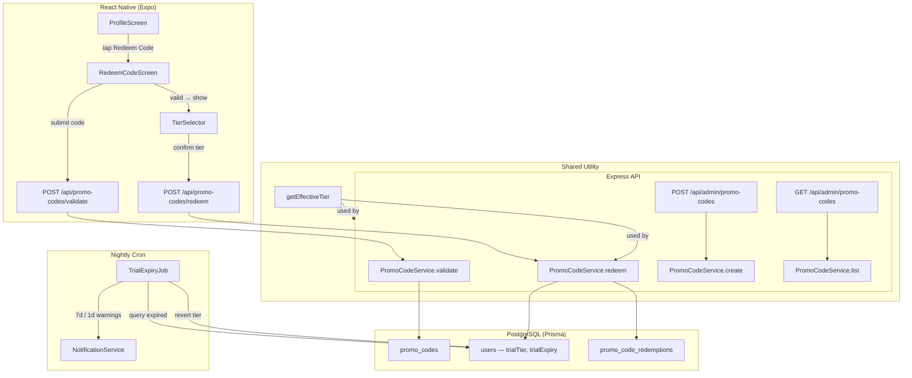

# Design Document: Promo Code Trials

## Overview

This feature adds a promotional code system to Muster that grants users a free trial of any membership tier (Player, Host, or Facility) for a configurable duration. The system spans the full stack: a Prisma schema extension for promo codes and trial state, Express API routes for validation/redemption/admin, a nightly cron job for trial expiry and advance notifications, a shared effective-tier resolver, and React Native screens for code entry and tier selection integrated into the existing Profile tab.

The design follows existing patterns in the codebase: jobs mirror `event-cutoff.ts` / `away-confirmation.ts`, routes follow the `X-User-Id` auth pattern, and the frontend uses RTK Query with theme tokens from `src/theme/`.

## Architecture



### Key Design Decisions

1. **Trial state on the User record** — `trialTier` and `trialExpiry` live directly on the `users` table rather than in a separate table. This keeps the effective-tier resolver a simple field check and avoids joins on every authenticated request.

2. **Codes stored uppercase** — The `code` column stores values in uppercase and lookups convert input to uppercase, giving case-insensitive matching without a functional index.

3. **Re-redemption upgrades only** — A user can redeem the same code again only if they pick a higher tier. The `trialExpiry` resets to a fresh duration from the new redemption date. This is tracked via the `promo_code_redemptions` table.

4. **Notification dedup via columns** — The `users` table gets `trialNotified7d` and `trialNotified1d` boolean flags. The nightly job checks these before sending, avoiding duplicate notifications without a separate notification log table.

5. **Single nightly job** — Trial expiry, tier reversion, and advance notifications (7-day and 1-day) are all handled in one job run, following the pattern of `processEventCutoffs` and `processExpiredConfirmations`.

## Components and Interfaces

### Database Layer (Prisma)

**New model: `PromoCode`** — maps to `promo_codes` table
**New model: `PromoCodeRedemption`** — maps to `promo_code_redemptions` table
**Extended model: `User`** — adds `trialTier`, `trialExpiry`, `trialNotified7d`, `trialNotified1d` fields

### Backend Service

**`server/src/services/promo-code.ts`** — `PromoCodeService`

```typescript
interface PromoCodeService {
  validate(code: string): Promise<{ valid: boolean; trialDurationDays: number } | { valid: false; error: string }>;
  redeem(userId: string, code: string, selectedTier: string): Promise<UserRecord>;
  create(code: string, trialDurationDays: number, adminId: string): Promise<PromoCode>;
  list(): Promise<PromoCode[]>;
}
```

**`server/src/utils/effective-tier.ts`** — shared resolver

```typescript
function getEffectiveTier(user: { membershipTier: string; trialTier: string | null; trialExpiry: Date | null }): string;
```

### Backend Routes

**`server/src/routes/promo-codes.ts`** — user-facing endpoints

| Method | Path | Auth | Description |
|--------|------|------|-------------|
| POST | `/api/promo-codes/validate` | User | Validate a code, return trial duration |
| POST | `/api/promo-codes/redeem` | User | Redeem code with selected tier |

**`server/src/routes/admin.ts`** (extended) — admin endpoints

| Method | Path | Auth | Description |
|--------|------|------|-------------|
| POST | `/api/admin/promo-codes` | Admin | Create a new promo code |
| GET | `/api/admin/promo-codes` | Admin | List all promo codes |

### Nightly Job

**`server/src/jobs/trial-expiry.ts`** — `processTrialExpiry`

Registered in `server/src/jobs/index.ts` on a daily schedule (e.g., `0 4 * * *` — 04:00 UTC).

```typescript
interface TrialExpiryMetrics {
  executionDate: Date;
  usersChecked: number;
  trialsExpired: number;
  notificationsSent7d: number;
  notificationsSent1d: number;
  duration: number;
  errors: Array<{ userId: string; error: string }>;
}

function processTrialExpiry(db?: PrismaClient): Promise<TrialExpiryMetrics>;
```

### Frontend Screens

**`src/screens/profile/RedeemCodeScreen.tsx`**
- Text input for promo code + Submit button
- On valid code → shows `TierSelector` with Player / Host / Facility options
- On redemption success → navigates back to ProfileScreen with success feedback
- Uses theme tokens from `src/theme/`

**Navigation update**: Add `RedeemCode` to `ProfileStackParamList` in `src/navigation/types.ts`.

### Frontend API Layer

**RTK Query endpoints** added to `src/store/api.ts` (or a new `promoCodeApi` injected endpoint):

```typescript
validatePromoCode: mutation<{ valid: boolean; trialDurationDays: number }, { code: string }>
redeemPromoCode: mutation<UserRecord, { code: string; selectedTier: string }>
```

### NotificationService Extension

Add two static methods to `NotificationService`:

```typescript
static async notifyTrialExpiring7d(userId: string, trialTier: string, expiryDate: Date): Promise<void>;
static async notifyTrialExpiring1d(userId: string, trialTier: string, expiryDate: Date): Promise<void>;
```

## Data Models

### PromoCode (new table: `promo_codes`)

| Column | Type | Constraints | Description |
|--------|------|-------------|-------------|
| id | UUID | PK, default uuid | Primary key |
| code | String | Unique | Promo code string, stored uppercase |
| trialDurationDays | Int | Default 30 | Duration of trial in days |
| createdAt | DateTime | Default now() | Creation timestamp |
| createdByAdminId | String | FK → users.id | Admin who created the code |

### PromoCodeRedemption (new table: `promo_code_redemptions`)

| Column | Type | Constraints | Description |
|--------|------|-------------|-------------|
| id | UUID | PK, default uuid | Primary key |
| userId | String | FK → users.id | User who redeemed |
| promoCodeId | String | FK → promo_codes.id | Code that was redeemed |
| selectedTier | String | | Tier chosen at redemption |
| redeemedAt | DateTime | Default now() | Redemption timestamp |

### User (extended fields)

| Column | Type | Constraints | Description |
|--------|------|-------------|-------------|
| trialTier | String? | Nullable | Active trial tier (Player/Host/Facility) |
| trialExpiry | DateTime? | Nullable | When the trial expires |
| trialNotified7d | Boolean | Default false | Whether 7-day warning was sent |
| trialNotified1d | Boolean | Default false | Whether 1-day warning was sent |

### Prisma Schema Additions

```prisma
model PromoCode {
  id                String   @id @default(uuid())
  code              String   @unique
  trialDurationDays Int      @default(30)
  createdAt         DateTime @default(now())
  createdByAdminId  String

  createdByAdmin User                  @relation("AdminPromoCodes", fields: [createdByAdminId], references: [id])
  redemptions    PromoCodeRedemption[]

  @@map("promo_codes")
}

model PromoCodeRedemption {
  id           String   @id @default(uuid())
  userId       String
  promoCodeId  String
  selectedTier String
  redeemedAt   DateTime @default(now())

  user      User      @relation("UserRedemptions", fields: [userId], references: [id])
  promoCode PromoCode @relation(fields: [promoCodeId], references: [id])

  @@index([userId])
  @@index([promoCodeId])
  @@map("promo_code_redemptions")
}
```

User model additions:
```prisma
  // Trial fields
  trialTier       String?
  trialExpiry     DateTime?
  trialNotified7d Boolean  @default(false)
  trialNotified1d Boolean  @default(false)

  // New relations
  promoCodesCreated PromoCode[]           @relation("AdminPromoCodes")
  redemptions       PromoCodeRedemption[] @relation("UserRedemptions")
```

### Effective Tier Resolution Logic

```typescript
function getEffectiveTier(user: {
  membershipTier: string;
  trialTier: string | null;
  trialExpiry: Date | null;
}): string {
  if (user.trialTier && user.trialExpiry && user.trialExpiry > new Date()) {
    return user.trialTier;
  }
  return user.membershipTier;
}
```

### Tier Hierarchy (for re-redemption upgrade check)

```
standard < player < host < facility
```

The redemption endpoint checks that the newly selected tier is strictly higher than the current `trialTier` when re-redeeming the same code.


## Correctness Properties

*A property is a characteristic or behavior that should hold true across all valid executions of a system — essentially, a formal statement about what the system should do. Properties serve as the bridge between human-readable specifications and machine-verifiable correctness guarantees.*

### Property 1: Effective tier resolution

*For any* user record, if `trialTier` is non-null and `trialExpiry` is in the future then `getEffectiveTier` returns `trialTier`; otherwise it returns `membershipTier`.

**Validates: Requirements 9.1, 9.2**

### Property 2: Case-insensitive code validation

*For any* promo code stored in the database and *for any* case permutation of that code string, validation should return a success response with the correct trial duration.

**Validates: Requirements 2.4, 8.5**

### Property 3: Valid code returns success with duration

*For any* promo code that exists in the `promo_codes` table, submitting it for validation should return `{ valid: true, trialDurationDays }` where `trialDurationDays` matches the stored value.

**Validates: Requirements 2.2**

### Property 4: Invalid code returns error

*For any* string that does not match any record in the `promo_codes` table, validation should return an error response with the message "Invalid promo code".

**Validates: Requirements 2.3**

### Property 5: Redemption sets trial state and creates log

*For any* user, valid promo code, and selected tier, after redemption: (a) the user's `trialTier` equals the selected tier, (b) the user's `trialExpiry` equals the redemption date plus the code's `trialDurationDays`, and (c) a `PromoCodeRedemption` record exists with the correct `userId`, `promoCodeId`, `selectedTier`, and `redeemedAt`.

**Validates: Requirements 4.1, 4.2, 4.3**

### Property 6: Re-redemption with higher tier upgrades and resets expiry

*For any* user with an active trial from a given promo code, redeeming the same code with a strictly higher tier should update `trialTier` to the new tier and reset `trialExpiry` to a fresh duration from the new redemption date.

**Validates: Requirements 4.4**

### Property 7: Multiple users can redeem the same code

*For any* promo code and *for any* set of N distinct users, all N redemptions should succeed and produce N distinct redemption log entries.

**Validates: Requirements 4.5**

### Property 8: Trial expiry reverts tier correctly

*For any* user whose `trialExpiry` is in the past and `trialTier` is non-null, after the trial expiry job runs: `trialTier` is null, `trialExpiry` is null, and `membershipTier` equals the user's active subscription plan if one exists, otherwise "standard".

**Validates: Requirements 5.2, 5.3, 5.4**

### Property 9: Advance notifications sent at correct milestones

*For any* user with a non-null `trialTier`, if `trialExpiry` is exactly 7 days from now and `trialNotified7d` is false, the job sends a 7-day notification and sets `trialNotified7d` to true. If `trialExpiry` is exactly 1 day from now and `trialNotified1d` is false, the job sends a 1-day notification and sets `trialNotified1d` to true.

**Validates: Requirements 6.1, 6.2**

### Property 10: No duplicate notifications

*For any* user where `trialNotified7d` is already true, running the trial expiry job should not send another 7-day notification. Likewise for `trialNotified1d` and the 1-day notification.

**Validates: Requirements 6.4**

### Property 11: Admin-only access to promo code management

*For any* user without the "admin" role, requests to create or list promo codes should be rejected with a 403 status.

**Validates: Requirements 7.1, 7.4**

### Property 12: Admin code creation stores all fields

*For any* valid code string and trial duration, after an admin creates a promo code, the database record contains the code in uppercase, the specified `trialDurationDays`, a `createdAt` timestamp, and the admin's user ID as `createdByAdminId`.

**Validates: Requirements 7.2**

### Property 13: Unique code enforcement is case-insensitive

*For any* existing promo code, attempting to create another code that differs only in letter casing should fail with a uniqueness error.

**Validates: Requirements 7.3**

## Error Handling

| Scenario | Behavior |
|----------|----------|
| Invalid promo code submitted | Return 400 with `{ error: "Invalid promo code" }` |
| Re-redemption with same or lower tier | Return 400 with `{ error: "You already have this tier or higher from this code" }` |
| Non-admin attempts to create/list codes | Return 403 with `{ error: "Admin access required" }` |
| Duplicate code creation (case-insensitive) | Return 409 with `{ error: "A promo code with this value already exists" }` |
| Empty or whitespace-only code submitted | Return 400 with `{ error: "Promo code is required" }` |
| Invalid tier selection (not Player/Host/Facility) | Return 400 with `{ error: "Invalid tier selection" }` |
| Trial expiry job fails for a single user | Log the error, continue processing remaining users, include in metrics `errors` array |
| Notification send failure | Log the error, do not mark the notification flag as sent (allows retry on next run) |
| Database transaction failure during redemption | Roll back all changes (trialTier, trialExpiry, redemption log) atomically via Prisma `$transaction` |

## Testing Strategy

### Unit Tests

- `getEffectiveTier` — specific examples: active trial returns trialTier, expired trial returns membershipTier, null trial returns membershipTier
- `PromoCodeService.validate` — example: valid code returns success, invalid code returns error
- `PromoCodeService.redeem` — example: successful redemption, re-redemption with lower tier rejected
- `processTrialExpiry` — example: expired trial with subscription reverts to plan, expired trial without subscription reverts to standard
- Admin route authorization — example: non-admin gets 403
- RedeemCodeScreen — component renders input and submit button, navigates on tap

### Property-Based Tests

Property-based tests use `fast-check` (already in the project) with a minimum of 100 iterations per property. Each test is tagged with a comment referencing the design property.

| Test | Property | Library |
|------|----------|---------|
| Effective tier resolution | Property 1 | fast-check |
| Case-insensitive validation | Property 2 | fast-check |
| Valid code returns duration | Property 3 | fast-check |
| Invalid code returns error | Property 4 | fast-check |
| Redemption state + log | Property 5 | fast-check |
| Re-redemption upgrade | Property 6 | fast-check |
| Multi-user redemption | Property 7 | fast-check |
| Trial expiry reversion | Property 8 | fast-check |
| Notification milestones | Property 9 | fast-check |
| No duplicate notifications | Property 10 | fast-check |
| Admin-only access | Property 11 | fast-check |
| Code creation fields | Property 12 | fast-check |
| Case-insensitive uniqueness | Property 13 | fast-check |

Each property test must:
- Run a minimum of 100 iterations
- Reference its design property with a tag comment: `// Feature: promo-code-trials, Property N: <title>`
- Be implemented as a single `fast-check` property test per design property
- Generate random inputs using `fast-check` arbitraries (e.g., `fc.string()`, `fc.constantFrom('player', 'host', 'facility')`, `fc.date()`)

Property tests focus on the service layer and utility functions (`getEffectiveTier`, `PromoCodeService`, `processTrialExpiry`). UI component tests remain as unit/example tests since they involve React Native rendering rather than pure logic.
