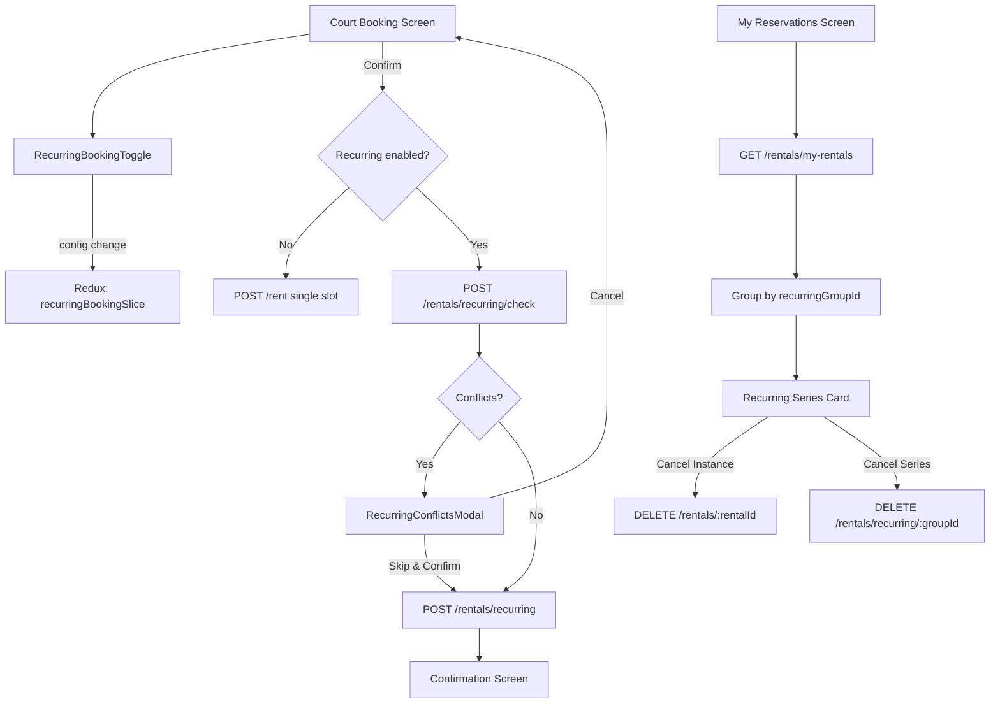
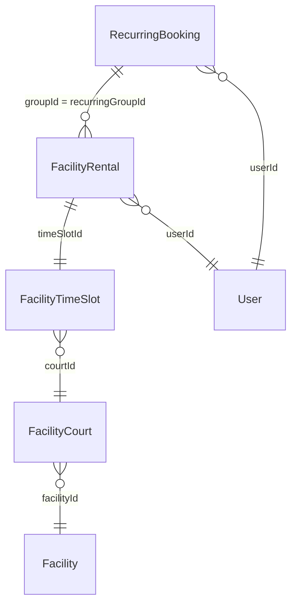

# Recurring Court Bookings — Design Document

## Overview

This feature adds recurring booking capability to the existing court rental flow in Muster. After a user selects a court and time slot, they can toggle on "Repeat Booking" to schedule weekly or monthly recurrences up to a chosen end date. The system generates all occurrence dates, checks each against court availability, surfaces conflicts via a modal, and lets the user skip unavailable dates or cancel. Confirmed instances are saved as individual `FacilityRental` records linked by a shared `recurringGroupId`, with metadata stored in a `RecurringBooking` row. Users can cancel single instances or the entire remaining series from My Reservations.

Much of the backend infrastructure already exists:
- `generateOccurrences()` in `server/src/services/recurring-bookings.ts` handles date generation for weekly/monthly patterns
- `POST /rentals/recurring/check` validates availability for each occurrence
- `POST /rentals/recurring` creates the series in a single transaction
- `DELETE /rentals/recurring/:groupId` cancels all future instances
- `GET /rentals/recurring/:groupId` fetches series details
- `RecurringBooking` model and `recurringGroupId` on `FacilityRental` are already in the Prisma schema
- `RecurringBookingToggle` and `RecurringConflictsModal` UI components are implemented

The remaining work is integration: wiring the toggle into the booking flow screen, adding Redux state management, building the "My Reservations" grouped display with series cancellation, and adding the recurring availability check API call before confirmation.

## Architecture



The architecture follows the existing pattern: React Native screens dispatch actions through Redux Toolkit slices, which call Express.js API endpoints. The backend uses Prisma transactions to atomically create/cancel rentals and update time slot statuses.

### Key Design Decisions

1. **Individual rentals, not a single mega-record**: Each occurrence is a separate `FacilityRental` linked by `recurringGroupId`. This keeps cancellation, refund, and event-linking logic identical to single bookings — no special-casing needed.

2. **Check-then-book two-step flow**: The UI first calls `/recurring/check` to get availability, shows conflicts if any, then calls `/recurring` to create. This avoids partial transaction failures and gives users full visibility before committing.

3. **Reuse existing components**: `RecurringBookingToggle` and `RecurringConflictsModal` are already built. The design wires them into the booking flow rather than rebuilding.

4. **Monthly day-of-month clamping**: When a month doesn't have the target day (e.g., booking on the 31st but February has 28 days), `generateOccurrences` clamps to the last day of that month. This is already implemented.

## Components and Interfaces

### Frontend Components

#### Existing (already implemented)
- **`RecurringBookingToggle`** (`src/components/bookings/RecurringBookingToggle.tsx`): Toggle switch with frequency selector (Weekly/Monthly) and end date picker. Emits `RecurringConfig` on change.
- **`RecurringConflictsModal`** (`src/components/bookings/RecurringConflictsModal.tsx`): Modal displaying conflicting dates with reasons. Actions: "Confirm N Dates" (skip conflicts) or "Cancel".

#### New Components
- **`RecurringSeriesCard`** (`src/components/bookings/RecurringSeriesCard.tsx`): Card for My Reservations that groups recurring instances. Shows frequency badge, remaining count, expandable instance list, and "Cancel Series" action.
- **`RecurringBookingPreview`** (`src/components/bookings/RecurringBookingPreview.tsx`): Summary shown before confirmation — lists all dates, total price, and instance count.

### Redux State

#### `recurringBookingSlice` (`src/store/slices/recurringBookingSlice.ts`)

```typescript
interface RecurringBookingState {
  config: RecurringConfig;           // from RecurringBookingToggle
  availabilityCheck: {
    loading: boolean;
    available: AvailableSlot[];
    conflicts: ConflictSlot[];
    totalInstances: number;
  } | null;
  booking: {
    loading: boolean;
    error: string | null;
    result: RecurringBookingResult | null;
  };
  seriesCancellation: {
    loading: boolean;
    error: string | null;
  };
}
```

#### Async Thunks
- `checkRecurringAvailability`: Calls `POST /rentals/recurring/check`
- `createRecurringBooking`: Calls `POST /rentals/recurring`
- `cancelRecurringSeries`: Calls `DELETE /rentals/recurring/:groupId`
- `cancelSingleInstance`: Calls existing `DELETE /rentals/:rentalId` (already handles `recurringGroupId` decrement)

### API Endpoints (Existing)

All backend endpoints are already implemented in `server/src/routes/rentals.ts`:

| Method | Path | Purpose |
|--------|------|---------|
| `POST` | `/rentals/recurring/check` | Check availability for all occurrences |
| `POST` | `/rentals/recurring` | Create recurring series |
| `GET` | `/rentals/recurring/:groupId` | Get series details + all rentals |
| `DELETE` | `/rentals/recurring/:groupId` | Cancel all future instances |
| `DELETE` | `/rentals/:rentalId` | Cancel single instance (existing, already handles recurring decrement) |

### API Service Layer

#### `RecurringBookingService` (`src/services/api/RecurringBookingService.ts`)

```typescript
interface RecurringCheckRequest {
  userId: string;
  courtId: string;
  facilityId: string;
  slotStartTime: string;
  slotEndTime: string;
  frequency: 'weekly' | 'monthly';
  startDate: string;   // ISO date
  endDate: string;     // ISO date
}

interface RecurringCheckResponse {
  available: { date: string; slotId: string; price: number }[];
  conflicts: { date: string; reason: string; slotId: string | null }[];
  totalInstances: number;
}

interface RecurringCreateRequest extends RecurringCheckRequest {
  skipConflicts: boolean;
}

interface RecurringCreateResponse {
  recurringGroupId: string;
  frequency: string;
  rentals: FacilityRental[];
  totalPrice: number;
  instanceCount: number;
  skippedConflicts: { date: string; reason: string }[];
}
```

## Data Models

### Existing Models (already in schema)

#### `RecurringBooking`
```prisma
model RecurringBooking {
  id               String   @id @default(uuid())
  groupId          String   @unique
  frequency        String   // "weekly" | "monthly"
  startDate        DateTime
  endDate          DateTime
  dayOfWeek        Int?     // 0-6 for weekly
  dayOfMonth       Int?     // 1-31 for monthly
  startTime        String   // HH:MM
  endTime          String   // HH:MM
  courtId          String
  userId           String
  totalInstances   Int
  activeInstances  Int
  createdAt        DateTime @default(now())
  updatedAt        DateTime @updatedAt
}
```

#### `FacilityRental` (recurring fields)
```prisma
model FacilityRental {
  // ... existing fields ...
  recurringGroupId String?  // Links to RecurringBooking.groupId
  // Indexed: @@index([recurringGroupId])
}
```

### No Schema Changes Required

The database schema already supports recurring bookings. The `RecurringBooking` model stores series metadata, and `FacilityRental.recurringGroupId` links individual instances. No migrations are needed.

### Key Data Relationships




## Correctness Properties

*A property is a characteristic or behavior that should hold true across all valid executions of a system — essentially, a formal statement about what the system should do. Properties serve as the bridge between human-readable specifications and machine-verifiable correctness guarantees.*

### Property 1: Weekly occurrences preserve day of week

*For any* start date and end date where end > start, all dates returned by `generateOccurrences({ frequency: 'weekly', startDate, endDate })` should fall on the same day of the week as the start date.

**Validates: Requirements 2.1**

### Property 2: Monthly occurrences preserve day of month (with clamping)

*For any* start date and end date where end > start, all dates returned by `generateOccurrences({ frequency: 'monthly', startDate, endDate })` should have a day-of-month equal to `min(startDate.day, lastDayOfThatMonth)`. This covers the edge case where the target day doesn't exist in shorter months (e.g., Feb 28 for a booking on the 31st).

**Validates: Requirements 2.2, 2.3**

### Property 3: End date validation rejects invalid configurations

*For any* `RecurringConfig`, the system should reject the booking if: (a) `endDate` is null, (b) `endDate` is on or before `startDate`, or (c) `endDate` is more than 365 days after `startDate`. Valid configurations should be accepted.

**Validates: Requirements 3.1, 3.2, 3.3**

### Property 4: Availability check correctly classifies slots

*For any* set of occurrence dates and a court, the `/recurring/check` endpoint should return each date as either available (slot exists and status is 'available') or conflicting (slot missing, blocked, or already rented), with no date omitted or duplicated.

**Validates: Requirements 4.1**

### Property 5: Skip-conflicts books only available slots

*For any* recurring booking request with `skipConflicts: true` where some slots are unavailable, the created `FacilityRental` records should correspond exactly to the slots that were available — no unavailable slot should have a rental, and no available slot should be skipped.

**Validates: Requirements 4.3**

### Property 6: Recurring creation produces correct rental count with shared group ID

*For any* successful recurring booking creation with N available slots, exactly N `FacilityRental` records should be created, and all should share the same `recurringGroupId` value equal to the `RecurringBooking.groupId`.

**Validates: Requirements 5.1, 5.2**

### Property 7: RecurringBooking metadata matches request

*For any* successful recurring booking creation, the `RecurringBooking` record should have `frequency`, `startDate`, `endDate`, `startTime`, `endTime`, `courtId`, and `userId` matching the original request, and `totalInstances` equal to the number of created rentals.

**Validates: Requirements 5.3**

### Property 8: Rentals with shared recurringGroupId group together

*For any* list of `FacilityRental` records, grouping by `recurringGroupId` (where non-null) should produce groups where all rentals in each group share the same `courtId`, `userId`, and time window (`startTime`/`endTime` via their time slots).

**Validates: Requirements 6.1**

### Property 9: Single instance cancellation preserves sibling instances

*For any* recurring series with multiple confirmed instances, cancelling one instance should: (a) set that rental's status to 'cancelled', (b) restore its time slot to 'available', (c) decrement `RecurringBooking.activeInstances` by 1, and (d) leave all other rentals in the series with status 'confirmed'.

**Validates: Requirements 7.1, 7.2**

### Property 10: Series cancellation affects only future instances

*For any* recurring series cancellation, all future confirmed rentals (slot date >= today) should become 'cancelled' with their time slots restored to 'available', while any past or already-completed instances remain unchanged.

**Validates: Requirements 7.3, 7.4**

### Property 11: Instance count cap

*For any* recurring pattern, `generateOccurrences` should never return more than 52 dates. If the date range would produce more than 52 occurrences, the API should reject the request.

**Validates: Requirements Limits L.1**

### Property 12: Occurrence generation bounds

*For any* valid recurring pattern, the first element of `generateOccurrences` should equal the start date, and every element should be <= the end date. The list should be sorted in ascending order with no duplicates.

**Validates: Requirements 2.1, 2.2**

## Error Handling

### Frontend Errors

| Scenario | Handling |
|----------|----------|
| End date not selected | Disable confirm button, show inline validation message |
| End date before start date | Show validation error under date picker |
| End date > 365 days out | Show validation error, cap date picker `maximumDate` (already implemented in `RecurringBookingToggle`) |
| Availability check fails (network) | Show toast error, allow retry |
| All instances conflicted | `RecurringConflictsModal` shows "No dates are available" with only Cancel button (already implemented) |
| Booking creation fails | Show error toast, return to booking screen with config preserved |
| Series cancellation fails | Show error toast, keep current state |

### Backend Errors

| Scenario | HTTP Status | Response |
|----------|-------------|----------|
| Missing required fields | 400 | `{ error: 'Missing required fields' }` |
| Invalid frequency value | 400 | `{ error: 'Frequency must be "weekly" or "monthly"' }` |
| No occurrences generated | 400 | `{ error: 'No occurrences generated' }` |
| Exceeds 52 instance cap | 400 | `{ error: 'Recurring series cannot exceed 52 instances' }` |
| Conflicts exist (skipConflicts=false) | 409 | `{ conflicts, availableCount }` |
| No available slots to book | 400 | `{ error: 'No available slots to book' }` |
| Recurring series not found | 404 | `{ error: 'Recurring series not found' }` |
| Unauthorized (not series owner) | 403 | `{ error: 'Unauthorized' }` |
| Transaction failure | 500 | `{ error: 'Failed to create recurring booking' }` |

### Edge Cases

- **Monthly booking on 29th/30th/31st**: `generateOccurrences` clamps to last day of month. No error, but the UI should note skipped/adjusted dates in the preview.
- **Slot deleted between check and book**: The transaction will fail for that slot. With `skipConflicts: true`, other slots still get booked.
- **Concurrent booking race**: Prisma transaction with `@unique` constraint on `FacilityRental.timeSlotId` prevents double-booking. The second request gets a conflict error.

## Testing Strategy

### Property-Based Testing

Use **fast-check** (already in the project) for property-based tests. Each property test runs a minimum of 100 iterations.

**Target files:**
- `server/src/services/__tests__/recurring-bookings.test.ts` — Properties 1, 2, 11, 12 (occurrence generation logic)
- `server/src/routes/__tests__/recurring-rentals.test.ts` — Properties 3–10 (API behavior, requires test database or mocked Prisma)

**Property test tagging format:**
```typescript
// Feature: recurring-bookings, Property 1: Weekly occurrences preserve day of week
```

Each correctness property above maps to exactly one property-based test. The generators should produce:
- Random valid dates (within reasonable range, e.g., 2024–2026)
- Random frequencies ('weekly' | 'monthly')
- Random court/slot availability states for API tests

### Unit Tests

Unit tests complement property tests for specific examples and edge cases:

- **Occurrence generation edge cases**: Feb 29 in leap year, Dec 31 rollover, single-day range (start === end)
- **Conflict modal rendering**: Verify `RecurringConflictsModal` shows correct count text and disables confirm when `availableCount === 0`
- **Toggle state management**: Verify `RecurringBookingToggle` emits correct `RecurringConfig` on frequency change and date selection
- **Redux slice**: Verify state transitions for `checkRecurringAvailability`, `createRecurringBooking`, and cancellation thunks
- **Grouping logic**: Verify My Reservations correctly groups rentals by `recurringGroupId`
- **Series cancellation**: Verify only future instances are cancelled, past instances preserved

### Integration Tests

- End-to-end recurring booking flow: create series → verify rentals → cancel one instance → verify series count → cancel series → verify all future cancelled
- Concurrent booking: two users attempt to book overlapping recurring series on the same court
