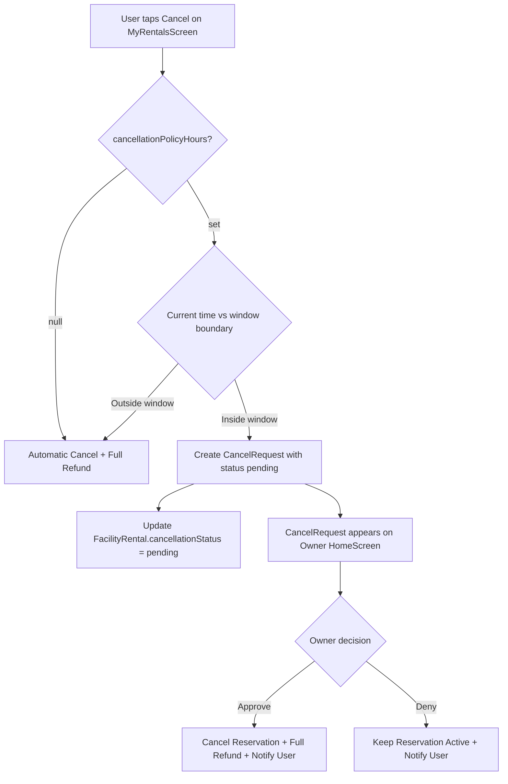
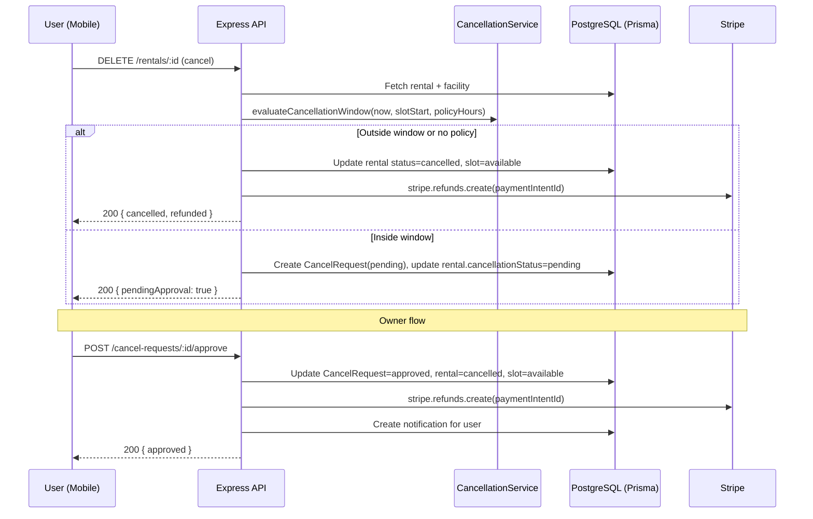

# Design Document — Reservation Cancellation Policy

## Overview

This feature introduces a configurable cancellation policy system for ground reservations in Muster. Ground owners define a cancellation window (in hours) on their ground. When a user cancels a reservation:

- **Outside the window** (or no policy set): The reservation is cancelled immediately with a full Stripe refund.
- **Inside the window**: A cancel request is created and routed to the ground owner for approval or denial via the Home Screen.

The system builds on the existing `FacilityRental` model and `rentals` route, adding a new `CancelRequest` model, a `cancellationPolicyHours` field on `Facility`, and new API endpoints for cancel request lifecycle management.

### Key Design Decisions

1. **Separate `cancel_requests` table** rather than overloading `FacilityRental` fields — keeps the audit trail clean and supports future features like cancel request messaging.
2. **Reuse existing Stripe refund patterns** from `public-event-escrow.ts` (using `stripe.refunds.create` with idempotency keys).
3. **Pure function for window calculation** — the cancellation window check is a deterministic, side-effect-free function that can be thoroughly property-tested.
4. **Allowed values for policy hours are constrained** to `[null, 0, 12, 24, 48, 72]` — enforced at both API and UI level via a picker, not free-text input.

## Architecture



### Component Interaction



## Components and Interfaces

### Backend

#### 1. CancellationWindowService (`server/src/services/cancellation-window.ts`)

Pure utility module for window calculation logic. No database or Stripe dependencies.

```typescript
export type WindowResult = 'inside' | 'outside';

/**
 * Determines whether a cancellation falls inside or outside the policy window.
 * Pure function — no side effects.
 */
export function evaluateCancellationWindow(
  currentTime: Date,
  bookingStartTime: Date,
  cancellationPolicyHours: number | null,
): WindowResult;
```

#### 2. CancelRequestService (`server/src/services/cancel-request.ts`)

Orchestrates cancel request creation, approval, and denial. Handles Stripe refunds and notifications.

```typescript
export async function createCancelRequest(
  rentalId: string,
  userId: string,
  prismaClient: PrismaClient,
): Promise<CancelRequest>;

export async function approveCancelRequest(
  cancelRequestId: string,
  ownerId: string,
  prismaClient: PrismaClient,
): Promise<void>;

export async function denyCancelRequest(
  cancelRequestId: string,
  ownerId: string,
  prismaClient: PrismaClient,
): Promise<void>;
```

#### 3. Cancel Request Routes (`server/src/routes/cancel-requests.ts`)

New route file for cancel request endpoints:

| Method | Path | Description |
|--------|------|-------------|
| `GET` | `/cancel-requests/pending` | Get pending cancel requests for owner's grounds |
| `POST` | `/cancel-requests/:id/approve` | Approve a cancel request |
| `POST` | `/cancel-requests/:id/deny` | Deny a cancel request |

#### 4. Modified Rental Route (`server/src/routes/rentals.ts`)

The existing `DELETE /rentals/:rentalId` endpoint is modified to:
1. Fetch the facility's `cancellationPolicyHours`
2. Call `evaluateCancellationWindow()`
3. If outside → proceed with existing immediate cancellation + add Stripe refund
4. If inside → call `createCancelRequest()` instead

#### 5. Modified Facility Route (`server/src/routes/facilities.ts`)

The existing facility create/update endpoints accept the new `cancellationPolicyHours` field. Validation ensures only allowed values: `null | 0 | 12 | 24 | 48 | 72`.

### Frontend

#### 1. CancellationPolicyPicker Component (`src/components/facilities/CancellationPolicyPicker.tsx`)

A picker component for the ground create/edit screens. Displays allowed hour options (None, 0h, 12h, 24h, 48h, 72h) and returns the selected value.

#### 2. CancelRequestCard Component (`src/components/home/CancelRequestCard.tsx`)

Card displayed in the HomeScreen "Cancel Requests" section. Shows:
- Requesting user's name
- Court/field name
- Booking date and time
- Approve and Deny buttons

Uses `colors.grass` for Approve, `colors.track` for Deny, `fonts.label` for card text, `fonts.ui` for buttons.

#### 3. HomeScreen Modifications (`src/screens/home/HomeScreen.tsx`)

Add a "Cancel Requests" section after the Invitations section. Fetches pending cancel requests via `GET /cancel-requests/pending`. Hidden when no pending requests exist.

#### 4. MyRentalsScreen Modifications (`src/screens/facilities/MyRentalsScreen.tsx`)

- Show "Cancellation Pending" badge (using `colors.court` background, `fonts.label`) on rentals with `cancellationStatus === 'pending'`.
- Disable the cancel button while a request is pending.
- Remove the rental from the list when cancellation is approved.

#### 5. RTK Query API Slice (`src/store/api/cancelRequestsApi.ts`)

New API slice for cancel request endpoints:
- `useGetPendingCancelRequestsQuery` — polls pending requests for owner's grounds
- `useApproveCancelRequestMutation`
- `useDenyCancelRequestMutation`


## Data Models

### Schema Changes

#### 1. Facility Table — New Column

```prisma
model Facility {
  // ... existing fields ...

  // Reservation cancellation policy (distinct from event/team cancellation policy)
  cancellationPolicyHours Int? // null = no policy (all cancellations automatic)

  // ... existing relations ...
  cancelRequests CancelRequest[]
}
```

Allowed values: `null`, `0`, `12`, `24`, `48`, `72`. Validated at the API layer.

#### 2. New CancelRequest Model

```prisma
model CancelRequest {
  id           String    @id @default(uuid())
  status       String    @default("pending") // "pending" | "approved" | "denied"
  requestedAt  DateTime  @default(now())
  resolvedAt   DateTime?

  // Foreign Keys
  userId       String
  reservationId String
  groundId     String

  // Relations
  user         User           @relation(fields: [userId], references: [id], onDelete: Cascade)
  reservation  FacilityRental @relation(fields: [reservationId], references: [id], onDelete: Cascade)
  ground       Facility       @relation(fields: [groundId], references: [id], onDelete: Cascade)

  @@unique([reservationId, status], name: "unique_pending_per_reservation")
  @@index([groundId, status])
  @@index([userId])
  @@map("cancel_requests")
}
```

The `@@unique([reservationId, status])` constraint prevents duplicate pending requests for the same reservation. Note: Prisma's unique constraint applies globally, so the application layer must additionally enforce that only one "pending" request exists per reservation (checked before insert).

#### 3. FacilityRental Table — Updated Column

The existing `cancellationStatus` field on `FacilityRental` currently accepts `null | "pending_cancellation" | "cancelled"`. This design updates the allowed values to align with the requirements:

```prisma
model FacilityRental {
  // ... existing fields ...

  cancellationStatus String? // null | "pending" | "approved" | "denied"

  // ... existing relations ...
  cancelRequests CancelRequest[]
}
```

#### 4. User Model — New Relation

```prisma
model User {
  // ... existing relations ...
  cancelRequests CancelRequest[]
}
```

### Migration Strategy

A single Prisma migration adds:
1. `cancellationPolicyHours` nullable integer column to `facilities`
2. `cancel_requests` table with all columns, indexes, and foreign keys
3. No data migration needed — existing rentals have `cancellationStatus = null` which is the correct default

The existing `cancellationStatus` values on `FacilityRental` (`"pending_cancellation"`) need a data migration to map to the new `"pending"` value. This can be done in the migration SQL:

```sql
UPDATE facility_rentals
SET "cancellationStatus" = 'pending'
WHERE "cancellationStatus" = 'pending_cancellation';
```

### API Request/Response Shapes

#### Cancel Rental (modified `DELETE /rentals/:rentalId`)

**Response (automatic cancellation):**
```json
{
  "id": "rental-uuid",
  "status": "cancelled",
  "cancelledAt": "2024-01-15T10:00:00Z",
  "refundAmount": 50.00,
  "cancellationStatus": null
}
```

**Response (pending approval):**
```json
{
  "id": "rental-uuid",
  "status": "confirmed",
  "cancellationStatus": "pending",
  "cancelRequest": {
    "id": "request-uuid",
    "status": "pending",
    "requestedAt": "2024-01-15T10:00:00Z"
  }
}
```

#### Get Pending Cancel Requests (`GET /cancel-requests/pending`)

**Response:**
```json
[
  {
    "id": "request-uuid",
    "status": "pending",
    "requestedAt": "2024-01-15T10:00:00Z",
    "user": {
      "id": "user-uuid",
      "firstName": "Jane",
      "lastName": "Doe"
    },
    "reservation": {
      "id": "rental-uuid",
      "totalPrice": 50.00,
      "timeSlot": {
        "date": "2024-01-20",
        "startTime": "14:00",
        "endTime": "15:00",
        "court": {
          "name": "Court 1",
          "facility": {
            "name": "Downtown Sports Complex"
          }
        }
      }
    }
  }
]
```

#### Approve/Deny Cancel Request (`POST /cancel-requests/:id/approve` or `/deny`)

**Response:**
```json
{
  "id": "request-uuid",
  "status": "approved",
  "resolvedAt": "2024-01-15T12:00:00Z"
}
```


## Correctness Properties

*A property is a characteristic or behavior that should hold true across all valid executions of a system — essentially, a formal statement about what the system should do. Properties serve as the bridge between human-readable specifications and machine-verifiable correctness guarantees.*

### Property 1: Cancellation policy hours validation

*For any* integer value, the system should accept it as a valid `cancellationPolicyHours` if and only if it is one of `[null, 0, 12, 24, 48, 72]`. All other values should be rejected.

**Validates: Requirements 1.3, 1.4**

### Property 2: Window calculator correctness

*For any* `currentTime` (Date), `bookingStartTime` (Date), and `cancellationPolicyHours` (number | null), `evaluateCancellationWindow` should return `"outside"` if `cancellationPolicyHours` is null OR `currentTime < bookingStartTime - cancellationPolicyHours` (in hours), and `"inside"` otherwise. The function is pure and deterministic — calling it twice with the same inputs always produces the same result.

**Validates: Requirements 8.1, 8.2, 8.3, 8.4, 8.5**

### Property 3: Automatic cancellation state invariants

*For any* reservation on a ground where the cancellation window evaluates to `"outside"`, after cancellation the reservation status should be `"cancelled"`, `cancelledAt` should be set, and the associated time slot status should be `"available"`.

**Validates: Requirements 2.2, 2.3, 2.5**

### Property 4: Full Stripe refund on completed cancellation

*For any* reservation that is cancelled (either automatically or via an approved cancel request), if the reservation has a paid payment, the system should issue a Stripe refund for the full `totalPrice` amount.

**Validates: Requirements 2.4, 5.3**

### Property 5: Cancel request creation invariants

*For any* reservation on a ground where the cancellation window evaluates to `"inside"`, initiating cancellation should create a `CancelRequest` record with `status = "pending"`, `userId` matching the requesting user, `reservationId` matching the rental, `groundId` matching the facility, and a `requestedAt` timestamp. The reservation's `cancellationStatus` should be updated to `"pending"`.

**Validates: Requirements 3.1, 3.2, 3.3**

### Property 6: Duplicate cancel request prevention

*For any* reservation with `cancellationStatus = "pending"`, attempting to create a second cancel request should fail and the existing cancel request should remain unchanged.

**Validates: Requirements 3.5**

### Property 7: Pending cancel request preserves reservation state

*For any* reservation with a pending cancel request, the reservation `status` should remain `"confirmed"` and the associated time slot `status` should remain `"rented"`.

**Validates: Requirements 3.6**

### Property 8: Approval state transitions

*For any* cancel request that is approved, the cancel request `status` should be `"approved"` with `resolvedAt` set, the reservation `status` should be `"cancelled"` with `cancellationStatus = "approved"`, and the associated time slot `status` should be `"available"`.

**Validates: Requirements 5.1, 5.2, 5.4**

### Property 9: Approval triggers user notification

*For any* cancel request that is approved, the system should send a notification to the requesting user indicating the cancellation was approved.

**Validates: Requirements 5.6**

### Property 10: Denial state transitions

*For any* cancel request that is denied, the cancel request `status` should be `"denied"` with `resolvedAt` set, the reservation `status` should remain `"confirmed"`, the reservation `cancellationStatus` should be `"denied"`, and the associated time slot `status` should remain unchanged.

**Validates: Requirements 6.1, 6.2, 6.3**

### Property 11: Denial triggers user notification

*For any* cancel request that is denied, the system should send a notification to the requesting user indicating the cancellation request was denied.

**Validates: Requirements 6.4**

### Property 12: Cancel request card displays all required fields

*For any* cancel request data object containing a user name, court/field name, and booking date/time, the rendered `CancelRequestCard` output should contain all of those values.

**Validates: Requirements 4.3**

## Error Handling

| Scenario | HTTP Status | Error Message | Behavior |
|----------|-------------|---------------|----------|
| Rental not found | 404 | "Rental not found" | Return error, no state change |
| User does not own rental | 403 | "Unauthorized" | Return error, no state change |
| Rental already cancelled | 400 | "Rental already cancelled" | Return error, no state change |
| Cancel request already pending | 400 | "Cancellation request already pending" | Return error, no state change |
| Rental used for event | 400 | "Cannot cancel rental used for an event" | Return error, no state change |
| Cancel request not found | 404 | "Cancel request not found" | Return error, no state change |
| User is not ground owner | 403 | "Unauthorized" | Return error, no state change |
| Cancel request already resolved | 400 | "Cancel request already resolved" | Return error, no state change |
| Invalid cancellationPolicyHours value | 400 | "Invalid cancellation policy value" | Reject save, no state change |
| Stripe refund fails | 500 | "Refund failed, please try again" | Roll back DB transaction, log error |
| Database transaction fails | 500 | "Internal server error" | Prisma transaction auto-rollback |

### Stripe Failure Handling

- Refund operations use idempotency keys (`{rentalId}:refund`) to prevent duplicate refunds on retry.
- If a Stripe refund fails during automatic cancellation, the entire transaction is rolled back — the rental remains confirmed and the user can retry.
- If a Stripe refund fails during approval, the cancel request remains in "pending" state and the owner can retry the approval.

## Testing Strategy

### Property-Based Testing

Use **fast-check** (already in the project's dev dependencies) for property-based tests. Each property test runs a minimum of 100 iterations.

**Target: `evaluateCancellationWindow` pure function (Properties 1, 2)**

These are the highest-value property tests because the window calculator is a pure function with no dependencies — ideal for exhaustive input generation.

```
Feature: reservation-cancellation-policy, Property 1: Cancellation policy hours validation
Feature: reservation-cancellation-policy, Property 2: Window calculator correctness
```

**Target: Cancel request service functions (Properties 3–11)**

Property tests for the service layer use mocked Prisma and Stripe clients. Generators produce random rental/facility/user combinations.

```
Feature: reservation-cancellation-policy, Property 3: Automatic cancellation state invariants
Feature: reservation-cancellation-policy, Property 4: Full Stripe refund on completed cancellation
Feature: reservation-cancellation-policy, Property 5: Cancel request creation invariants
Feature: reservation-cancellation-policy, Property 6: Duplicate cancel request prevention
Feature: reservation-cancellation-policy, Property 7: Pending cancel request preserves reservation state
Feature: reservation-cancellation-policy, Property 8: Approval state transitions
Feature: reservation-cancellation-policy, Property 9: Approval triggers user notification
Feature: reservation-cancellation-policy, Property 10: Denial state transitions
Feature: reservation-cancellation-policy, Property 11: Denial triggers user notification
```

**Target: CancelRequestCard component (Property 12)**

Property test renders the component with generated data and verifies all fields appear.

```
Feature: reservation-cancellation-policy, Property 12: Cancel request card displays all required fields
```

### Unit Tests

Unit tests complement property tests by covering specific examples, edge cases, and integration points:

- **Window calculator edge cases**: Exactly at the boundary (currentTime === bookingStart - policyHours), policyHours = 0 (always inside), very large policyHours values
- **API endpoint tests**: Correct HTTP status codes, authorization checks, error responses
- **UI component tests**: CancellationPolicyPicker renders all options, CancelRequestCard renders Approve/Deny buttons, MyRentalsScreen shows "Cancellation Pending" badge, HomeScreen shows/hides Cancel Requests section
- **Database constraint tests**: Unique constraint prevents duplicate pending requests
- **Stripe integration tests**: Refund called with correct amount and idempotency key, transaction rollback on Stripe failure

### Test File Organization

```
server/src/services/__tests__/cancellation-window.test.ts    — Property tests for window calculator
server/src/services/__tests__/cancel-request.test.ts         — Property + unit tests for service
server/src/routes/__tests__/cancel-requests.test.ts          — API endpoint unit tests
src/components/home/__tests__/CancelRequestCard.test.tsx     — Property + unit tests for card
src/screens/facilities/__tests__/MyRentalsScreen.test.tsx    — Unit tests for badge display
src/screens/home/__tests__/HomeScreen.test.tsx               — Unit tests for section visibility
```

