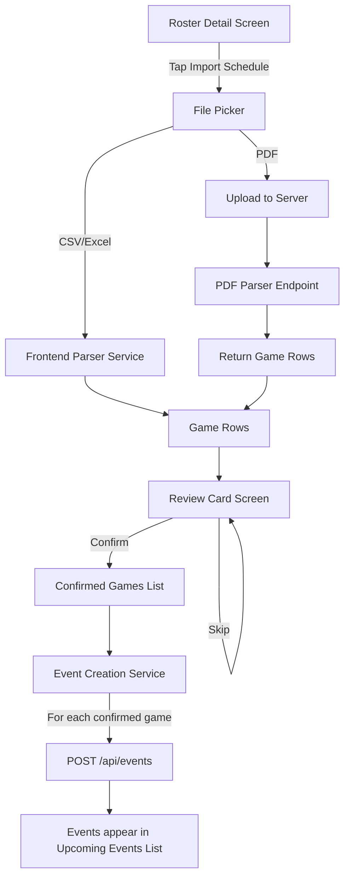

# Design Document: Schedule Import

## Overview

The Schedule Import feature allows a Roster Manager to upload a CSV, Excel, or PDF file containing a game schedule from the Roster Detail Screen. The app parses the file, presents each game as a swipeable review card, and creates Events for confirmed games linked to the roster.

CSV and Excel files are parsed entirely on the frontend using `papaparse` (CSV) and `xlsx` (Excel). PDF files are uploaded to a new server endpoint that uses `pdf-parse` to extract text and return structured game rows. After parsing, the user reviews each game on a full-screen card with Confirm/Skip actions. Confirmed games become Events via the existing `POST /api/events` endpoint, with `scheduledStatus` set to `scheduled` (date + time) or `unscheduled` (date only, time TBD).

The feature also handles automatic opponent identification (matching Home/Away team names against the current roster name), facility matching (searching existing Muster Grounds by name), and opponent roster linking (searching existing rosters by name).

## Architecture



The architecture splits into three layers:

1. **Parsing Layer** — `ScheduleParserService` on the frontend handles CSV/Excel. A new `POST /api/schedule/parse-pdf` endpoint handles PDF server-side.
2. **Review Layer** — `ScheduleReviewScreen` presents parsed games as swipeable cards. The user confirms or skips each game.
3. **Creation Layer** — `ScheduleImportService` takes confirmed games, resolves facilities and opponents, and creates Events via the existing API.

### New Files

| File                                         | Purpose                                                            |
| -------------------------------------------- | ------------------------------------------------------------------ |
| `src/services/ScheduleParserService.ts`      | Frontend CSV/Excel parsing, field extraction, normalization        |
| `src/services/ScheduleImportService.ts`      | Facility matching, opponent matching, event creation orchestration |
| `src/screens/teams/ScheduleReviewScreen.tsx` | Full-screen swipeable review card UI                               |
| `src/types/scheduleImport.ts`                | TypeScript types for GameRow, ParseResult, etc.                    |
| `server/src/routes/schedule.ts`              | PDF parse endpoint                                                 |

### Modified Files

| File                                      | Change                                           |
| ----------------------------------------- | ------------------------------------------------ |
| `src/screens/teams/TeamDetailsScreen.tsx` | Add "Import Schedule" button for managers        |
| `src/navigation/`                         | Register ScheduleReviewScreen in the teams stack |
| `server/src/routes/`                      | Mount schedule router in the Express app         |
| `src/components/ui/EventCard.tsx`         | Add "Pending" badge for `unscheduled` events     |

## Components and Interfaces

### ScheduleParserService

A stateless service class that handles file parsing on the frontend.

```typescript
// src/services/ScheduleParserService.ts
import Papa from 'papaparse';
import * as XLSX from 'xlsx';

export interface GameRow {
  gameNumber: string | null;
  date: string; // ISO date string (YYYY-MM-DD)
  time: string | null; // ISO time string (HH:mm) or null for TBD
  homeTeam: string;
  awayTeam: string;
  location: string | null;
  division: string | null;
}

export interface ParseResult {
  success: boolean;
  gameRows: GameRow[];
  errors: string[];
}

class ScheduleParserService {
  parseCSV(fileContent: string): ParseResult;
  parseExcel(fileBuffer: ArrayBuffer): ParseResult;
  normalizeRow(raw: Record<string, string>): GameRow | null;
  detectColumns(headers: string[]): ColumnMapping;
}
```

Key behaviors:

- `detectColumns` uses fuzzy header matching to map column names (e.g., "Game #", "Game No", "Number" → `gameNumber`).
- `normalizeRow` parses date strings into ISO format, handles empty time/location fields by setting them to `null`.
- Returns `{ success: false, errors: [...] }` when no valid rows can be extracted.

### PDF Parser Endpoint

```typescript
// server/src/routes/schedule.ts
// POST /api/schedule/parse-pdf
// Accepts: multipart/form-data with a single PDF file
// Returns: { success: boolean, gameRows: GameRow[], errors: string[] }
```

Uses `pdf-parse` to extract text, then applies regex/heuristic line parsing to identify tabular game data. Returns the same `ParseResult` shape as the frontend parser.

### ScheduleReviewScreen

A new screen pushed onto the teams navigation stack. Receives `gameRows: GameRow[]` and `team: Team` as route params.

```typescript
// src/screens/teams/ScheduleReviewScreen.tsx
interface ScheduleReviewScreenProps {
  route: {
    params: {
      gameRows: GameRow[];
      team: Team;
    };
  };
}
```

Displays one `ReviewCard` at a time. Each card shows:

- Game number (if present)
- Date and time (or "Time TBD")
- Roster name vs Opponent name (auto-identified)
- Location (or "Location TBD")
- Division (if present)
- Confirm / Skip buttons

Uses `Animated` from React Native for card transitions. No external gesture library needed — simple button-based confirm/skip with a fade/slide animation between cards.

### ScheduleImportService

Orchestrates the creation of Events from confirmed game rows.

```typescript
// src/services/ScheduleImportService.ts
class ScheduleImportService {
  async createEventsFromGames(
    confirmedGames: ConfirmedGame[],
    team: Team,
    userId: string
  ): Promise<ImportResult>;

  async matchFacility(locationName: string): Promise<string | null>;
  async matchOpponentRoster(opponentName: string): Promise<string | null>;

  buildEventPayload(
    game: ConfirmedGame,
    team: Team,
    userId: string,
    facilityId: string | null,
    opponentRosterId: string | null
  ): CreateEventData;
}

interface ConfirmedGame extends GameRow {
  isHomeTeam: boolean;
  opponentName: string;
}

interface ImportResult {
  created: number;
  failed: number;
  errors: string[];
}
```

`matchFacility` calls `facilityService.searchFacilities(locationName)` and returns the first exact-ish name match or `null`.
`matchOpponentRoster` calls `teamService.searchTeams(opponentName)` and returns the first name match or `null`.

### Opponent Identification Logic

```typescript
function identifyOpponent(
  gameRow: GameRow,
  rosterName: string
): {
  opponentName: string;
  isHomeTeam: boolean;
  matched: boolean;
} {
  const homeLower = gameRow.homeTeam.toLowerCase().trim();
  const awayLower = gameRow.awayTeam.toLowerCase().trim();
  const rosterLower = rosterName.toLowerCase().trim();

  if (homeLower.includes(rosterLower) || rosterLower.includes(homeLower)) {
    return { opponentName: gameRow.awayTeam, isHomeTeam: true, matched: true };
  }
  if (awayLower.includes(rosterLower) || rosterLower.includes(awayLower)) {
    return { opponentName: gameRow.homeTeam, isHomeTeam: false, matched: true };
  }
  return { opponentName: '', isHomeTeam: true, matched: false };
}
```

When `matched` is `false`, the Review Card shows both team names and a toggle for the user to pick which side is their roster.

### Event Payload Construction

For a confirmed game with date + time (`scheduledStatus: 'scheduled'`):

```typescript
{
  title: `${rosterName} vs ${opponentName}`,
  description: `Imported game #${gameNumber}`,
  sportType: team.sportType,
  facilityId: matchedFacilityId || undefined,
  locationName: matchedFacilityId ? undefined : locationName,
  locationAddress: matchedFacilityId ? undefined : locationName,
  startTime: new Date(`${date}T${time}`),
  endTime: new Date(startTime.getTime() + 2 * 60 * 60 * 1000), // default 2hr duration
  maxParticipants: team.maxMembers,
  price: 0,
  skillLevel: team.skillLevel,
  equipment: [],
  eventType: 'game',
  organizerId: userId,
  eligibility: {
    restrictedToTeams: [team.id, ...(opponentRosterId ? [opponentRosterId] : [])],
  },
  scheduledStatus: 'scheduled',
}
```

For date-only games (`scheduledStatus: 'unscheduled'`):

- `startTime` is set to midnight of the game date
- `scheduledStatus` is `'unscheduled'`
- All other fields are the same

## Data Models

### GameRow (Frontend)

```typescript
interface GameRow {
  gameNumber: string | null;
  date: string; // YYYY-MM-DD
  time: string | null; // HH:mm or null
  homeTeam: string;
  awayTeam: string;
  location: string | null;
  division: string | null;
}
```

### ConfirmedGame (Frontend)

```typescript
interface ConfirmedGame extends GameRow {
  isHomeTeam: boolean; // true if current roster is home team
  opponentName: string; // resolved opponent name
}
```

### ParseResult (Shared shape — frontend and server)

```typescript
interface ParseResult {
  success: boolean;
  gameRows: GameRow[];
  errors: string[];
}
```

### No Database Schema Changes

The feature uses the existing `Event` model as-is. The `scheduledStatus` field already supports `'scheduled'` and `'unscheduled'` values. Location fields (`facilityId`, `locationName`, `locationAddress`) and team restriction fields (`eligibilityRestrictedToTeams`) already exist. No Prisma migration is needed.

## Correctness Properties

_A property is a characteristic or behavior that should hold true across all valid executions of a system — essentially, a formal statement about what the system should do. Properties serve as the bridge between human-readable specifications and machine-verifiable correctness guarantees._

### Property 1: Parsing round-trip

_For any_ array of valid GameRow objects, serializing them to CSV format and then parsing the CSV back through the ScheduleParserService SHALL produce an equivalent array of GameRow objects (same field values, same order).

**Validates: Requirements 2.6**

### Property 2: Field extraction from raw rows

_For any_ raw row object containing the fields Game Number, Date, Time, Home Team, Away Team, Location, and Division (with Time and Location optionally empty), calling `normalizeRow` SHALL produce a GameRow with all non-empty fields preserved and empty Time/Location fields set to `null`.

**Validates: Requirements 2.2, 2.3, 2.4**

### Property 3: Review card displays all required information

_For any_ GameRow and roster name, the rendered ReviewCard SHALL contain the game's date, the roster name, the opponent name (or both team names if unmatched), the time (or "Time TBD" when time is null), and the location (or "Location TBD" when location is null).

**Validates: Requirements 4.2**

### Property 4: Opponent identification correctness

_For any_ GameRow with homeTeam and awayTeam values, and a rosterName that matches exactly one of them, the `identifyOpponent` function SHALL return the non-matching team as the opponent and correctly indicate whether the roster is the home or away team. When rosterName matches neither, the function SHALL return `matched: false`.

**Validates: Requirements 5.1, 5.2, 5.3, 5.4**

### Property 5: Event payload correctness

_For any_ ConfirmedGame, team, and userId, the `buildEventPayload` function SHALL produce an event payload where: (a) `scheduledStatus` is `'scheduled'` when time is non-null and `'unscheduled'` when time is null, (b) `startTime` uses the game's date and time when available or midnight when time is null, (c) `title` contains both the roster name and opponent name, (d) `sportType` matches the team's sportType, (e) `organizerId` equals the userId, and (f) `eligibilityRestrictedToTeams` includes the team's ID.

**Validates: Requirements 6.1, 6.2, 6.3, 6.4, 6.5, 6.6, 7.1, 7.2, 7.3**

### Property 6: Pending events sort before scheduled events

_For any_ list of Events containing a mix of `scheduledStatus: 'unscheduled'` and `scheduledStatus: 'scheduled'` events, after applying the upcoming events sort, all unscheduled events SHALL appear before all scheduled events.

**Validates: Requirements 10.1**

## Error Handling

| Scenario                                 | Handling                                                                                                                                 |
| ---------------------------------------- | ---------------------------------------------------------------------------------------------------------------------------------------- |
| Unsupported file type selected           | Display inline error: "Unsupported file type. Please select a CSV, Excel (.xlsx, .xls), or PDF file." Do not attempt parsing.            |
| CSV/Excel parsing fails (no valid rows)  | Display error: "Could not extract any games from this file. Please check the file format and try again." Return to roster detail screen. |
| PDF upload fails (network error)         | Display error: "Could not upload the PDF. Please check your connection and try again." Offer retry.                                      |
| PDF parsing fails (server returns error) | Display error: "Could not extract games from this PDF. The file may not contain a recognizable schedule format."                         |
| Event creation fails for a single game   | Log the error, continue creating remaining events. Show summary at end: "Created X of Y events. Z failed."                               |
| Opponent name matches neither team       | Show "Unmatched" label on review card with a toggle for the user to pick their side.                                                     |
| No facility match found                  | Silently fall back to Open Ground (store location as free text). No error shown.                                                         |
| File is empty or zero bytes              | Display error: "The selected file appears to be empty."                                                                                  |

All errors use the existing `Alert.alert()` pattern from the app. Network errors leverage the retry logic in `BaseApiService`.

## Testing Strategy

### Property-Based Tests (fast-check)

The project already uses `fast-check` for property testing. Each property test runs a minimum of 100 iterations.

| Test                       | Property   | Library                                   |
| -------------------------- | ---------- | ----------------------------------------- |
| CSV round-trip             | Property 1 | fast-check                                |
| Row normalization          | Property 2 | fast-check                                |
| Review card content        | Property 3 | fast-check + React Native Testing Library |
| Opponent identification    | Property 4 | fast-check                                |
| Event payload construction | Property 5 | fast-check                                |
| Event list ordering        | Property 6 | fast-check                                |

Each test is tagged with: `Feature: schedule-import, Property {N}: {title}`

### Unit Tests (Jest)

- `ScheduleParserService.parseCSV` — specific CSV samples with known output
- `ScheduleParserService.parseExcel` — specific Excel buffer with known output
- `ScheduleParserService.detectColumns` — header variations (e.g., "Game #", "Game No.", "Number")
- `identifyOpponent` — edge cases: partial name matches, case insensitivity, whitespace
- `buildEventPayload` — specific confirmed game → expected payload
- File type validation — reject `.txt`, `.doc`, accept `.csv`, `.xlsx`, `.xls`, `.pdf`
- Error display when no valid rows are parsed

### Integration Tests

- PDF parse endpoint (`POST /api/schedule/parse-pdf`) — upload sample PDFs, verify response shape
- Full import flow — parse CSV → review → create events → verify events appear in team events list
- Facility matching — mock `facilityService.searchFacilities`, verify `facilityId` is set or `locationName` is used
- Opponent roster matching — mock `teamService.searchTeams`, verify `eligibilityRestrictedToTeams` includes matched roster

### Component Tests (React Native Testing Library)

- `ScheduleReviewScreen` — renders first card, advances on Confirm/Skip, shows summary at end
- "Import Schedule" button visibility — shown for managers, hidden for non-managers
- "Pending" badge on EventCard — shown for `unscheduled` events, hidden for `scheduled`
- Unmatched opponent toggle — displayed when neither team matches roster name
