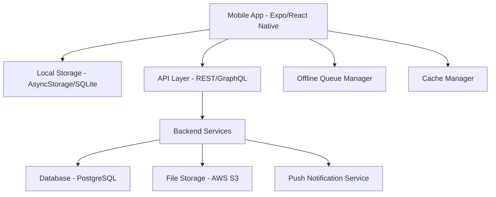

# Design Document

## Overview

The Sports Booking App is a React Native mobile application built with Expo that enables users to discover, book, and manage sporting events. The app features offline-first architecture with local caching, push notifications, and real-time synchronization. The design emphasizes user experience with intuitive navigation, responsive UI, and reliable offline functionality.

## Architecture

### High-Level Architecture



### Technology Stack

- **Frontend**: React Native with Expo SDK 49+
- **Navigation**: React Navigation 6
- **State Management**: Redux Toolkit with RTK Query
- **Local Storage**: AsyncStorage for simple data, Expo SQLite for complex queries
- **Networking**: Axios with offline queue support
- **Push Notifications**: Expo Notifications
- **Maps**: React Native Maps
- **Authentication**: Expo AuthSession with JWT tokens
- **Image Handling**: Expo ImagePicker and ImageManipulator
- **Offline Support**: Redux Persist with custom sync middleware

## Screen List and Navigation Map

### Screen Hierarchy

```mermaid
graph TD
    A[App Entry] --> B[Onboarding Stack]
    A --> C[Auth Stack]
    A --> D[Main Tab Navigator]
    
    B --> B1[Welcome Screen]
    B --> B2[Feature Overview]
    B --> B3[Get Started]
    
    C --> C1[Login Screen]
    C --> C2[Register Screen]
    C --> C3[Forgot Password]
    
    D --> D1[Home Tab]
    D --> D2[Events Tab]
    D --> D3[Facilities Tab]
    D --> D4[Teams Tab]
    D --> D5[Bookings Tab]
    D --> D6[Profile Tab]
    
    D1 --> E1[Event Details]
    D1 --> E2[Facility Details]
    D1 --> E3[Search Results]
    
    D2 --> F1[Create Event]
    D2 --> F2[Edit Event]
    D2 --> E1
    
    D3 --> G1[Create Facility]
    D3 --> G2[Edit Facility]
    D3 --> E2
    
    D4 --> J1[Create Team]
    D4 --> J2[Team Details]
    D4 --> J3[Join Team]
    
    D5 --> H1[Booking Details]
    D5 --> H2[Booking History]
    
    D6 --> I1[Edit Profile]
    D6 --> I2[Settings]
    D6 --> I3[Notification Preferences]
```



### Screen Specifications

#### Onboarding Stack
- **Welcome Screen**: App logo, tagline, and navigation to feature overview
- **Feature Overview**: Carousel showcasing key app features with illustrations
- **Get Started**: Final onboarding step with CTA to login/register

#### Authentication Stack
- **Login Screen**: Email/password form with "Remember Me" and "Forgot Password" options
- **Register Screen**: User registration form with validation
- **Forgot Password**: Email input for password reset

#### Main Application (Tab Navigator)
- **Home Tab**: Dashboard with upcoming events, nearby facilities, quick actions
- **Events Tab**: Event discovery with filters, search, and list/map views
- **Facilities Tab**: Facility browser with search, filters, and map integration
- **Teams Tab**: Team discovery, creation, and management interface
- **Bookings Tab**: User's bookings (upcoming, past) with management options
- **Profile Tab**: User profile, settings, and app preferences

#### Modal/Detail Screens
- **Event Details**: Full event information with booking functionality
- **Facility Details**: Facility information, photos, amenities, and events
- **Team Details**: Team information, members, stats, and management options
- **Create/Edit Event**: Form for event creation and modification
- **Create/Edit Facility**: Form for facility management
- **Create/Join Team**: Team creation form and join interface
- **Booking Details**: Individual booking information and actions
- **Settings**: App preferences, notifications, account management

## Components and Interfaces

### Core Components

#### Navigation Components
- **TabNavigator**: Bottom tab navigation with badge support
- **StackNavigator**: Screen stack management with custom transitions
- **DrawerNavigator**: Side menu for additional navigation (if needed)

#### UI Components
- **EventCard**: Reusable event display component
- **FacilityCard**: Facility information display
- **BookingCard**: Booking status and details display
- **TeamCard**: Team information and member display
- **SearchBar**: Universal search component with filters
- **MapView**: Interactive map with markers and clustering
- **DateTimePicker**: Custom date/time selection component
- **ImageCarousel**: Photo gallery component for facilities/events
- **LoadingSpinner**: Consistent loading indicator
- **OfflineIndicator**: Network status display
- **NotificationBanner**: In-app notification display
- **MemberList**: Team member management component
- **InviteModal**: Team invitation interface

#### Form Components
- **FormInput**: Standardized text input with validation
- **FormSelect**: Dropdown selection component
- **FormCheckbox**: Checkbox with label component
- **FormButton**: Consistent button styling and behavior
- **ImageUploader**: Photo selection and upload component

### Service Interfaces

#### API Service Layer
```typescript
interface ApiService {
  // Authentication
  login(credentials: LoginCredentials): Promise<AuthResponse>
  register(userData: RegisterData): Promise<AuthResponse>
  refreshToken(): Promise<TokenResponse>
  
  // Events
  getEvents(filters?: EventFilters): Promise<Event[]>
  getEvent(id: string): Promise<Event>
  createEvent(event: CreateEventData): Promise<Event>
  updateEvent(id: string, updates: UpdateEventData): Promise<Event>
  deleteEvent(id: string): Promise<void>
  bookEvent(eventId: string, teamId?: string): Promise<Booking>
  cancelBooking(bookingId: string): Promise<void>
  
  // Facilities
  getFacilities(filters?: FacilityFilters): Promise<Facility[]>
  getFacility(id: string): Promise<Facility>
  createFacility(facility: CreateFacilityData): Promise<Facility>
  updateFacility(id: string, updates: UpdateFacilityData): Promise<Facility>
  deleteFacility(id: string): Promise<void>
  
  // Teams
  getTeams(filters?: TeamFilters): Promise<Team[]>
  getTeam(id: string): Promise<Team>
  createTeam(team: CreateTeamData): Promise<Team>
  updateTeam(id: string, updates: UpdateTeamData): Promise<Team>
  deleteTeam(id: string): Promise<void>
  joinTeam(teamId: string, inviteCode?: string): Promise<TeamMember>
  leaveTeam(teamId: string): Promise<void>
  inviteToTeam(teamId: string, userId: string): Promise<void>
  removeFromTeam(teamId: string, userId: string): Promise<void>
  
  // Users
  getProfile(): Promise<UserProfile>
  updateProfile(updates: UpdateProfileData): Promise<UserProfile>
  uploadProfileImage(image: ImageData): Promise<string>
}
```

#### Offline Service Layer
```typescript
interface OfflineService {
  queueAction(action: OfflineAction): void
  syncPendingActions(): Promise<SyncResult>
  getCachedData<T>(key: string): Promise<T | null>
  setCachedData<T>(key: string, data: T): Promise<void>
  clearCache(): Promise<void>
  getNetworkStatus(): boolean
}
```

## Data Models

### User Models
```typescript
interface User {
  id: string
  email: string
  firstName: string
  lastName: string
  profileImage?: string
  phoneNumber?: string
  dateOfBirth?: Date
  preferredSports: string[]
  notificationPreferences: NotificationPreferences
  createdAt: Date
  updatedAt: Date
}

interface NotificationPreferences {
  eventReminders: boolean
  eventUpdates: boolean
  newEventAlerts: boolean
  marketingEmails: boolean
  pushNotifications: boolean
}
```

### Event Models
```typescript
interface Event {
  id: string
  title: string
  description: string
  sportType: SportType
  facilityId: string
  facility?: Facility
  organizerId: string
  organizer?: User
  teamIds?: string[]
  teams?: Team[]
  startTime: Date
  endTime: Date
  maxParticipants: number
  currentParticipants: number
  price: number
  currency: string
  skillLevel: SkillLevel
  equipment: string[]
  rules?: string
  status: EventStatus
  eventType: EventType
  participants: Participant[]
  createdAt: Date
  updatedAt: Date
}

enum EventType {
  INDIVIDUAL = 'individual',
  TEAM_BASED = 'team_based',
  PICKUP = 'pickup',
  TOURNAMENT = 'tournament'
}

interface Participant {
  userId: string
  user?: User
  bookingId: string
  joinedAt: Date
  status: ParticipantStatus
}

enum SportType {
  BASKETBALL = 'basketball',
  SOCCER = 'soccer',
  TENNIS = 'tennis',
  VOLLEYBALL = 'volleyball',
  BADMINTON = 'badminton',
  OTHER = 'other'
}

enum SkillLevel {
  BEGINNER = 'beginner',
  INTERMEDIATE = 'intermediate',
  ADVANCED = 'advanced',
  ALL_LEVELS = 'all_levels'
}

enum EventStatus {
  ACTIVE = 'active',
  CANCELLED = 'cancelled',
  COMPLETED = 'completed',
  FULL = 'full'
}
```

### Facility Models
```typescript
interface Facility {
  id: string
  name: string
  description: string
  address: Address
  coordinates: Coordinates
  amenities: Amenity[]
  sportTypes: SportType[]
  images: string[]
  contactInfo: ContactInfo
  operatingHours: OperatingHours
  pricing: FacilityPricing
  ownerId: string
  owner?: User
  rating: number
  reviewCount: number
  createdAt: Date
  updatedAt: Date
}

interface Address {
  street: string
  city: string
  state: string
  zipCode: string
  country: string
}

interface Coordinates {
  latitude: number
  longitude: number
}

interface Amenity {
  id: string
  name: string
  icon: string
  description?: string
}

interface ContactInfo {
  phone?: string
  email?: string
  website?: string
}

interface OperatingHours {
  [key: string]: TimeSlot[] // key is day of week
}

interface TimeSlot {
  open: string // HH:mm format
  close: string // HH:mm format
}
```

### Booking Models
```typescript
interface Booking {
  id: string
  userId: string
  user?: User
  eventId: string
  event?: Event
  teamId?: string
  team?: Team
  status: BookingStatus
  paymentStatus: PaymentStatus
  paymentId?: string
  bookedAt: Date
  cancelledAt?: Date
  cancellationReason?: string
  refundAmount?: number
  createdAt: Date
  updatedAt: Date
}

enum BookingStatus {
  CONFIRMED = 'confirmed',
  CANCELLED = 'cancelled',
  COMPLETED = 'completed',
  NO_SHOW = 'no_show'
}

enum PaymentStatus {
  PENDING = 'pending',
  PAID = 'paid',
  REFUNDED = 'refunded',
  FAILED = 'failed'
}
```

### Team Models
```typescript
interface Team {
  id: string
  name: string
  description?: string
  captainId: string
  captain?: User
  members: TeamMember[]
  sportType: SportType
  skillLevel: SkillLevel
  maxMembers: number
  isPublic: boolean
  inviteCode?: string
  logo?: string
  stats: TeamStats
  createdAt: Date
  updatedAt: Date
}

interface TeamMember {
  userId: string
  user?: User
  role: TeamRole
  joinedAt: Date
  status: MemberStatus
}

interface TeamStats {
  gamesPlayed: number
  gamesWon: number
  gamesLost: number
  winRate: number
  averageScore?: number
}

enum TeamRole {
  CAPTAIN = 'captain',
  CO_CAPTAIN = 'co_captain',
  MEMBER = 'member'
}

enum MemberStatus {
  ACTIVE = 'active',
  INACTIVE = 'inactive',
  PENDING = 'pending',
  REMOVED = 'removed'
}
```

## API Requirements

### Authentication Endpoints
- `POST /auth/login` - User login
- `POST /auth/register` - User registration  
- `POST /auth/refresh` - Token refresh
- `POST /auth/logout` - User logout
- `POST /auth/forgot-password` - Password reset request
- `POST /auth/reset-password` - Password reset confirmation

### Event Endpoints
- `GET /events` - List events with filtering and pagination
- `GET /events/:id` - Get event details
- `POST /events` - Create new event
- `PUT /events/:id` - Update event
- `DELETE /events/:id` - Delete event
- `POST /events/:id/book` - Book event
- `DELETE /bookings/:id` - Cancel booking
- `GET /events/:id/participants` - Get event participants

### Facility Endpoints
- `GET /facilities` - List facilities with filtering
- `GET /facilities/:id` - Get facility details
- `POST /facilities` - Create facility
- `PUT /facilities/:id` - Update facility
- `DELETE /facilities/:id` - Delete facility
- `GET /facilities/:id/events` - Get facility events
- `POST /facilities/:id/images` - Upload facility images

### User Endpoints
- `GET /users/profile` - Get user profile
- `PUT /users/profile` - Update user profile
- `POST /users/profile/image` - Upload profile image
- `GET /users/bookings` - Get user bookings
- `GET /users/events` - Get user's created events
- `GET /users/teams` - Get user's teams
- `PUT /users/notifications` - Update notification preferences

### Team Endpoints
- `GET /teams` - List teams with filtering and pagination
- `GET /teams/:id` - Get team details
- `POST /teams` - Create new team
- `PUT /teams/:id` - Update team
- `DELETE /teams/:id` - Delete team
- `POST /teams/:id/join` - Join team (with optional invite code)
- `POST /teams/:id/leave` - Leave team
- `POST /teams/:id/invite` - Invite user to team
- `DELETE /teams/:id/members/:userId` - Remove member from team
- `GET /teams/:id/events` - Get team's events
- `PUT /teams/:id/members/:userId/role` - Update member role

### Search and Discovery
- `GET /search/events` - Search events
- `GET /search/facilities` - Search facilities
- `GET /search/teams` - Search teams
- `GET /events/nearby` - Get nearby events
- `GET /facilities/nearby` - Get nearby facilities
- `GET /teams/nearby` - Get nearby teams
- `GET /events/recommended` - Get recommended events
- `GET /teams/recommended` - Get recommended teams

### Push Notification Endpoints
- `POST /notifications/register` - Register device for push notifications
- `PUT /notifications/preferences` - Update notification preferences
- `POST /notifications/test` - Send test notification

## Error Handling

### Error Response Format
```typescript
interface ApiError {
  code: string
  message: string
  details?: any
  timestamp: Date
}
```

### Common Error Codes
- `AUTH_REQUIRED` - Authentication required
- `INVALID_CREDENTIALS` - Invalid login credentials
- `VALIDATION_ERROR` - Request validation failed
- `NOT_FOUND` - Resource not found
- `PERMISSION_DENIED` - Insufficient permissions
- `RATE_LIMITED` - Too many requests
- `SERVER_ERROR` - Internal server error
- `NETWORK_ERROR` - Network connectivity issue

### Offline Error Handling
- Queue failed requests for retry when online
- Show appropriate offline indicators
- Provide cached data when available
- Handle sync conflicts gracefully

## Correctness Properties

*A property is a characteristic or behavior that should hold true across all valid executions of a system-essentially, a formal statement about what the system should do. Properties serve as the bridge between human-readable specifications and machine-verifiable correctness guarantees.*

### Property Reflection

After analyzing all acceptance criteria, several properties can be consolidated to eliminate redundancy:
- Authentication properties (2.1-2.5) can be combined into comprehensive authentication behavior
- CRUD operations for facilities and events follow similar patterns and can be generalized
- Notification properties (9.1-9.6) share common notification delivery patterns
- Offline sync properties (8.1-8.6, 10.1-10.6) can be consolidated around sync consistency

### Core Properties

**Property 1: Authentication Round Trip**
*For any* valid user credentials, successful authentication should maintain session state until explicit logout or expiration, and invalid credentials should always be rejected with appropriate error messages
**Validates: Requirements 2.1, 2.2, 2.3, 2.5**

**Property 2: CRUD Data Consistency**
*For any* facility or event, creating then reading should return equivalent data, updating then reading should reflect changes, and deleting should make the resource unavailable
**Validates: Requirements 4.1, 4.2, 4.3, 5.1, 5.2, 5.3**

**Property 3: Booking Capacity Invariant**
*For any* event, the number of confirmed bookings should never exceed the maximum capacity, and booking attempts on full events should be rejected
**Validates: Requirements 6.1, 6.2, 6.4**

**Property 4: Booking State Consistency**
*For any* booking operation (create/cancel), the participant count and availability should be updated atomically, and the user's booking list should reflect the change
**Validates: Requirements 6.2, 6.3, 6.5**

**Property 5: Search Result Relevance**
*For any* search query with filters, all returned results should match the specified criteria (sport type, date range, location, price)
**Validates: Requirements 4.4, 5.6**

**Property 6: Profile Update Propagation**
*For any* profile change, the updated information should be reflected consistently across all app screens and user interactions
**Validates: Requirements 7.1, 7.2, 7.3**

**Property 7: Offline Data Availability**
*For any* cached data (bookings, profile, recent events), it should remain accessible when offline and sync properly when connectivity is restored
**Validates: Requirements 8.1, 8.2, 8.3, 8.6**

**Property 8: Sync Conflict Resolution**
*For any* data conflict between local and server state, the resolution should follow defined precedence rules (server for shared data, user preference for personal data) without data loss
**Validates: Requirements 8.5, 10.2**

**Property 9: Notification Delivery**
*For any* notification trigger (event reminder, booking confirmation, event changes), notifications should be sent to affected users according to their preferences and device permissions
**Validates: Requirements 9.1, 9.2, 9.5, 9.6**

**Property 10: Data Validation Consistency**
*For any* input data (events, facilities, user profiles), invalid data should be rejected with descriptive error messages, and valid data should be accepted and stored correctly
**Validates: Requirements 4.6, 5.4**

**Property 11: Cache Management**
*For any* app startup, cached data should load immediately while background sync occurs, and cache cleanup should prioritize essential data when storage is limited
**Validates: Requirements 10.3, 10.5**

## Testing Strategy

### Dual Testing Approach

The app will use both unit testing and property-based testing to ensure comprehensive coverage:

**Unit Tests**: Verify specific examples, edge cases, and error conditions
- Component rendering and user interactions
- API response handling and error states  
- Navigation flows and screen transitions
- Form validation and input handling
- Offline state management

**Property Tests**: Verify universal properties across all inputs
- Authentication flows with various credential combinations
- CRUD operations with randomly generated data
- Booking capacity and state management
- Search and filtering with diverse query inputs
- Sync behavior with simulated network conditions

### Property-Based Testing Configuration

- **Framework**: Use `fast-check` for JavaScript property-based testing
- **Test Iterations**: Minimum 100 iterations per property test
- **Test Tagging**: Each property test must reference its design document property
- **Tag Format**: `// Feature: sports-booking-app, Property {number}: {property_text}`

### Testing Tools and Frameworks

- **Unit Testing**: Jest with React Native Testing Library
- **Property Testing**: fast-check for property-based test generation
- **Integration Testing**: Detox for end-to-end mobile app testing
- **API Testing**: MSW (Mock Service Worker) for API mocking
- **Component Testing**: Storybook for component isolation testing

### Test Data Management

- **Generators**: Create smart generators for users, events, facilities, and bookings
- **Constraints**: Ensure generated data respects business rules (valid dates, capacity limits, etc.)
- **Cleanup**: Implement proper test data cleanup between test runs
- **Mocking**: Mock external services (push notifications, maps, image uploads) appropriately

### Performance and Load Testing

- **Offline Performance**: Test app responsiveness with large cached datasets
- **Sync Performance**: Verify sync operations complete within acceptable timeframes
- **Memory Usage**: Monitor memory consumption during extended offline usage
- **Battery Impact**: Test background sync and notification impact on battery life

## Error Handling

### Client-Side Error Handling

#### Network Errors
- **Connection Loss**: Queue operations for retry when connectivity returns
- **Timeout Errors**: Provide user feedback and retry options
- **Server Errors**: Display user-friendly messages and fallback options

#### Validation Errors
- **Form Validation**: Real-time validation with clear error messages
- **Data Integrity**: Prevent invalid state transitions and data corruption
- **User Input**: Sanitize and validate all user inputs before processing

#### Offline Errors
- **Sync Conflicts**: Present conflict resolution options to users
- **Storage Limits**: Gracefully handle storage quota exceeded scenarios
- **Cache Corruption**: Detect and recover from corrupted cache data

### Error Recovery Strategies

#### Automatic Recovery
- **Retry Logic**: Exponential backoff for failed network requests
- **Cache Fallback**: Use cached data when fresh data unavailable
- **Graceful Degradation**: Disable features that require connectivity when offline

#### User-Initiated Recovery
- **Manual Sync**: Allow users to trigger manual data synchronization
- **Cache Clear**: Provide option to clear cache and reload fresh data
- **Logout/Login**: Reset authentication state to resolve auth-related issues

### Error Monitoring and Logging

#### Client-Side Logging
- **Error Tracking**: Log errors with context for debugging
- **Performance Metrics**: Track app performance and user interactions
- **Crash Reporting**: Capture and report app crashes with stack traces

#### Privacy Considerations
- **Data Anonymization**: Remove PII from error logs and crash reports
- **User Consent**: Respect user preferences for data collection and reporting
- **Secure Transmission**: Encrypt error reports during transmission to servers