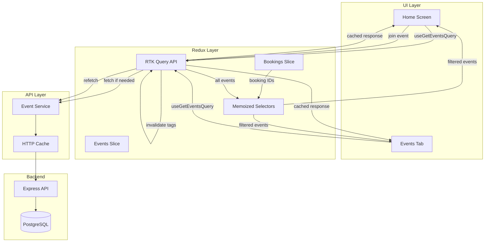
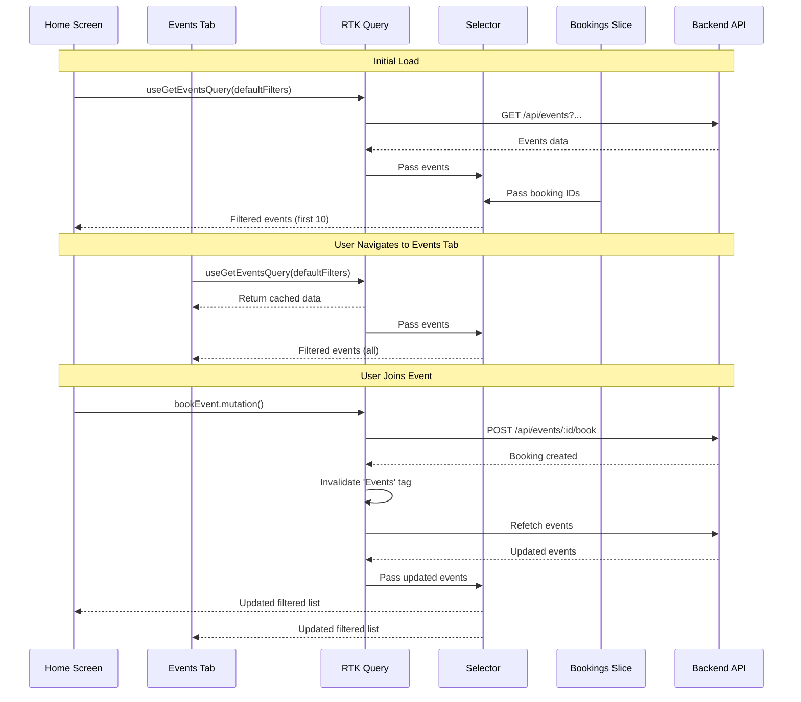

# Design Document: Sync Home Screen Nearby Events with Events Tab

## Overview

This design establishes a unified event query system that ensures the Home Screen's "Nearby Events" list and the Events Tab pull from the same data source, apply consistent filtering logic, and remain synchronized in real-time. The solution leverages Redux Toolkit Query (RTK Query) for caching and automatic invalidation, Redux selectors for filtering joined events, and a shared query configuration to maintain consistency across both screens.

### Current State

Currently, both screens fetch events independently:
- **HomeScreen.tsx**: Calls `eventService.getEvents()` directly, manually filters out booked events, and displays up to 20 events
- **EventsListScreen.tsx**: Uses Redux actions to fetch events, applies filters, and supports pagination

This leads to:
- Duplicate API calls when both screens are active
- Inconsistent filtering logic between screens
- Manual cache invalidation after booking/cancellation operations
- Potential race conditions when data changes

### Proposed Solution

The design introduces:
1. **RTK Query Integration**: Replace manual API calls with RTK Query endpoints for automatic caching and invalidation
2. **Unified Query Configuration**: Define a "default filter" configuration that both screens use
3. **Memoized Selectors**: Create Redux selectors that filter out joined events based on bookings state
4. **Automatic Synchronization**: Use RTK Query's tag-based invalidation to update both screens when events or bookings change
5. **Home Screen Limit**: Apply a 10-event limit in the Home Screen component while preserving full pagination in Events Tab

### Key Benefits

- Single source of truth for event data
- Automatic cache management and invalidation
- Real-time synchronization without manual refresh
- Reduced network requests through intelligent caching
- Consistent user experience across screens
- Backward compatibility with existing Events Tab features

## Architecture

### High-Level Data Flow



### Component Interaction Diagram



### State Management Architecture

The solution uses a layered approach:

1. **RTK Query API Layer**: Manages API calls, caching, and automatic refetching
2. **Redux Slices**: Store normalized data and provide base selectors
3. **Memoized Selectors**: Combine data from multiple slices to derive filtered views
4. **Component Layer**: Consume selectors and hooks with minimal logic

This separation ensures that business logic (filtering joined events) lives in selectors, not components, making it reusable and testable.

## Components and Interfaces

### RTK Query API Definition

**File**: `src/store/api/eventsApi.ts`

```typescript
import { createApi, fetchBaseQuery } from '@reduxjs/toolkit/query/react';
import { Event, EventFilters, PaginatedResponse, PaginationParams, Booking } from '../../types';

// Default filter configuration used by both Home Screen and Events Tab
export const DEFAULT_EVENT_FILTERS: EventFilters = {
  status: 'ACTIVE',
  // Location-based sorting will be handled by backend based on user location
};

export const eventsApi = createApi({
  reducerPath: 'eventsApi',
  baseQuery: fetchBaseQuery({ 
    baseUrl: process.env.EXPO_PUBLIC_API_URL || 'http://localhost:3000/api',
    prepareHeaders: (headers, { getState }) => {
      // Add auth token from state
      const token = (getState() as any).auth.token;
      if (token) {
        headers.set('authorization', `Bearer ${token}`);
      }
      return headers;
    },
  }),
  tagTypes: ['Events', 'Bookings'],
  endpoints: (builder) => ({
    // Get events with filters and pagination
    getEvents: builder.query<PaginatedResponse<Event>, {
      filters?: EventFilters;
      pagination?: PaginationParams;
    }>({
      query: ({ filters = {}, pagination = { page: 1, limit: 20 } }) => ({
        url: '/events',
        params: {
          ...filters,
          ...pagination,
          // Convert Date objects to ISO strings if present
          startDate: filters.startDate?.toISOString(),
          endDate: filters.endDate?.toISOString(),
        },
      }),
      providesTags: (result) =>
        result
          ? [
              ...result.data.map(({ id }) => ({ type: 'Events' as const, id })),
              { type: 'Events', id: 'LIST' },
            ]
          : [{ type: 'Events', id: 'LIST' }],
    }),

    // Get user bookings
    getUserBookings: builder.query<PaginatedResponse<Booking>, {
      status?: 'upcoming' | 'past' | 'all';
      pagination?: PaginationParams;
    }>({
      query: ({ status = 'upcoming', pagination = { page: 1, limit: 100 } }) => ({
        url: '/users/me/bookings',
        params: {
          status,
          ...pagination,
        },
      }),
      providesTags: (result) =>
        result
          ? [
              ...result.data.map(({ id }) => ({ type: 'Bookings' as const, id })),
              { type: 'Bookings', id: 'LIST' },
            ]
          : [{ type: 'Bookings', id: 'LIST' }],
    }),

    // Book an event
    bookEvent: builder.mutation<Booking, { eventId: string; userId: string; teamId?: string }>({
      query: ({ eventId, userId, teamId }) => ({
        url: `/events/${eventId}/book`,
        method: 'POST',
        body: { userId, teamId },
      }),
      // Invalidate both Events and Bookings to trigger refetch
      invalidatesTags: (result, error, { eventId }) => [
        { type: 'Events', id: eventId },
        { type: 'Events', id: 'LIST' },
        { type: 'Bookings', id: 'LIST' },
      ],
    }),

    // Cancel a booking
    cancelBooking: builder.mutation<void, { eventId: string; bookingId: string }>({
      query: ({ eventId, bookingId }) => ({
        url: `/events/${eventId}/book/${bookingId}`,
        method: 'DELETE',
      }),
      // Invalidate both Events and Bookings to trigger refetch
      invalidatesTags: (result, error, { eventId }) => [
        { type: 'Events', id: eventId },
        { type: 'Events', id: 'LIST' },
        { type: 'Bookings', id: 'LIST' },
      ],
    }),
  }),
});

export const {
  useGetEventsQuery,
  useGetUserBookingsQuery,
  useBookEventMutation,
  useCancelBookingMutation,
} = eventsApi;
```

### Redux Selectors

**File**: `src/store/selectors/eventSelectors.ts`

```typescript
import { createSelector } from '@reduxjs/toolkit';
import { RootState } from '../store';
import { Event, Booking } from '../../types';

// Base selector for events from RTK Query cache
const selectEventsResult = (state: RootState) =>
  state.eventsApi.queries['getEvents({"filters":{},"pagination":{"page":1,"limit":20}})']?.data;

// Base selector for bookings from RTK Query cache
const selectBookingsResult = (state: RootState) =>
  state.eventsApi.queries['getUserBookings({"status":"upcoming","pagination":{"page":1,"limit":100}})']?.data;

// Memoized selector: Get set of booked event IDs
export const selectBookedEventIds = createSelector(
  [selectBookingsResult],
  (bookingsResult): Set<string> => {
    if (!bookingsResult?.data) return new Set();
    return new Set(bookingsResult.data.map((booking: Booking) => booking.eventId));
  }
);

// Memoized selector: Get events excluding joined events
export const selectAvailableEvents = createSelector(
  [selectEventsResult, selectBookedEventIds],
  (eventsResult, bookedEventIds): Event[] => {
    if (!eventsResult?.data) return [];
    return eventsResult.data.filter((event: Event) => !bookedEventIds.has(event.id));
  }
);

// Memoized selector: Get first 10 available events for Home Screen
export const selectHomeScreenEvents = createSelector(
  [selectAvailableEvents],
  (availableEvents): Event[] => {
    return availableEvents.slice(0, 10);
  }
);

// Memoized selector: Get all available events for Events Tab
export const selectEventsTabEvents = createSelector(
  [selectAvailableEvents],
  (availableEvents): Event[] => {
    return availableEvents;
  }
);
```

### Updated Home Screen Component

**File**: `src/screens/home/HomeScreen.tsx` (key changes)

```typescript
import { useGetEventsQuery, useGetUserBookingsQuery } from '../../store/api/eventsApi';
import { selectHomeScreenEvents } from '../../store/selectors/eventSelectors';
import { DEFAULT_EVENT_FILTERS } from '../../store/api/eventsApi';

export function HomeScreen(): JSX.Element {
  // Use RTK Query hooks
  const { 
    data: eventsData, 
    isLoading: eventsLoading, 
    error: eventsError,
    refetch: refetchEvents 
  } = useGetEventsQuery({
    filters: DEFAULT_EVENT_FILTERS,
    pagination: { page: 1, limit: 20 },
  });

  const { 
    data: bookingsData, 
    isLoading: bookingsLoading,
    refetch: refetchBookings 
  } = useGetUserBookingsQuery({
    status: 'upcoming',
    pagination: { page: 1, limit: 100 },
  });

  // Use selector to get filtered events
  const nearbyEvents = useSelector(selectHomeScreenEvents);
  const upcomingBookings = bookingsData?.data || [];

  const isLoading = eventsLoading || bookingsLoading;

  // Refresh handler
  const handleRefresh = useCallback(async () => {
    setIsRefreshing(true);
    await Promise.all([refetchEvents(), refetchBookings()]);
    setIsRefreshing(false);
  }, [refetchEvents, refetchBookings]);

  // Rest of component remains similar...
}
```

### Updated Events List Screen Component

**File**: `src/screens/events/EventsListScreen.tsx` (key changes)

```typescript
import { useGetEventsQuery, useGetUserBookingsQuery } from '../../store/api/eventsApi';
import { selectEventsTabEvents } from '../../store/selectors/eventSelectors';
import { DEFAULT_EVENT_FILTERS } from '../../store/api/eventsApi';

export function EventsListScreen(): JSX.Element {
  const [customFilters, setCustomFilters] = useState<EventFilters>({});
  
  // Determine if using default or custom filters
  const hasCustomFilters = Object.keys(customFilters).length > 0;
  const activeFilters = hasCustomFilters ? customFilters : DEFAULT_EVENT_FILTERS;

  // Use RTK Query hooks
  const { 
    data: eventsData, 
    isLoading, 
    error,
    refetch 
  } = useGetEventsQuery({
    filters: activeFilters,
    pagination: { page: 1, limit: 20 },
  });

  const { data: bookingsData } = useGetUserBookingsQuery({
    status: 'upcoming',
    pagination: { page: 1, limit: 100 },
  });

  // Use selector only when using default filters
  const filteredEvents = useSelector(selectEventsTabEvents);
  
  // Use filtered events for default view, raw events for custom filters
  const displayEvents = hasCustomFilters ? (eventsData?.data || []) : filteredEvents;

  // Rest of component with pagination support...
}
```

### Cache Configuration

**File**: `src/store/store.ts` (updated)

```typescript
import { configureStore } from '@reduxjs/toolkit';
import { setupListeners } from '@reduxjs/toolkit/query';
import { eventsApi } from './api/eventsApi';
import authReducer from './slices/authSlice';
import eventsReducer from './slices/eventsSlice';
import bookingsReducer from './slices/bookingsSlice';

export const store = configureStore({
  reducer: {
    [eventsApi.reducerPath]: eventsApi.reducer,
    auth: authReducer,
    events: eventsReducer,
    bookings: bookingsReducer,
  },
  middleware: (getDefaultMiddleware) =>
    getDefaultMiddleware({
      serializableCheck: {
        // Ignore RTK Query actions
        ignoredActions: [eventsApi.reducerPath],
      },
    }).concat(eventsApi.middleware),
});

// Enable refetchOnFocus and refetchOnReconnect behaviors
setupListeners(store.dispatch);

export type RootState = ReturnType<typeof store.getState>;
export type AppDispatch = typeof store.dispatch;
```

## Data Models

### Event Query Parameters

```typescript
interface EventQueryParams {
  filters: EventFilters;
  pagination: PaginationParams;
}

interface EventFilters {
  status?: EventStatus;
  sportType?: SportType;
  skillLevel?: SkillLevel;
  facilityId?: string;
  organizerId?: string;
  teamIds?: string[];
  startDate?: Date;
  endDate?: Date;
  minPrice?: number;
  maxPrice?: number;
  location?: {
    latitude: number;
    longitude: number;
    radius: number; // in km
  };
}

interface PaginationParams {
  page: number;
  limit: number;
}
```

### Cache Entry Structure

RTK Query maintains cache entries with the following structure:

```typescript
interface CacheEntry<T> {
  status: 'uninitialized' | 'pending' | 'fulfilled' | 'rejected';
  data?: T;
  error?: SerializedError;
  requestId: string;
  startedTimeStamp: number;
  fulfilledTimeStamp?: number;
}
```

### Query Key Generation

RTK Query automatically generates cache keys based on endpoint name and parameters:

```
getEvents({"filters":{"status":"ACTIVE"},"pagination":{"page":1,"limit":20}})
getUserBookings({"status":"upcoming","pagination":{"page":1,"limit":100}})
```

This ensures that:
- Identical queries share the same cache entry
- Different filter combinations create separate cache entries
- Home Screen and Events Tab with default filters share cache

## Correctness Properties

*A property is a characteristic or behavior that should hold true across all valid executions of a system—essentially, a formal statement about what the system should do. Properties serve as the bridge between human-readable specifications and machine-verifiable correctness guarantees.*


### Property Reflection

After analyzing all acceptance criteria, several redundancies were identified:

**Redundant Properties Identified:**
- Requirements 2.1 and 2.4 both test the 10-event limit for Home Screen
- Requirements 3.4, 4.2, 4.3, and 4.4 all test joined event exclusion
- Requirements 4.5 and 5.4 both test cache updates after joining an event
- Requirements 5.5, 5.6, and 5.7 all test automatic re-rendering
- Requirements 3.5 and 6.5 both test filter independence
- Requirements 1.5, 7.1, 7.2, and 7.3 all test basic caching behavior
- Requirements 5.1, 5.2, 5.3 are covered by the general cache invalidation property 7.4

**Consolidation Strategy:**
- Combine all joined event exclusion tests into one comprehensive property
- Combine all caching tests into one property with cache hit/miss scenarios
- Combine all cache invalidation tests into one property covering create/update/delete/join
- Combine automatic re-rendering tests into one property for both screens
- Keep specific properties for: Home Screen limit, sort order consistency, filter independence, pagination, search, retry logic, and stale cache handling

### Property 1: Query Result Filtering

*For any* set of events returned by the API and any set of user bookings, the filtered event list should exclude all events where the event ID appears in the user's booking list.

**Validates: Requirements 3.4, 4.2, 4.3, 4.4**

### Property 2: Home Screen Display Limit

*For any* query result containing N events (where N > 10), the Home Screen should display exactly 10 events, and for any result containing N ≤ 10 events, the Home Screen should display exactly N events.

**Validates: Requirements 2.1, 2.4**

### Property 3: Sort Order Consistency

*For any* query result, the order of events displayed on the Home Screen should match the order of the first 10 events displayed on the Events Tab when both use the default filter.

**Validates: Requirement 2.5**

### Property 4: Cache Hit Behavior

*For any* query with specific filter parameters, if that exact query is executed twice in succession without any invalidating mutations between them, the second execution should return cached results without making a network request.

**Validates: Requirements 1.5, 7.1, 7.2, 7.3**

### Property 5: Cache Miss and Storage

*For any* query with specific filter parameters that has not been executed before or whose cache has been invalidated, the query should make a network request and store the results in cache for subsequent requests.

**Validates: Requirement 7.5**

### Property 6: Cache Invalidation on Mutations

*For any* mutation operation (create event, update event, delete event, or join event), the cache for event queries should be invalidated, causing subsequent queries to fetch fresh data from the API.

**Validates: Requirements 5.1, 5.2, 5.3, 4.5, 5.4, 7.4**

### Property 7: Automatic UI Synchronization

*For any* cache invalidation that triggers a refetch, all components subscribed to that query (Home Screen and Events Tab) should automatically re-render with the updated data without requiring user-initiated refresh.

**Validates: Requirements 5.5, 5.6, 5.7**

### Property 8: Filter Independence

*For any* custom filter applied on the Events Tab, the Home Screen query parameters should remain unchanged and continue using the default filter configuration.

**Validates: Requirements 3.5, 6.5**

### Property 9: Pagination Preservation

*For any* page number N requested on the Events Tab, the query should return results corresponding to page N with the correct offset and limit, maintaining pagination functionality.

**Validates: Requirement 6.3**

### Property 10: Search Functionality Preservation

*For any* search query string Q, the Events Tab should return only events where the title, description, or facility name contains Q (case-insensitive).

**Validates: Requirement 6.4**

### Property 11: Request Deduplication

*For any* two simultaneous queries with identical filter parameters, only one network request should be made, and both queries should receive the same cached result.

**Validates: Requirement 7.6**

### Property 12: Error State Propagation

*For any* API request that fails with an error, the query should transition to an error state and make that error available to consuming components.

**Validates: Requirement 8.1**

### Property 13: Retry on Network Failure

*For any* query that fails due to a network error, the service should automatically retry the request up to 3 times before returning a final error state.

**Validates: Requirement 8.4**

### Property 14: Stale Cache Fallback

*For any* query refetch that fails when valid cached data exists, the service should return the stale cached data along with a staleness indicator rather than returning only an error.

**Validates: Requirement 8.5**

### Property 15: Query Parameter Application

*For any* query execution, the service should apply all specified filters (location-based filtering, sorting, and user booking exclusions) to the results.

**Validates: Requirement 1.4**

## Error Handling

### Error Categories

1. **Network Errors**: Connection failures, timeouts, DNS resolution failures
2. **API Errors**: 4xx and 5xx HTTP status codes
3. **Data Errors**: Invalid response format, missing required fields
4. **Cache Errors**: Cache read/write failures (non-critical)

### Error Handling Strategy

**Network Errors:**
- Automatically retry up to 3 times with exponential backoff (1s, 2s, 4s)
- If all retries fail and cached data exists, return stale cache with staleness flag
- If no cached data exists, propagate error to UI
- Use brand error code: `ERR_NETWORK`

**API Errors:**
- 401 Unauthorized: Redirect to login screen
- 403 Forbidden: Show permission error using `colors.track`
- 404 Not Found: Show "Event not found" message
- 429 Too Many Requests: Show rate limit message and suggest retry
- 500+ Server Errors: Retry once, then show error message
- Use brand error codes from `src/theme/brand.ts`

**Data Errors:**
- Log error details for debugging
- Return empty result set to prevent UI crashes
- Show generic error message: "Unable to load events"
- Use brand error code: `ERR_DATA_INVALID`

**Cache Errors:**
- Log error but don't block operations
- Fall back to network requests
- Continue normal operation without cache

### Error Recovery

```typescript
interface QueryError {
  code: string;
  message: string;
  isStale?: boolean;
  retryCount?: number;
}

// Error handling in RTK Query
const eventsApi = createApi({
  // ... other config
  endpoints: (builder) => ({
    getEvents: builder.query({
      query: (params) => ({ url: '/events', params }),
      // Retry logic
      extraOptions: {
        maxRetries: 3,
        backoff: (attempt) => Math.min(1000 * Math.pow(2, attempt), 10000),
      },
      // Transform error
      transformErrorResponse: (response, meta, arg) => ({
        code: response.status === 401 ? 'ERR_UNAUTHORIZED' : 'ERR_API',
        message: response.data?.message || 'Failed to load events',
        retryCount: meta.retryCount,
      }),
    }),
  }),
});
```

### User-Facing Error Messages

All error messages should:
- Use `colors.track` for error styling
- Be concise and actionable
- Avoid technical jargon
- Provide next steps when possible

Examples:
- "Unable to load events. Please check your connection."
- "Something went wrong. Pull down to refresh."
- "This event is no longer available."

## Testing Strategy

### Dual Testing Approach

This feature requires both unit tests and property-based tests to ensure comprehensive coverage:

**Unit Tests** focus on:
- Specific examples of filter configurations
- Edge cases (empty results, single event, exactly 10 events)
- Error conditions (network failures, invalid responses)
- Integration between RTK Query and Redux selectors
- Component rendering with different data states

**Property-Based Tests** focus on:
- Universal properties that hold for all inputs
- Comprehensive input coverage through randomization
- Cache behavior across various scenarios
- Filter and sort consistency with random data sets

### Property-Based Testing with fast-check

All property tests will use the `fast-check` library (already in the project) and run a minimum of 100 iterations per test.

**Test File Structure:**
```
src/store/api/__tests__/
  eventsApi.test.ts          # Unit tests for RTK Query endpoints
  eventsApi.properties.test.ts  # Property-based tests

src/store/selectors/__tests__/
  eventSelectors.test.ts     # Unit tests for selectors
  eventSelectors.properties.test.ts  # Property-based tests

src/screens/home/__tests__/
  HomeScreen.test.tsx        # Unit tests for Home Screen
  HomeScreen.properties.test.tsx  # Property-based tests

src/screens/events/__tests__/
  EventsListScreen.test.tsx  # Unit tests for Events Tab
  EventsListScreen.properties.test.tsx  # Property-based tests
```

### Property Test Configuration

Each property test must:
1. Run minimum 100 iterations (configured in fast-check)
2. Include a comment tag referencing the design property
3. Use appropriate generators for test data
4. Verify the property holds for all generated inputs

**Tag Format:**
```typescript
/**
 * Feature: sync-home-events-with-events-tab
 * Property 1: Query Result Filtering
 * 
 * For any set of events and bookings, filtered results should exclude joined events
 */
test('property: joined events are excluded from results', () => {
  fc.assert(
    fc.property(
      fc.array(eventGenerator),
      fc.array(bookingGenerator),
      (events, bookings) => {
        // Test implementation
      }
    ),
    { numRuns: 100 }
  );
});
```

### Test Data Generators

**Event Generator:**
```typescript
const eventGenerator = fc.record({
  id: fc.uuid(),
  title: fc.string({ minLength: 5, maxLength: 50 }),
  sportType: fc.constantFrom('BASKETBALL', 'SOCCER', 'TENNIS'),
  startTime: fc.date({ min: new Date() }),
  status: fc.constant('ACTIVE'),
  currentParticipants: fc.integer({ min: 0, max: 20 }),
  maxParticipants: fc.integer({ min: 5, max: 30 }),
  // ... other required fields
});
```

**Booking Generator:**
```typescript
const bookingGenerator = fc.record({
  id: fc.uuid(),
  userId: fc.uuid(),
  eventId: fc.uuid(),
  status: fc.constantFrom('CONFIRMED', 'PENDING'),
  bookedAt: fc.date(),
});
```

### Unit Test Coverage

**RTK Query API Tests:**
- Query parameter serialization
- Cache key generation
- Tag-based invalidation
- Mutation side effects
- Error transformation

**Selector Tests:**
- Empty state handling
- Single event filtering
- Multiple bookings filtering
- Memoization verification

**Component Tests:**
- Loading states
- Error states
- Empty states
- Event list rendering
- Refresh functionality
- Navigation interactions

### Integration Tests

**End-to-End Scenarios:**
1. User opens Home Screen → sees filtered events
2. User navigates to Events Tab → sees same events (first 10)
3. User joins an event → event disappears from both screens
4. User applies custom filter on Events Tab → Home Screen unchanged
5. Network fails → stale cache displayed with indicator
6. User pulls to refresh → fresh data loaded

### Performance Tests

**Metrics to Monitor:**
- Cache hit rate (target: >80% for default queries)
- Time to first render (target: <500ms)
- Memory usage (cache size should not exceed 10MB)
- Number of network requests (should decrease by ~50% vs current implementation)

### Test Execution

```bash
# Run all tests
npm test

# Run property-based tests only
npm test -- --testPathPattern=properties

# Run with coverage
npm run test:coverage

# Run specific test file
npm test eventsApi.properties.test.ts
```

### Continuous Integration

All tests must pass before merging:
- Unit tests: 100% pass rate required
- Property tests: 100% pass rate required
- Coverage: Minimum 80% for new code
- No console errors or warnings


## Implementation Notes

### Migration Strategy

The implementation should follow this phased approach to minimize risk:

**Phase 1: RTK Query Setup**
1. Create `src/store/api/eventsApi.ts` with RTK Query endpoints
2. Add eventsApi reducer to store configuration
3. Write unit tests for API endpoints
4. Verify cache behavior in isolation

**Phase 2: Selector Implementation**
1. Create `src/store/selectors/eventSelectors.ts` with memoized selectors
2. Write unit and property tests for selectors
3. Verify selector memoization performance

**Phase 3: Home Screen Migration**
1. Update HomeScreen to use RTK Query hooks
2. Replace manual filtering with selectors
3. Remove old event fetching logic
4. Test Home Screen in isolation
5. Verify 10-event limit

**Phase 4: Events Tab Migration**
1. Update EventsListScreen to use RTK Query hooks
2. Preserve custom filter functionality
3. Maintain pagination support
4. Test Events Tab in isolation
5. Verify backward compatibility

**Phase 5: Integration Testing**
1. Test both screens together
2. Verify cache sharing
3. Test real-time synchronization
4. Verify joined event exclusion
5. Performance testing

**Phase 6: Cleanup**
1. Remove deprecated code from eventsSlice
2. Remove manual cache clearing from EventService
3. Update documentation
4. Final regression testing

### Backward Compatibility

To maintain backward compatibility:

**Preserve Existing Redux Slices:**
- Keep `eventsSlice.ts` and `bookingsSlice.ts` for now
- They may be used by other parts of the app
- Deprecate gradually in future releases

**Maintain EventService Methods:**
- Keep existing EventService methods
- Update internal implementation to use RTK Query
- Maintain same method signatures
- Add deprecation warnings

**Support Old Filter Format:**
- Accept both old and new filter formats
- Transform old format to new format internally
- Log warnings for deprecated usage

### Performance Considerations

**Cache Size Management:**
- RTK Query automatically manages cache size
- Default cache lifetime: 60 seconds
- Stale data refetched in background
- Manual cache clearing on logout

**Selector Optimization:**
- Use `createSelector` for memoization
- Avoid creating selectors in components
- Reuse selectors across components
- Profile selector performance

**Network Optimization:**
- Batch multiple queries when possible
- Use request deduplication
- Implement optimistic updates for mutations
- Prefetch data on navigation

**Memory Management:**
- Limit cache entries to 50 queries
- Clear cache on memory warnings
- Use shallow equality checks in selectors
- Avoid storing large objects in cache

### Security Considerations

**Authentication:**
- Include JWT token in all requests
- Handle 401 responses by redirecting to login
- Refresh tokens automatically when expired
- Clear cache on logout

**Data Validation:**
- Validate all API responses against TypeScript types
- Sanitize user input in filters
- Prevent injection attacks in search queries
- Validate event IDs before mutations

**Privacy:**
- Don't cache sensitive user data
- Clear cache when user logs out
- Use HTTPS for all API calls
- Follow GDPR data retention policies

### Monitoring and Debugging

**Logging:**
```typescript
// Enable RTK Query dev tools in development
if (__DEV__) {
  import('@reduxjs/toolkit/query/react').then(({ setupListeners }) => {
    setupListeners(store.dispatch);
  });
}

// Log cache hits/misses
const eventsApi = createApi({
  // ... config
  endpoints: (builder) => ({
    getEvents: builder.query({
      // ... query config
      onQueryStarted: async (arg, { queryFulfilled }) => {
        console.log('[RTK Query] getEvents started:', arg);
        try {
          const { data } = await queryFulfilled;
          console.log('[RTK Query] getEvents succeeded:', data.data.length, 'events');
        } catch (error) {
          console.error('[RTK Query] getEvents failed:', error);
        }
      },
    }),
  }),
});
```

**Metrics to Track:**
- Cache hit rate
- Average query time
- Error rate by error type
- Number of refetches
- Memory usage

**Debug Tools:**
- Redux DevTools for state inspection
- RTK Query DevTools for cache inspection
- React DevTools for component profiling
- Network tab for request monitoring

### Rollback Plan

If issues arise in production:

**Immediate Rollback:**
1. Revert to previous version using git
2. Deploy previous stable version
3. Monitor error rates

**Partial Rollback:**
1. Add feature flag for new implementation
2. Disable flag to use old implementation
3. Fix issues in new implementation
4. Re-enable flag after testing

**Feature Flag Implementation:**
```typescript
const USE_RTK_QUERY = process.env.EXPO_PUBLIC_USE_RTK_QUERY === 'true';

export function HomeScreen() {
  if (USE_RTK_QUERY) {
    return <HomeScreenWithRTKQuery />;
  }
  return <HomeScreenLegacy />;
}
```

## Appendix

### Glossary

- **RTK Query**: Redux Toolkit Query - data fetching and caching library
- **Memoization**: Caching computed values to avoid recalculation
- **Cache Invalidation**: Marking cached data as stale to trigger refetch
- **Tag-Based Invalidation**: RTK Query's system for automatic cache invalidation
- **Optimistic Update**: Updating UI before server confirms the change
- **Stale-While-Revalidate**: Returning cached data while fetching fresh data

### References

- [RTK Query Documentation](https://redux-toolkit.js.org/rtk-query/overview)
- [Redux Toolkit Documentation](https://redux-toolkit.js.org/)
- [Reselect (createSelector) Documentation](https://github.com/reduxjs/reselect)
- [fast-check Documentation](https://github.com/dubzzz/fast-check)
- [React Native Performance](https://reactnative.dev/docs/performance)

### Related Documents

- `.kiro/specs/sync-home-events-with-events-tab/requirements.md` - Feature requirements
- `src/store/README.md` - Redux store architecture
- `DESIGN_SYSTEM.md` - Muster design system and brand guidelines
- `.kiro/steering/tech.md` - Technology stack documentation

### Change Log

| Version | Date | Author | Changes |
|---------|------|--------|---------|
| 1.0 | 2024 | Kiro | Initial design document |

---

**Document Status**: Draft  
**Last Updated**: 2024  
**Next Review**: After implementation phase 1
